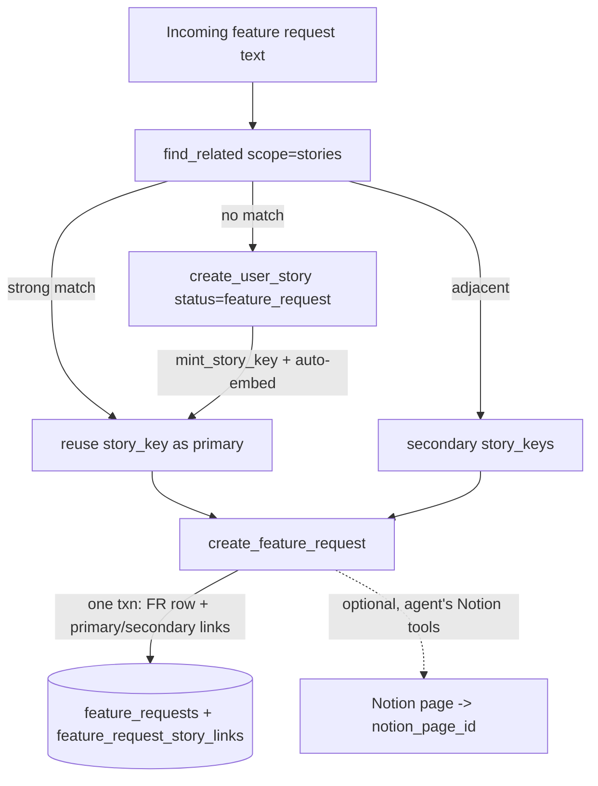

# feat: Feature-request → user-story linking + first MCP write capability

## Product Contract

### Summary

Add the first **write** capability to the currently read-only user-story MCP so a triage agent can map each incoming customer feature request to product work: log every request in an append-only `feature_requests` table, create a `feature_request`-status user story when no existing story matches, and link each request to one **primary** + N **secondary** stories. Matching/dedup stays at the story level (reuse the existing semantic search). Writes are enforced at the database — the agent can only ever create or edit `feature_request` stories, never `production`.

### Problem Frame

A triage agent ("Product Bot") processes tagged customer feature requests and needs to map each one to a user story: reuse an existing story when one matches, otherwise create a new one. This MCP is the entire contract — there is no other backend. Today the server is read-only, has no place to store feature requests or their links, has no way to fetch a story by key, and its `story_status` enum has no `feature_request` value. This plan supplies the storage, the status, and the write tools, while protecting the existing 204 production stories from agent writes.

### Requirements

- **R1** — Every individual incoming feature request is recorded (append-only evidence log; no dedup at the FR level).
- **R2** — The agent can create a user story with status `feature_request`, in a section it assigns, with a server-minted `story_key`.
- **R3** — The agent can link a feature request to one `primary` and zero-or-more `secondary` stories; these links are what produce `primaryUserStory` / `secondaryUserStories`.
- **R4** — The agent can fetch a user story by its exact `story_key`.
- **R5** — The agent can edit an existing `feature_request` story (content; not lifecycle promotion).
- **R6** — The agent can **never** create or modify a `production` (or any non-`feature_request`) story — enforced at the database, not only in app code.
- **R7** — A created story becomes semantically searchable via the existing pipeline (auto-embed) so the next similar request matches it.

### Scope Boundaries

In scope: the `feature_requests` + `feature_request_story_links` tables; the `feature_request` status; server-side `story_key` minting; the write tools; a `story_key` filter on `query_stories`; DB-level write enforcement.

Out of scope (non-goals):
- **Notion integration** — the agent's own Notion tools write the human-facing mirror; we only store `notion_page_id` as an outbound pointer.
- **FR-to-FR semantic dedup** — `feature_requests` has no embedding and no search tool; dedup is at the story level.
- **A `draft` status** — only `feature_request` is added.
- **A server-side duplicate guard** on create — rely on the agent's search-first discipline.
- **Lifecycle promotion** (`feature_request` → `in_progress`/`production`) — a human/PM action.

#### Deferred to Follow-Up Work

- A separately-permissioned **long-term cleanup agent** (dedup/merge/cancel of `feature_request` stories).
- Final secret management for the write connection string in the remote deployment (this plan reads it from an env var; setting the value is a one-time ops step).

---

## Planning Contract

### Key Technical Decisions

- **KTD1 — `feature_requests` is an append-only log, no embedding.** All matching intelligence is at the story level via existing `find_related(scope="stories")`. (Per R1; avoids an FR vector corpus + search tool.)
- **KTD2 — Postgres is the system of record** for FRs, links, and stories. Notion is a downstream mirror referenced by `feature_requests.notion_page_id`, written by the agent's own tools — never a dependency.
- **KTD3 — Reads consolidated, not multiplied.** Fetch-by-key is the *same mechanism* as `query_stories` (exact filter SELECT), so add a `story_key` filter there and attach FR links to records — do **not** add a `get_user_story` tool. (Mechanism boundary: merge within a mechanism.)
- **KTD4 — Writes are new, separate tools** with `readOnlyHint: false`, on a separate DB connection. (Mechanism + permission boundary: split across mechanisms.)
- **KTD5 — Write guardrail enforced at the DB via a least-privilege role + RLS.** A non-superuser `mcp_writer` role with RLS `WITH CHECK (status = 'feature_request')` on `user_stories`. Superuser bypasses RLS, so writes must use this role via a new `SUPABASE_DB_URL_WRITE`. App-layer validation stays for good error messages. A blanket trigger is rejected — it would break the ingest script that legitimately writes `production` stories.
- **KTD6 — Only `feature_request`** is added to the `story_status` enum (no `draft`).
- **KTD7 — `story_key` is minted server-side** by `mint_story_key(section_id)` = `sections.key_prefix || '-' || lpad(max_suffix_in_section + 1, 3, '0')`, row-locked. `sections.key_prefix` is backfilled 1:1 from existing keys (verified clean across all 33 sections); numeric `id` is already identity.
- **KTD8 — `create_feature_request` writes the FR row + its primary/secondary links in one transaction** (atomic "record this request against these stories").
- **KTD9 — No server-side dup guard.** Rely on the agent's search-first policy (reinforced in tool descriptions); cleanup is a deferred separate agent.

### Assumptions

- `update_user_story` edits an existing `feature_request` story's content (`title`, `story_text`, `actor`, `section_key`); it does **not** promote lifecycle. RLS confines it to `feature_request` rows. (Open: whether the triage agent may set `cancelled` — left to the cleanup agent for now.)
- Supabase (PG15) allows `ALTER TYPE ... ADD VALUE`; the new value is committed in its own migration step before any RLS policy references the literal.
- The pooler accepts a custom role in the connection username (standard Supabase/Supavisor behavior).

---

## High-Level Technical Design

Two DB connections after this change: the existing `postgres` (read, RLS-bypassing) for all read tools, and a new `mcp_writer` (RLS-constrained) for the write tools.

---

## Implementation Units

### U1. Migration: `feature_request` status, `sections.key_prefix`, `mint_story_key()`

**Goal:** Schema groundwork that has no dependency on the new tables or role.
**Requirements:** R2, R7, KTD6, KTD7.
**Files:** `migrations/0007_feature_request_status_and_keygen.sql`, `scripts/` apply step.
**Approach:**
- `ALTER TYPE story_status ADD VALUE IF NOT EXISTS 'feature_request';` — applied/committed **first and alone** (cannot be referenced in the same transaction).
- `ALTER TABLE sections ADD COLUMN IF NOT EXISTS key_prefix text;` then backfill 1:1 from existing `user_stories` keys (`regexp_replace(story_key,'-[0-9]+$','')` per section); derive a prefix for the few story-less sections from `section_key`.
- `mint_story_key(p_section_id bigint) returns text` — `SELECT ... FOR UPDATE` lock on the section's stories (or an advisory lock keyed on section_id), compute next numeric suffix, return `key_prefix || '-' || lpad(n::text, 3, '0')`.
**Patterns to follow:** existing migration style (`migrations/0006_help_article_embeddings.sql`), `create or replace function` idempotency.
**Test scenarios:**
- `mint_story_key` for a populated section returns the next sequential key matching the section's prefix (e.g. `collection-listing` → `COLL-LIST-0NN`).
- `mint_story_key` for a story-less section returns `<derived-prefix>-001`.
- Two concurrent mints on the same section do not collide (locked).
- `'feature_request'` is present in the enum after apply.
**Verification:** enum value present; `key_prefix` populated for all 33 sections; `mint_story_key` returns a unique, format-correct key.

### U2. Migration: `feature_requests` + `feature_request_story_links` tables

**Goal:** The evidence log and the story-link bridge.
**Requirements:** R1, R3, KTD1, KTD2, KTD8.
**Files:** `migrations/0008_feature_requests.sql`.
**Approach:**
- `feature_requests`: `id` identity PK, `source`, `source_thread_id`, `source_thread_url`, `raw_thread_jsonb jsonb`, `title`, `summary`, `requested_change`, `context`, `priority_signal`, `confidence real`, `product_area`, `status text`, `notion_page_id`, `created_at/updated_at/last_triaged_at` (defaults `now()`). No embedding column.
- `feature_request_story_links`: `id` identity PK, `feature_request_id bigint FK → feature_requests`, `user_story_id bigint FK → user_stories(id)`, `user_story_title_snapshot text`, `user_story_url_snapshot text` (nullable — stories have no URL), `link_type text` (`primary`|`secondary`), `link_source text`, `created_at`. Unique `(feature_request_id, user_story_id)`; partial unique index enforcing **one `primary` per FR**. Indexes both FK directions.
**Patterns to follow:** `story_help_articles` shape and indexing in `migrations/0002`/help migration.
**Test scenarios:**
- Insert FR + two links (one primary, one secondary) round-trips.
- Second `primary` link for the same FR is rejected by the partial unique index.
- Duplicate `(feature_request_id, user_story_id)` rejected.
- Deleting a story is blocked or cascades per FK (decide: `RESTRICT`).
**Verification:** tables + constraints + indexes exist; the one-primary rule holds.

### U3. Migration: `mcp_writer` role + RLS + grants

**Goal:** Database-level enforcement that the agent connection can only ever write `feature_request` stories.
**Requirements:** R6, KTD5.
**Dependencies:** U1 (enum value committed), U2 (FR tables exist).
**Files:** `migrations/0009_mcp_writer_role_rls.sql`.
**Approach:**
- `CREATE ROLE mcp_writer LOGIN PASSWORD '<set-via-vault-or-ops>' NOSUPERUSER;` (idempotent guard).
- `GRANT SELECT ON ALL relevant read tables; GRANT INSERT, UPDATE ON user_stories, feature_requests, feature_request_story_links; GRANT USAGE/SELECT on sequences; GRANT EXECUTE ON mint_story_key`. No `DELETE`.
- `ALTER TABLE user_stories ENABLE ROW LEVEL SECURITY;` + policies scoped to role `mcp_writer`:
  - `INSERT WITH CHECK (status = 'feature_request')`
  - `UPDATE USING (status = 'feature_request') WITH CHECK (status = 'feature_request')`
  - `SELECT USING (true)` (reads unrestricted).
- Confirm `postgres`/owner + ingest are unaffected (they bypass RLS / own the table).
**Patterns to follow:** Supabase RLS conventions.
**Execution note:** Verify enforcement by connecting **as `mcp_writer`** and attempting a forbidden write — must be rejected by the DB, not just the app.
**Test scenarios:**
- As `mcp_writer`: INSERT a `feature_request` story → allowed.
- As `mcp_writer`: INSERT a `production` story → rejected by RLS.
- As `mcp_writer`: UPDATE a `production` story → rejected (row invisible to the policy).
- As `mcp_writer`: UPDATE a `feature_request` story's content → allowed.
- As `postgres` (ingest): INSERT a `production` story → still allowed (RLS bypassed).
**Verification:** the forbidden-write tests fail at the DB layer under the `mcp_writer` connection.

### U4. Write connection wiring (`config.ts`, `db.ts`)

**Goal:** A second, RLS-constrained connection used only by write tools.
**Requirements:** KTD4, KTD5.
**Dependencies:** U3.
**Files:** `src/config.ts`, `src/db.ts`.
**Approach:** add `dbWriteUrl` from `SUPABASE_DB_URL_WRITE` (fallback: undefined → write tools error with an actionable message, mirroring the read-path guard). Add a `getWriteSql()` singleton parallel to `getSql()`. A shared `withWriteTransaction(fn)` helper for the atomic multi-statement writes.
**Patterns to follow:** `getSql()` singleton + `formatError` hints in `src/db.ts`/`src/tools/shared.ts`.
**Test scenarios:** write tools return an actionable error when `SUPABASE_DB_URL_WRITE` is unset (mirrors the existing DB-absent smoke test).
**Verification:** read tools unchanged; write tools use the writer connection.

### U5. `query_stories`: `story_key` filter + FR links on records

**Goal:** Fetch-by-key and FR-evidence visibility without a new tool.
**Requirements:** R4, KTD3.
**Files:** `src/schemas.ts`, `src/db.ts`, `src/tools/query_stories.ts`.
**Approach:** add `story_key: string[]` to the filter factory + `applied_filters`; AND-combine in `queryStories`. Attach `feature_requests` (id, title, link_type) to each record like `help_articles`, capped. Extend `queryStoriesOutputShape`.
**Patterns to follow:** the `help_relationship`/`help_article_slug` filters and the `help_articles` footprint attach already in `src/db.ts`.
**Test scenarios:**
- `query_stories(story_key=["COLL-LIST-003"])` returns exactly that record.
- A story linked to FRs surfaces them on the record; one with none shows an empty list.
- Unknown `story_key` → total 0 + the standard top-level `note`.
**Verification:** integration test fetches a known key and sees the record.

### U6. `create_user_story` tool

**Goal:** Create a `feature_request` story in an agent-assigned section, server-minted key, auto-embedded.
**Requirements:** R2, R6, R7, KTD5, KTD6, KTD7, KTD9.
**Dependencies:** U1, U3, U4.
**Files:** `src/schemas.ts` (input + output shape, fresh instances), `src/db.ts` (`createUserStory`), `src/tools/create_user_story.ts`, `src/server.ts`.
**Approach:** input `section_key` (required, validated against `sections`), `title`, `story_text` (composed from userProblem/requestedChange by the agent), `actor?`, `status` defaulting/forced to `feature_request`. App-validate status ∈ {`feature_request`}. In one writer transaction: resolve section_id, `mint_story_key`, INSERT (RLS enforces status). Return `story_key`, `id`, `status`, `section_key`, and a note that the embedding populates in ~10s. `readOnlyHint: false`.
**Patterns to follow:** tool structure of `get_help_article.ts`; `errorResult`/`jsonResult`.
**Test scenarios:**
- Create with a valid section → returns a new section-consistent `story_key`; row exists with status `feature_request`.
- Unknown `section_key` → actionable error, no insert.
- Attempt `status='production'` → rejected (app + DB).
- Created story is embedded within the pipeline window (assert non-null after poll) and then matchable by `find_related`.
**Verification:** new story present, correctly keyed, status-locked, becomes searchable.

### U7. `update_user_story` tool

**Goal:** Edit an existing `feature_request` story's content.
**Requirements:** R5, R6, KTD5.
**Dependencies:** U3, U4.
**Files:** `src/schemas.ts`, `src/db.ts` (`updateUserStory`), `src/tools/update_user_story.ts`, `src/server.ts`.
**Approach:** input `story_key` (required) + optional `title`/`story_text`/`actor`/`section_key`. App-guard: reject if the target's current status ≠ `feature_request`. UPDATE via writer connection (RLS double-enforces). Touching `title`/`story_text` re-triggers auto-embed. Return the updated record.
**Test scenarios:**
- Update a `feature_request` story's title → succeeds; embedding clears then repopulates.
- Update a `production` story → rejected at app layer AND would be rejected by RLS.
- Unknown `story_key` → actionable error.
**Verification:** content updates apply only to `feature_request` stories.

### U8. Feature-request tools: `create_feature_request`, `link_feature_request`, `get_feature_request`

**Goal:** Record an FR + its links atomically; add links later; read back the FR with its primary/secondary stories.
**Requirements:** R1, R3, KTD2, KTD8.
**Dependencies:** U2, U4.
**Files:** `src/schemas.ts`, `src/db.ts`, `src/tools/feature_requests.ts`, `src/server.ts`.
**Approach:**
- `create_feature_request(... , primary_story_key, secondary_story_keys[])` — one writer transaction: INSERT FR, resolve story_keys → ids + title snapshots, INSERT links (`primary` + `secondary`). Validate exactly one primary; unknown story_keys → error, rollback. Returns `fr_id` + the written links.
- `link_feature_request(feature_request_id, story_key, link_type)` — add a link to an existing FR (respects the one-primary constraint).
- `get_feature_request(feature_request_id)` — returns the FR row + `primary_story` + `secondary_stories[]` (joined, current titles + the link snapshots).
**Test scenarios:**
- Create FR with one primary + two secondaries → FR + 3 links persisted; `get_feature_request` returns them split correctly.
- Create FR with an unknown `primary_story_key` → error, nothing persisted (atomic).
- `link_feature_request` adding a second primary → rejected.
- `get_feature_request` for an unknown id → empty/`note`, not an error.
**Verification:** primaryUserStory/secondaryUserStories reconstructable from `get_feature_request`.

### U9. Schemas, output schemas, server registration, descriptions

**Goal:** Wire all new tools with input + output schemas and update orientation.
**Requirements:** all.
**Files:** `src/schemas.ts` (`STORY_STATUSES` += `feature_request`; new input/output shapes with fresh instances — no `$ref`), `src/server.ts` (register 5 new tools; non-readonly annotations; instructions), `src/resources.ts` (`docs://how-to-query` triage flow; taxonomy advertises `feature_request`), `src/tools/*` descriptions (search-first discipline; routing).
**Test scenarios:** covered via smoke (tool count/names/annotations) and integration.
**Verification:** server registers all tools; `tsc` clean; no `$ref` in generated schemas (smoke `listTools`).

### U10. Tests + docs

**Goal:** Lock behavior and document the new surface.
**Files:** `scripts/smoke.ts` (tool count → 10, names, write tools annotated `readOnlyHint:false`, DB-absent write-error paths), `scripts/integration.ts` (new write round-trip section: create story → create FR + links → get_feature_request → query_stories by key; cleanup of test rows), `README.md`, `.env.example` (`SUPABASE_DB_URL_WRITE`).
**Execution note:** integration writes must clean up after themselves (delete test FRs/links and the test `feature_request` story) so the corpus stays pristine.
**Test scenarios:** the full triage round-trip passes against the live DB; smoke asserts the new tool roster and that writes fail cleanly without the writer connection.
**Verification:** `tsc`, ranking, smoke, integration all green.

---

## Risks & Dependencies

- **RLS + superuser bypass** — if a write tool accidentally uses the `postgres` connection, enforcement silently disappears. Mitigation: writes go only through `getWriteSql()`; U3 test connects *as `mcp_writer`* to prove enforcement, not as `postgres`.
- **Enum ordering** — `feature_request` must be committed before any RLS policy references it; U1 applies the `ADD VALUE` standalone before U3.
- **Embedding lag (~10s)** — a freshly created story isn't immediately searchable; tools return the `story_key` so the agent links without re-searching, and the create response says so.
- **Role provisioning in the remote deploy** — the migration creates the role; the connection string (`SUPABASE_DB_URL_WRITE`) is a one-time ops step (Deferred).
- **Dependency order:** U1 → U3; U2 → U3/U8; U4 → U6/U7/U8.

## Definition of Done

All ten units implemented; migrations applied to the live DB; `mcp_writer` enforcement proven by a forbidden-write test under the writer role; the full triage round-trip (create story → create FR + links → read back → fetch by key) passes in `scripts/integration.ts`; `tsc`, ranking, smoke, integration all green; README + `.env.example` updated.
