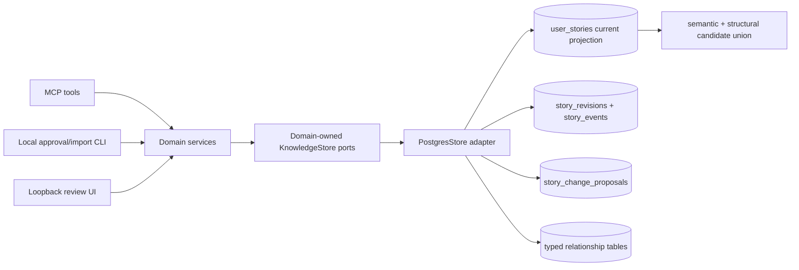
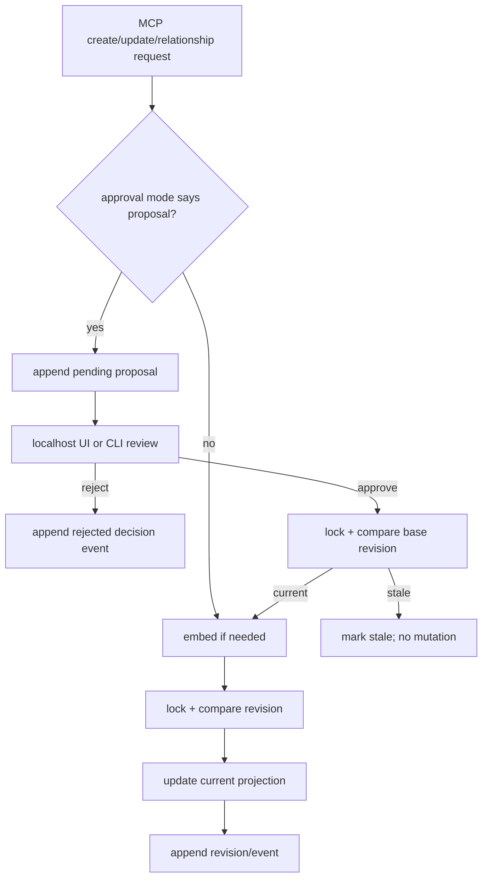

# feat: Trustworthy story lifecycle, guarded production changes, and reliable retrieval

## Product contract

### Summary

Evolve the current user-story knowledge graph from a latest-row catalog into a trustworthy product lifecycle system. Keep accepted current stories fast and clean to search; add immutable revisions and events for history; route production-sensitive changes through human-reviewed proposals by default; make every current relationship mutable through typed operations; harden bulk imports, embedding calls, HTTP defaults, and database privileges; and split the PostgreSQL implementation behind a genuine domain-owned storage port.

The plan deliberately does not add deployments or tenancy. It preserves the OSS/self-hosted shape while making the current security and approval boundary explicit.

### Requirements

- **R1 — Clean current search:** `find_related`, `query_stories`, `find_crossover`, and help-link enrichment read only accepted current state. Pending proposals and historical revisions never leak into ordinary results.
- **R2 — Complete lifecycle retrieval:** accepted story snapshots are immutable revisions; lifecycle and relationship actions are immutable events; `get_story_history` returns them explicitly.
- **R3 — Configurable production gate:** `STORY_APPROVAL_MODE=production` is the default, with `all` and `off` alternatives. Production-sensitive changes cannot be directly applied with the ordinary writer credential.
- **R4 — Human approval surfaces:** pending changes can be diffed, approved, or rejected through the localhost review UI and CLI. There is no regular MCP approval/apply tool.
- **R5 — Concurrency safety:** proposals are based on a revision number and cannot overwrite changes accepted after they were proposed.
- **R6 — Relationship completeness:** callers can add, remove, and replace story entities, code assets, help articles, and feature-request links. The same approval policy applies to relationship changes.
- **R7 — Safe bulk authoring:** import is CLI/local-review first, disabled as an MCP tool by default, explicitly credentialed, batched, bounded, idempotent when retried, and reported per batch.
- **R8 — Correct hybrid retrieval:** structural candidates are not gated by semantic KNN; semantic and structural qualification are independent; thresholds are calibrated by an evaluation fixture.
- **R9 — Correct help retrieval:** help filters constrain the SQL KNN query, and MCP/TypeScript nullability matches the database.
- **R10 — Reliable embeddings:** all providers produce 384 dimensions; external calls time out, retry only transient failures, respect rate-limit hints, redact errors, and use bounded concurrency.
- **R11 — Portable persistence:** domain ports and request/result types do not import or derive from the PostgreSQL adapter. PostgreSQL is one implementation.
- **R12 — Safe OSS HTTP defaults:** local HTTP binds to loopback and validates `Origin`; remote exposure is explicit and documented as gateway-authenticated.
- **R13 — Installation correctness:** fresh and upgraded databases grant required sequence/function/table privileges to the proper roles; ingest never inherits a read URL silently.
- **R14 — Defect/drift cleanup:** address the identified validation, duplicate output, enum, documentation, graph, configuration, and dependency defects.

### Non-goals

- Deployment/release records or story-to-deployment associations.
- Organization/tenant columns, hosted user accounts, or first-party OAuth.
- Searching historical revisions in normal retrieval.
- Replacing normalized joins with a generic polymorphic artifact table.
- A full help-center editorial system or article-body chunking.
- Implementing a second storage adapter in this change; the acceptance condition is a clean port plus a fake test adapter.

## Repository findings

- `src/db.ts` currently combines connections, retrieval, taxonomy, graph, story writes, and feature-request writes in one large module.
- `src/store.ts` uses `typeof pg.*`, imports `db.ts`, and passes PostgreSQL `Sql` into import code; this makes the advertised port adapter-owned.
- `src/config.ts` falls back from `DATABASE_URL_INGEST` to `DATABASE_URL`, registers import unconditionally through `src/server.ts`, and allows runtime embedding dimensions despite fixed `vector(384)` migrations.
- `migrations/0009_mcp_writer_role_rls.sql` grants table writes but not sequence usage, so identity-backed inserts fail for a clean least-privilege role.
- `src/authoring/import.ts` performs the full corpus in one transaction, calls external embeddings inside that transaction, and replaces entity/code links destructively without history.
- `find_related` obtains only semantic KNN candidates before structural fusion. The current `FIND_RELATED_MIN_SCORE=0.15` blends incomparable qualification signals.
- `matchHelpArticles` limits KNN before filtering `product_area` and `audience` in JavaScript.
- `getDocFrequencies` caches forever in-process while relationships can change.
- Production stories can be created and rewritten directly by `mcp_writer`; integration tests explicitly assert that behavior.
- The current local review UI is already a strong base for proposal approval, but its “commit” action is specifically wired to bulk import.
- No `docs/solutions/` directory or institutional solution notes exist, so this plan relies on current source, tests, the prior feature-request plan, and primary specifications.

## Key technical decisions

### KTD1 — Accepted current state is a projection, history is append-only

`user_stories` remains the only current story row and vector searched by runtime tools. `story_revisions` captures every accepted mutation of story fields, including status. `story_events` captures the semantic action and relationship changes. Revisions do not store embeddings; historical text is not part of normal KNN.

### KTD2 — Approval is a separate workflow, not a story status

`story_change_proposals.status` is `pending | approved | rejected | stale`. A proposal has `operation=create | update | relationships`, a schema-versioned typed JSON patch, actor/source/reason, and `base_revision_number`. The story keeps its current lifecycle status while a proposal waits.

### KTD3 — The database credential is part of the production gate

- `mcp_reader`: current/history/proposal reads.
- `mcp_writer`: direct non-sensitive story changes, feature-request writes, relationship changes allowed by policy, and proposal creation. It cannot directly modify a production row or transition into production.
- `mcp_approver`: applies/rejects proposals and is used only by the local review/CLI. `STORY_APPROVAL_MODE=off` also requires this credential for automatic application.
- ingest/owner: migrations and bounded bulk import preparation; imports still pass through the domain approval decision rather than raw upsert for existing stories.

The approver receives `EXECUTE` on narrowly scoped decision functions, not direct mutation grants. Those functions are `SECURITY DEFINER`, owned by a no-login lifecycle owner, use a fixed safe `search_path`, revoke execution from `PUBLIC`, and perform the revision/proposal checks internally. Relationship-table RLS policies consult the parent story so `mcp_writer` cannot edit links on a production story directly.

Do not implement the gate with a client-provided boolean or writable session setting.

### KTD4 — Optimistic revision checks plus row locking

Every current story has `revision_number`. Direct mutation and proposal approval use `SELECT ... FOR UPDATE` and compare the expected/base revision in the same transaction. A mismatch returns a typed stale result and changes nothing.

### KTD5 — Typed relationships, normalized tables

Keep `story_entities`, `story_code_assets`, `story_help_articles`, and `feature_request_story_links`. Add domain operations that express `add`, `remove`, and `replace` with family-specific types. Do not introduce `artifact_type`, arbitrary IDs, or metadata JSON as the canonical storage model.

### KTD6 — Fixed 384-dimensional vector contract

The public storage contract is 384 dimensions. Remove `EMBEDDING_DIM` and `EMBEDDING_DIMENSIONS` as runtime tuning knobs. OpenAI’s default adapter requests 384 dimensions; compatible endpoints must use a model that returns 384. A width change requires a migration and full re-embed.

### KTD7 — Union retrieval, independent qualification

Build the candidate set as `semantic KNN UNION exact entity/path matches`, deduplicated by story ID. Rank the union with the existing fusion model, but qualify a result when either:

- vector similarity clears `FIND_RELATED_MIN_VECTOR_SCORE` (initially 0.80 for GTE-small, finalized by the evaluation fixture); or
- it has an exact code-path match or non-zero weighted exact entity overlap meeting the structural floor.

Do not use one low blended score as the empty-result gate.

### KTD8 — Compute document frequency from relationship truth

Document frequency is `count(distinct story_id)` per entity/path. Replace process-lifetime cache correctness and manual refresh dependence with SQL views/CTEs over indexed join tables. Leave legacy columns temporarily for migration compatibility, but stop reading them. Reconsider materialization only after measurement at a much larger corpus.

### KTD9 — Import is a resumable domain operation

Prepare embeddings outside transactions with bounded concurrency; commit batches of 50 by default. Each source record has a stable `(import_source, import_ref)` identity stored in `story_import_refs`. Each batch is atomic and yields created/updated/proposed/failed results. The CLI writes a checkpoint/report after each committed batch.

### KTD10 — HTTP stays self-hosting friendly but safe by default

stdio remains default. HTTP binds to `127.0.0.1`, rejects invalid origins with 403, and requires an explicit `HTTP_HOST`/allowed-origin configuration to listen beyond loopback. This follows MCP’s Streamable HTTP guidance without adding tenancy/auth into the OSS core.

## High-level design



### Lifecycle flow



## Data model

```mermaid
erDiagram
  SECTIONS ||--o{ USER_STORIES : contains
  USER_STORIES ||--o{ STORY_REVISIONS : snapshots
  USER_STORIES ||--o{ STORY_EVENTS : records
  USER_STORIES ||--o{ STORY_CHANGE_PROPOSALS : targets
  STORY_REVISIONS o|--o{ STORY_EVENTS : resulting_revision
  STORY_CHANGE_PROPOSALS o|--o| STORY_EVENTS : decision_event
  USER_STORIES ||--o{ STORY_ENTITIES : has
  ENTITIES ||--o{ STORY_ENTITIES : classifies
  USER_STORIES ||--o{ STORY_CODE_ASSETS : implemented_by
  CODE_ASSETS ||--o{ STORY_CODE_ASSETS : links
  USER_STORIES ||--o{ STORY_HELP_ARTICLES : documented_by
  HELP_ARTICLES ||--o{ STORY_HELP_ARTICLES : links
  FEATURE_REQUESTS ||--o{ FEATURE_REQUEST_STORY_LINKS : maps
  USER_STORIES ||--o{ FEATURE_REQUEST_STORY_LINKS : receives
  USER_STORIES ||--o{ STORY_IMPORT_REFS : identifies

  USER_STORIES {
    bigint id PK
    text story_key UK
    bigint section_id FK
    text title
    text actor NULL
    text story_text
    story_status status
    int revision_number
    vector_384 embedding NULL
    timestamptz updated_at
  }
  STORY_REVISIONS {
    bigint id PK
    bigint story_id FK
    int revision_number
    bigint section_id FK
    text title
    text actor NULL
    text story_text
    story_status status
    text change_reason NULL
    text actor_label NULL
    text source
    timestamptz created_at
  }
  STORY_EVENTS {
    bigint id PK
    bigint story_id FK
    bigint revision_id FK_NULL
    bigint proposal_id FK_NULL
    text event_type
    story_status from_status NULL
    story_status to_status NULL
    jsonb details
    text actor_label NULL
    text source
    timestamptz created_at
  }
  STORY_CHANGE_PROPOSALS {
    bigint id PK
    bigint story_id FK_NULL
    text proposed_story_key NULL
    text operation
    int patch_version
    jsonb patch
    int base_revision_number NULL
    text status
    text reason NULL
    text proposed_by NULL
    text source
    text decided_by NULL
    text decision_note NULL
    timestamptz created_at
    timestamptz decided_at NULL
  }
  STORY_IMPORT_REFS {
    bigint story_id FK
    text import_source
    text import_ref
  }
```

## Capability map

| User/operator action | MCP | Local UI | CLI | Domain operation |
|---|---:|---:|---:|---|
| Search current stories/help | yes | optional | optional | search ports |
| Read story history | yes | yes | yes | `getStoryHistory` |
| Create/update a non-sensitive story | yes | optional | yes | `mutateStory` |
| Propose a production-sensitive change | yes | yes | yes | `submitStoryChange` |
| List/diff pending proposals | read-only yes | yes | yes | `list/getStoryChangeProposals` |
| Approve/reject a proposal | no | yes | yes | approver-only `decideStoryChange` |
| Add/remove/replace story relationships | yes | yes | yes | `mutateStoryRelationships` |
| Replace FR primary/secondary links | yes | optional | yes | `setFeatureRequestStoryLinks` |
| Bulk import | opt-in only | yes | yes | `importStoryBatches` |
| Import help articles | no initially | optional | yes | `importHelpArticleBatches` |

## Implementation units

### Implementation progress

- [x] U1. Domain types and genuine persistence ports
- [x] U2. Split the PostgreSQL adapter
- [x] U3. Migration ledger and clean role privileges
- [x] U4. Lifecycle, proposal, and import-reference schema
- [x] U5. Lifecycle domain service and atomic mutation path
- [x] U6. Approval CLI and localhost review UI
- [x] U7. History and proposal read tools
- [x] U8. Complete typed relationship mutations
- [x] U9. Batched, gated, idempotent story import
- [x] U10. Hybrid structural candidate union and relevance calibration
- [x] U11. Live document frequencies
- [x] U12. Help filtering, nullability, import, and suggestions
- [x] U13. Embedding reliability and fixed-width configuration
- [x] U14. OSS HTTP boundary and configuration validation
- [x] U15. Small defects, drift, and dependency cleanup
- [x] U16. Documentation, verification, and upgrade guide

### U1. Domain types and genuine persistence ports

**Goal:** remove adapter ownership from the core contract before adding more behavior.

**Files:**

- Add `src/domain/story.ts`, `src/domain/history.ts`, `src/domain/relationships.ts`, `src/domain/help.ts`, `src/domain/feature-requests.ts`, `src/domain/import.ts`.
- Add `src/domain/ports/knowledge-store.ts` and focused capability interfaces.
- Replace `src/store.ts` with composition/bootstrap only.
- Update `src/types.ts`, tool imports, and test fakes.

**Approach:**

- Define plain request/result discriminated unions such as `StoryMutationResult = applied | proposed | stale | not_found | invalid`.
- Compose `KnowledgeStore` from `StoryReader`, `StoryWriter`, `SearchStore`, `RelationshipStore`, `HistoryStore`, `ProposalStore`, `HelpStore`, `FeatureRequestStore`, and `ImportStore`.
- Keep transaction concepts behind high-level atomic methods. No `Sql`, tagged template, `typeof pg.method`, or adapter imports in domain files.
- Add a small in-memory fake implementing the port and compile-time conformance tests.

**Acceptance:** deleting/renaming an internal PostgreSQL function cannot change the domain interface; `rg 'postgres|Sql|./db' src/domain src/store.ts` returns no adapter dependency.

### U2. Split the PostgreSQL adapter

**Goal:** replace the monolithic `src/db.ts` with cohesive adapter modules while preserving behavior.

**Files:**

- Add `src/adapters/postgres/connections.ts`, `vector.ts`, `search-repository.ts`, `story-repository.ts`, `history-repository.ts`, `relationship-repository.ts`, `help-repository.ts`, `feature-request-repository.ts`, `taxonomy-repository.ts`, `import-repository.ts`, `postgres-store.ts`.
- Remove `src/db.ts` after call sites and tests are migrated.
- Update `scripts/integration.ts` to use adapter/bootstrap test helpers instead of importing raw `getSql` for normal assertions.

**Approach:** one connection manager owns read/write/approval/ingest pools. Repository functions accept a transaction-scoped adapter internally; the composed `PostgresStore` is the only object exposed to the domain bootstrap.

**Acceptance:** build, smoke, ranking, and the pre-existing read integration suite pass before lifecycle behavior changes.

### U3. Migration ledger and clean role privileges

**Goal:** make fresh installs and upgrades deterministic and make identity inserts work under least privilege.

**Files:** `scripts/migrate.ts`, `migrations/0009_mcp_writer_role_rls.sql`, new `migrations/0010_lifecycle_and_privileges.sql`.

**Approach:**

- Add `schema_migrations(filename, checksum, applied_at)` and apply each migration once; fail if an applied filename’s checksum changes.
- Preserve a documented `--verify` path for checking migration state.
- In `0009`, grant `USAGE, SELECT ON ALL SEQUENCES IN SCHEMA public TO mcp_writer` for clean installs and establish default sequence privileges for objects created later by the migration owner.
- In `0010`, repeat the all-sequence grant so already-deployed databases receive it, and grant exact privileges for new lifecycle tables/functions.
- Create `mcp_approver` without a repository password. Give it only the proposal decision functions/tables required; do not grant broad owner rights.
- Own the decision functions with a dedicated `NOLOGIN` lifecycle owner, set an explicit `search_path`, revoke `PUBLIC` execution, and grant `mcp_approver` only `EXECUTE`.
- Enable RLS on story relationship tables with writer policies that require the parent story to be non-production; approver functions bypass only through the dedicated owner and always append history.
- Remove `DATABASE_URL_INGEST` fallback to `DATABASE_URL`. `migrate` and `import` fail with an actionable message if ingest credentials are absent.

**Tests:** clean database migration; second migrate no-op; changed-checksum failure; inserts as `mcp_writer`; forbidden production update as `mcp_writer`; approval succeeds only as `mcp_approver`.

### U4. Lifecycle, proposal, and import-reference schema

**Goal:** add immutable history and proposal state without changing current-search tables.

**Files:** `migrations/0010_lifecycle_and_privileges.sql` (or split into `0010` schema and `0011` grants if transaction ordering requires it).

**Approach:**

- Add `user_stories.revision_number int not null default 1` with `check (revision_number > 0)`.
- Create `story_revisions`, unique `(story_id, revision_number)`, indexed newest-first.
- Create `story_events`, indexes `(story_id, created_at desc)` and `proposal_id`.
- Create `story_change_proposals` with check constraints for operation/status/base fields, a unique reservation for pending `proposed_story_key`, and indexes for pending review.
- Create `story_import_refs` with primary key `(import_source, import_ref)` and unique `(story_id, import_source, import_ref)`.
- Backfill one baseline revision and `baseline_imported` event for each current story, using the story’s `updated_at` when available. Make the backfill idempotent.
- Prevent update/delete of revisions/events with privileges plus an immutable-row trigger for defense in depth. Proposals permit only the valid pending-to-terminal transition through an approval function.

**Migration validation:** revision count equals current story count; every story’s `revision_number` resolves; no pending proposal points at a missing existing story unless `operation=create`.

### U5. Lifecycle domain service and atomic mutation path

**Goal:** ensure every accepted story mutation consistently updates current state, revision, and event.

**Files:** add `src/services/story-lifecycle.ts`; implement in PostgreSQL story/history repositories; update create/update tools.

**Approach:**

1. Validate and normalize the typed patch.
2. Determine sensitivity from `STORY_APPROVAL_MODE`, current status, target status, and relationship target.
3. For an applied content change, compute the embedding before opening the DB transaction.
4. In the transaction, lock the story, verify `expected_revision`, write the current row, increment the revision, insert the snapshot, and append the event.
5. For proposal-required changes, append only a proposal. For proposed production creates, reserve/mint the key in the proposal and create the story only on approval.
6. Return a discriminated result that MCP can communicate without ambiguity.

**Sensitivity rule:** default `production` mode proposes when current status is production, target status is production, a create targets production, or a relationship mutation targets a production story.

**Tests:** direct idea edit; idea-to-in-progress; in-progress-to-production proposal; production text proposal; production relationship proposal; all-mode proposal; off-mode auto-apply through approval connection; embedding failure leaves DB unchanged; stale expected revision changes nothing.

### U6. Approval CLI and localhost review UI

**Goal:** give humans a clear, non-MCP decision surface.

**Files:**

- Add `scripts/review-changes.ts`, `scripts/approve-story-change.ts` or a single subcommand CLI.
- Extend `scripts/review.ts` and add proposal-specific host/view modules under `src/authoring/review-ui/`.
- Add package scripts `review:changes`, `changes:list`, `changes:approve`, `changes:reject`.

**Approach:**

- List pending proposals with story key, base/current revision, operation, source, proposer, reason, and age.
- Render field-level before/after diffs and relationship additions/removals.
- Approval calls the approver-only domain operation; it locks and rechecks the base revision, embeds changed content, applies current state, writes revision/event, and terminally marks the proposal in one transaction.
- Rejection records decision actor/note and a decision event without mutating the story.
- Bind review HTTP to `127.0.0.1`; generate a random process token, require it on mutation requests, validate `Origin`, use POST only, and set `Cache-Control: no-store` plus restrictive CSP.
- Do not register approve/reject as MCP tools. MCP proposal-list output is read-only.

**Tests:** approve, reject, stale, double-decision, invalid CSRF, invalid Origin, and a diff fixture for create/content/status/relationship proposals.

### U7. History and proposal read tools

**Goal:** expose lifecycle retrieval without polluting current search.

**Files:** `src/schemas.ts` (or split schemas by tool), add `src/tools/get_story_history.ts`, `src/tools/list_story_change_proposals.ts`, register in `src/server.ts`, update `src/resources.ts`.

**Tool contracts:**

- `get_story_history(story_key, revision_limit=20, event_limit=100, before?)` returns current story, newest-first revisions, chronological/typed events, and pagination cursor.
- `list_story_change_proposals(status=['pending'], story_key?, limit=50, before?)` returns safe proposal diffs and stale indicator; `readOnlyHint=true`.

**Tests:** unknown story is an unmistakable empty; pending patch absent from current search; history reconstructs accepted status sequence; pagination is stable; tool outputs validate against schemas.

### U8. Complete typed relationship mutations

**Goal:** support all existing relationship paths for new and existing stories.

**Files:** domain relationship types/service; PostgreSQL relationship repository; add `src/tools/update_story_relationships.ts`; replace/extend feature-request link tooling and schemas.

**Contract:**

`update_story_relationships` accepts `story_key`, `expected_revision`, and one or more typed family operations:

- `entities: { add?, remove?, replace? }`, where values include `entity_slug` and `relationship_type`;
- `code_assets: { add?, remove?, replace? }`, where values include `repo`, `path`, optional symbol/type/summary, link/provenance/confidence/reason/sort/verification metadata;
- `help_articles: { add?, remove?, replace? }`, referencing existing `article_slug` with relationship/confidence.

Reject mixing `replace` with `add/remove` for the same family. Validate every referenced key before mutating; apply all requested families atomically. Direct accepted changes append one or more relationship events. Production-sensitive changes serialize the same typed operation into a proposal.

Add `set_feature_request_story_links(feature_request_id, primary_story_key, secondary_story_keys, expected_version?)` to atomically replace/reorder FR links; retain `link_feature_request` temporarily as a deprecated additive alias, then remove in a major version. Allow removal by replacing with the desired complete set while always enforcing exactly one primary.

**Tests:** add/remove/replace each family; metadata update; unknown refs roll back; duplicate inputs normalize; production proposal; event details; primary swap; no orphaned relationship rows.

### U9. Batched, gated, idempotent story import

**Goal:** turn import into a safe occasional bulk-authoring operation.

**Files:** `src/authoring/schema.ts`, `src/services/story-import.ts`, PostgreSQL import repository, `scripts/import-stories.ts`, `src/tools/import_stories.ts`, `src/server.ts`, review host adapters, config/docs.

**Approach:**

- Add `import_source` at payload level and required `import_ref` per keyless/retryable story. Preserve `_review.id` as the default ref when converting a draft.
- Default batch size 50; allow CLI range 1–200. The opt-in MCP tool has a hard total and payload-size limit.
- Resolve existing story by stable import ref first, explicit story key second. Never deduplicate by title.
- Prepare embeddings in bounded parallelism before each batch transaction.
- Each batch invokes the same lifecycle decision service: create/update directly or create proposals according to approval mode. Relationship replacement is part of the same per-story decision.
- Write a JSON report/checkpoint with source checksum, batch number, story key/ref, disposition, proposal ID, and error. Retry skips completed refs.
- Register `import_stories` only when `ENABLE_IMPORT_TOOL=true`; do not expose it in the base tool list.
- Local review commits directly through the local service/CLI route. The MCP App version requires both `ENABLE_REVIEW_APP` and `ENABLE_IMPORT_TOOL` and clearly labels the elevated capability.

**Tests:** 125-record three-batch import; failure rolls back only its batch; retry is idempotent; keyless missing ref rejected; production changes proposed; import disabled tool roster; ingest credential has no read fallback.

### U10. Hybrid structural candidate union and relevance calibration

**Goal:** find structurally exact stories outside the semantic pool and produce clean empty results.

**Files:** domain search types, PostgreSQL search repository/functions, `src/tools/find_related.ts`, `src/ranking.ts`, `src/config.ts`, `scripts/test-ranking.ts`, add `testdata/retrieval-eval.json` and `scripts/evaluate-retrieval.ts`.

**Approach:**

- Extract query paths/entities before candidate retrieval. Fetch current entity vocabulary/frequencies from the store.
- Request semantic KNN candidates and exact structural candidates independently, then union/deduplicate.
- Preserve raw vector similarity even for structural-only candidates (compute distance for their row or use 0 when no embedding).
- Add `qualifiesCandidate` with separate vector and structural rules. Rank qualifying candidates with normalized fusion.
- Replace `FIND_RELATED_MIN_SCORE` with `FIND_RELATED_MIN_VECTOR_SCORE` and `FIND_RELATED_MIN_STRUCTURAL_SCORE`. Start GTE-small at 0.80 and lock the final default against checked-in positive/negative cases.
- Include `candidate_sources`, raw qualification signals, and gate used in the result “why”/query diagnostics.

**Tests:** exact path outside top K is returned; exact entity qualifies independently; off-topic prose is empty; semantic positive with no footprint is returned; area grouping remains stable; eval reports precision/recall and fails below agreed bounds.

### U11. Live document frequencies

**Goal:** remove stale rare-signal weights and simplify mutation bookkeeping.

**Files:** migration updating taxonomy views/functions; PostgreSQL search/taxonomy/graph repositories; remove `dfCache` and refresh calls.

**Approach:**

- Add views/CTEs that count distinct story IDs from `story_entities` and `story_code_assets`.
- Use these counts in find-related weighting, crossover, taxonomy, and graph generation.
- Stop reading `entities.doc_frequency` and `code_assets.doc_frequency`; stop calling `refresh_document_frequencies()` from import.
- Keep columns/function for one compatibility release, mark deprecated, and add a later removal migration only after external users have a transition window.

**Tests:** add/remove relationship changes df on the next query; duplicate joins do not inflate df; no explicit cache refresh is required.

### U12. Help filtering, nullability, import, and suggestions

**Goal:** make the existing KB feature usable without overbuilding it.

**Files:** migration replacing `match_help_articles`; domain/help schemas and types; PostgreSQL help repository; `scripts/import-help.ts`; add `src/tools/suggest_story_help_links.ts`; docs/tests.

**Approach:**

- Extend the SQL function with optional `product_area[]` and `audience[]` filters applied before `ORDER BY ... LIMIT`.
- Make `summary`, `url`, `markdown`, and other nullable database fields nullable in TypeScript and Zod output. Do not fabricate empty strings.
- Add JSON/JSONL batch help import, stable `article_slug` upsert, 384-dimensional summary-card embedding, batch report, and bounded concurrency.
- Add read-only `suggest_story_help_links(story_key?, article_slug?, limit=10)` requiring exactly one direction. Use current vectors and return score plus explanation; do not persist automatically.
- Accepted suggestions are persisted with `update_story_relationships`, so approval/history rules remain centralized.

**Tests:** restrictive filters still return the best eligible row even when excluded rows dominate global KNN; null fields validate; article import retry idempotent; XOR direction validation; suggestion does not write.

### U13. Embedding reliability and fixed-width configuration

**Goal:** eliminate hanging network calls, uncontrolled retries, and dimension drift.

**Files:** `src/embeddings.ts` split into `src/embeddings/` providers/helper; `src/config.ts`; `.env.example`; README; embedding unit tests with a local fake HTTP server.

**Approach:**

- Export `EMBEDDING_DIMENSION = 384` and remove runtime width configuration.
- Add shared `fetchEmbeddingWithRetry`: default timeout 10,000 ms, three total attempts, retry network/408/429/5xx only, honor bounded `Retry-After`, exponential backoff with jitter, and cap error-body capture.
- Never include authorization headers/API keys in errors or logs.
- OpenAI adapter requests 384 dimensions for the official default; provide a compatibility flag only for whether the endpoint supports the request field, not for changing storage width. Returned vectors must always be 384.
- Add a reusable concurrency limiter (default 4) for import jobs.
- Validate provider credentials/model and optional local dependency during startup/preflight instead of failing on the first real search.

**Tests:** timeout abort, 429 then success, 500 max attempts, 400 no retry, `Retry-After`, malformed JSON, redaction, 383/385 rejection, and concurrency ceiling.

### U14. OSS HTTP boundary and configuration validation

**Goal:** make local defaults safe and deployment assumptions explicit.

**Files:** `src/http.ts`, `src/config.ts`, `.env.example`, README, HTTP tests.

**Approach:**

- Add `HTTP_HOST` default `127.0.0.1`; pass it to `app.listen`.
- Validate `Origin` for `/mcp` against `HTTP_ALLOWED_ORIGINS`; reject invalid present origins with 403. Document non-browser clients without Origin.
- Refuse `0.0.0.0`/non-loopback without explicit allowed origins and a documented `HTTP_TRUST_PROXY`/gateway mode acknowledgement.
- Validate ports, limits, timeouts, batch sizes, and relevance floors as bounded numbers; invalid values fail fast rather than silently taking defaults.
- Keep auth out of scope, but state that remote HTTP requires a gateway and TLS.

**Tests:** default listen host; allowed/denied origins; health remains available; invalid numeric config; remote host without acknowledgement rejected.

### U15. Small defects, drift, and dependency cleanup

**Goal:** close all identified low-level defects while touched files are being reorganized.

**Files:** relevant schemas/types/tools/graph/config/docs/package files.

**Fixes:**

- Make `find_crossover` require exactly one of `section_key` or `story_key` (`XOR`, not OR).
- Remove the duplicate `linked_story_keys` push in help enrichment and assert count/list consistency.
- Add `feature_request` to `StoryStatus`, then use the canonical domain enum everywhere instead of duplicated arrays.
- Correct server/tool-count comments, README wording, `.env.example` production-lock drift, migration names, and `docs://how-to-query` verb counts.
- Remove the embedded NUL/binary character from the graph pair key; use an unambiguous tuple serialization. Cap/normalize graph weight and keep node/edge visual scaling stable for skewed corpora.
- Return the moved story’s section from the same write transaction rather than a second read connection.
- Audit all database-null fields against Zod/TypeScript outputs, not only help fields.
- Upgrade esbuild to a non-vulnerable compatible release, refresh the lockfile, run `npm audit`, and verify both app bundles.
- Add schema drift assertions so duplicated MCP/authoring enums cannot diverge again.

### U16. Documentation, verification, and upgrade guide

**Goal:** make the new behavior understandable and safely adoptable.

**Files:** README, `.env.example`, `docs/upgrade-story-lifecycle.md`, resources/tool descriptions, package scripts, CI if present.

**Document:**

- latest-state search versus history;
- revision/event/proposal semantics;
- all approval modes and why `off` needs the approval credential;
- local UI/CLI approval commands;
- import use cases, batching, refs, and opt-in MCP registration;
- typed relationship operations and artifact-link terminology;
- KB import/suggestion flow;
- fixed 384-dimensional model contract and re-embed implications;
- OSS transport boundary and gateway responsibility;
- upgrade order, role passwords, grants, backfill checks, and rollback limits.

**Verification commands:**

```bash
npm ci
npm run build
npm run typecheck:ui
npm run test:ranking
npm run test:smoke
npm run test:embeddings
npm run test:http
DATABASE_URL=... DATABASE_URL_WRITE=... DATABASE_URL_APPROVAL=... DATABASE_URL_INGEST=... npm run test:integration
npm audit
```

## Flow and edge-case coverage

### Story creation

- Non-production create under `production` mode applies immediately and produces revision 1 + created event.
- Production create under `production` mode reserves a key in a pending proposal; it is not searchable until approved.
- `all` proposes either case; `off` applies either case through the approval credential.
- Duplicate import ref returns the existing disposition, not another story.

### Story update

- Empty/no-op patch returns `no_fields` without revision/event noise.
- Actor can explicitly be cleared with `null`; omission means unchanged.
- Section move validates the section and returns the committed section from the write transaction.
- Content embedding is computed before transaction; the final revision check prevents an outdated embedding from overwriting a newer story.

### Proposal decisions

- A proposal captures a display snapshot so it remains understandable if the current story later changes.
- Approval of a stale base never auto-merges. It marks or reports stale and requires a fresh proposal.
- Reject is terminal; reopening means creating a new proposal.
- A process crash cannot leave proposal approved while the current story/history write rolled back, because the decision is one transaction.

### Relationship operations

- Replace with `[]` intentionally clears that family and is distinguishable from omission.
- Remove of a missing link is idempotent and reported as unchanged.
- Help links require existing articles; entity/code add can create canonical rows with validation.
- Feature requests always retain exactly one primary story.

### Import

- External embedding failures happen before the batch transaction and are attributed to records.
- Committed earlier batches remain committed when a later batch fails; the report makes that explicit.
- `--continue-on-error` continues only after recording a failed batch; default stops.
- A payload that updates the same story twice is rejected before batching to avoid order-dependent results.

### Search

- Structural mode can operate when a semantic provider is temporarily unavailable if exact paths/entities are present; blended/semantic mode returns an actionable embedding error if semantic results are required.
- Historical or rejected text does not influence current KNN.
- Unknown filters/keys produce explicit empty responses, not broadened searches.

## Rollout sequence

1. Land U1–U3 refactor/privilege foundation with behavior-preserving tests.
2. Apply U4 schema/backfill and verify counts before enabling new writes.
3. Land U5–U8 lifecycle, proposal review, history, and relationship completeness. Default approval mode to `production` immediately.
4. Land U9 import changes and disable base MCP import by default.
5. Land U10–U11 retrieval changes and calibrate thresholds against fixtures.
6. Land U12 KB minimum functionality.
7. Land U13–U15 reliability/security/drift fixes.
8. Finish U16 docs and run the full clean-install/upgrade matrices.

Do not combine schema backfill, adapter split, and ranking changes into one unreviewable commit. Each rollout step should build and retain behavior-specific tests.

## Rollback and migration safety

- Database changes are additive first. Keep current columns/tables and old document-frequency columns through one compatibility release.
- Before migration, record counts for stories and every relationship table. After backfill, verify one baseline revision per story and unchanged current rows/embeddings.
- Proposal/history tables can be left in place if application rollback is needed; old runtime code ignores them.
- Once production RLS is tightened, rolling back application code that expects direct production writes will fail safely rather than silently bypassing approval.
- Never down-migrate by deleting revisions/events. A schema rollback should preserve audit data.
- Import reports/checkpoints are operator artifacts and should not contain database credentials or raw embedding-service errors with secrets.

## Risks and mitigations

- **Approval connection misuse:** keep it out of normal MCP bootstrap; instantiate only in local approval/off-mode paths and test that ordinary writer SQL is rejected.
- **Proposal patch drift:** include `patch_version`; parse with a strict domain schema; retain readers for old versions before adding a new one.
- **Long migration backfill:** current corpus is small, but write idempotent set-based inserts and document a maintenance window for larger adopters.
- **Port abstraction becomes lowest-common-denominator:** use domain capabilities and high-level atomic outcomes, not CRUD or raw query leakage.
- **Search threshold overfitting:** check in representative positives/negatives, report metrics by semantic/structural mode, and keep an explicit empty-result expectation.
- **Batch partial completion surprises:** atomic per batch plus durable report/checkpoint and default stop-on-failure.
- **Local review web surface:** loopback binding, origin validation, CSRF token, CSP, no-store, and no remote listen by default.
- **Fixed dimension limits model choice:** document this as intentional schema stability; changing it is supported only through an explicit migration/re-embed project.

## Definition of done

- All R1–R14 requirements have automated coverage.
- Fresh install and upgrade-from-0009 both pass migration/privilege tests.
- Ordinary writer cannot directly mutate production or apply a proposal.
- Default production proposal can be reviewed and approved end-to-end in both CLI and localhost UI.
- Pending/rejected text never appears in current search; accepted history is retrievable.
- Every existing relationship family supports add/remove/replace and records history.
- A structural exact match outside KNN is returned; off-topic semantic queries return clean empty results.
- Help filters run before KNN limiting and nullable rows validate.
- External embedding retry/timeout/redaction tests pass at 384 dimensions.
- Base MCP tool list excludes bulk import and all approval mutations.
- `src/domain` contains no PostgreSQL dependency and the fake store proves the port can be implemented independently.
- README, `.env.example`, static MCP resources, and comments agree with runtime behavior.
- Full verification suite and dependency audit pass.

## Primary references

- MCP Streamable HTTP requires `Origin` validation and recommends localhost binding for local servers: [MCP Transports specification](https://modelcontextprotocol.io/specification/2025-11-25/basic/transports).
- MCP tool annotations are advisory hints, not an authorization boundary: [MCP schema reference](https://modelcontextprotocol.io/specification/2025-11-25/schema).
- MCP recommends human control for tool invocation; this plan keeps approval out of the model-controlled tool surface: [MCP tools specification](https://modelcontextprotocol.io/specification/draft/server/tools).
- PostgreSQL `nextval` requires sequence `USAGE` or `UPDATE`, which is why table grants alone do not make clean writer installs work: [PostgreSQL sequence functions](https://www.postgresql.org/docs/current/functions-sequence.html) and [privileges](https://www.postgresql.org/docs/current/ddl-priv.html).
- PostgreSQL `SELECT ... FOR UPDATE` locks selected rows against concurrent updates and supports the atomic stale-check design: [PostgreSQL SELECT](https://www.postgresql.org/docs/current/sql-select.html).
- pgvector explicitly recommends combining vector retrieval with other retrieval and fusing results; the planned union/fusion follows that direction: [pgvector hybrid search](https://github.com/pgvector/pgvector#hybrid-search).
- Node provides `AbortSignal.timeout`, used by the shared external embedding timeout path: [Node.js globals](https://nodejs.org/api/globals.html#static-method-abortsignaltimeoutdelay).
