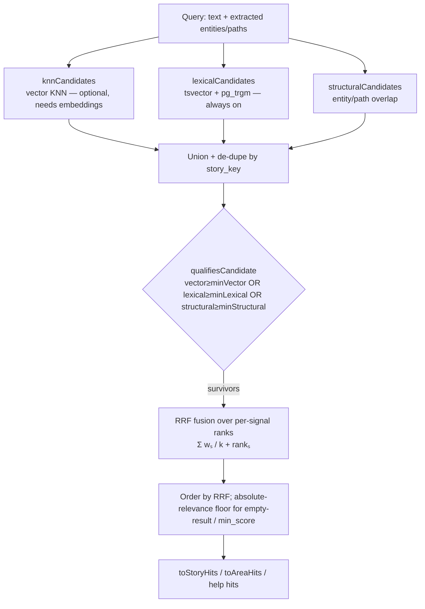

# feat: Full-text search as an always-on retrieval baseline

## Summary

Add Postgres lexical full-text search (FTS) as a first-class, always-on retrieval signal so tieline's search is useful with **zero embedding setup**. Today every relevance-ranked search is gated on the `vector` signal (`qualifiesCandidate` requires `vector >= minVector OR structural`), so with no embedding provider configured, search collapses to structural-only (shared entity slugs / code paths) — narrow, and the reason embeddings feel mandatory. This plan makes lexical a peer signal: candidates that clear a lexical floor qualify on their own, and all signals are combined with **Reciprocal Rank Fusion (RRF)** instead of the current min-max weighted sum. Embeddings become an optional semantic-recall upgrade; the existing structural signal is retained.

Lexical retrieval is a shared candidate source consumed by every text-query surface (`find_related`, `find_help`, and a new keyword mode for `query_stories`). Impact is measured against the existing `testdata/retrieval-eval.json` fixture, extended with lexical and no-embedding cases.

**Product Contract source:** direct planning (`ce-plan-bootstrap`) grounded in a prior design discussion; no upstream brainstorm.

---

## Problem Frame

- **Retrieval is embedding-gated.** `src/ranking.ts` `qualifiesCandidate` admits a candidate only if `raw.vector >= minVector`, or (when `allowStructural`) an entity/path overlap clears `minStructural`. With no embedding provider, `vector` is absent and only exact entity/path overlap survives.
- **No lexical layer exists.** Verified: no `tsvector`/`to_tsquery`/`pg_trgm`/`ilike` anywhere in `migrations/` or `src/adapters/`. Keyword matches over story/section/help text are simply not retrievable.
- **The corpus is identifier-heavy** — entity slugs, code paths, product-specific vocabulary — exactly where lexical/BM25 beats dense embeddings and where embeddings blur rare tokens.
- **Onboarding cost.** Because useful search requires embeddings, first-run forces an embedding-provider choice (and, for `local`, the ~271 MB `onnxruntime` download). FTS removes that gate for the baseline experience.

**Goal:** search that works out of the box on the Postgres tieline already requires, with embeddings as an optional quality layer, structural retained, and all three fused.

---

## Requirements

- **R1** — Lexical FTS retrieves stories/sections/help articles by keyword with no embedding provider configured.
- **R2** — A candidate that clears only the lexical floor qualifies (search returns results with `vector` absent).
- **R3** — Signals are fused with RRF; per-signal quality floors are preserved so low-quality matches are still excluded.
- **R4** — Lexical is a **shared** candidate source used by `find_related`, `find_help`, and a new keyword mode for `query_stories`. `find_crossover` is out of scope (structural by construction — no text query).
- **R5** — Identifier/partial matching (code paths, slugs) is supported via trigram, not only stemmed FTS.
- **R6** — The migration is host-agnostic (Postgres 16 + pgvector already required; adds only the native `pg_trgm` contrib) and populates existing rows without a manual backfill.
- **R7** — The existing "no clearly-matching result" behavior (`find_help` empty-result note, `min_score` gating) is preserved under RRF via an absolute-relevance floor, not rank alone.
- **R8** — Retrieval quality change is measured against `testdata/retrieval-eval.json`, extended with lexical-only-recall and no-embedding cases; existing cases still pass.
- **R9** — Embeddings remain fully supported and unchanged (384-dim contract untouched); when present they contribute as one more RRF signal.

---

## Key Technical Decisions

**KTD1 — RRF for fusion (not extended weighted-sum).** Reciprocal Rank Fusion is the established best practice for combining heterogeneous rankers (lexical + dense + structural) — it fuses by *rank position*, sidestepping the score-scale mismatch between cosine (0–1), `ts_rank` (unbounded), and the structural overlap score. This replaces the min-max-normalized weighted `fused` value used for ordering in `scoreCandidates`. RRF score per candidate = `Σ_signal weight_signal / (k + rank_signal)`, with `k` configurable (default 60) and optional per-signal weights so `mode` (semantic/structural/blended/lexical) can bias contributions.

**KTD2 — Gate/RRF reconciliation: floors gate eligibility, RRF orders survivors.** RRF only ranks; it does not express quality floors, and R7 needs an absolute relevance notion. Keep the raw per-signal values and extend `qualifiesCandidate` to `vector >= minVector OR lexical >= minLexical OR (allowStructural AND structural >= minStructural)`. Qualifying candidates are then ordered by RRF. Retain an absolute-relevance value (the max of the raw per-signal scores, or the existing `absBlend` extended with lexical) for the `min_score`/empty-result semantics that `find_help` and `find_related` report.

**KTD3 — Lexical mechanism: `tsvector` for prose + `pg_trgm` for identifiers.** `websearch_to_tsquery` + `ts_rank_cd` over a `tsvector` (GIN index) covers prose (story title/text/actor, section name, help title/summary/headings). `pg_trgm` trigram similarity (GIN `gin_trgm_ops`) covers partial/identifier matching on code paths and entity slugs where stemmed FTS is weak. Both feed a single `lexical` raw score (max/blend of the two sub-signals).

**KTD4 — Generated `STORED` tsvector columns (PG12+).** Use `GENERATED ALWAYS AS (to_tsvector(...)) STORED` columns rather than trigger-maintained columns: they populate existing rows at `ALTER` time (no manual backfill — satisfies R6), stay consistent automatically, and add no trigger surface. Small corpus makes the one-time table rewrite negligible.

**KTD5 — FTS always-on, provider-neutral defaults.** Lexical contributes to every text-query search whenever a query string is present, not only as an embedding fallback. Default config makes retrieval useful with `embeddingProvider` unset (gate admits lexical/structural; RRF ranks whatever signals exist).

**KTD6 — `pg_trgm` host-agnosticism.** `pg_trgm` is native Postgres contrib, preinstalled or allowed on every target host (Supabase, Neon, RDS `rds.allowed_extensions`, Crunchy, Timescale, the `pgvector/pgvector` image). Add it exactly as `migrations/0001_extensions.sql` adds `vector` (`create extension if not exists pg_trgm`), keeping the file host-agnostic.

---

## High-Level Technical Design

Candidate flow after this change — three independent candidate sources, each floor-gated, unioned, then RRF-ordered:

Directional guidance, not implementation specification — the prose above and the unit sections below are authoritative on disagreement.

---

## Scope Boundaries

**In scope:** lexical candidate generation; RRF fusion + gate reconciliation in `src/ranking.ts`; wiring into `find_related`, `find_help`, and a keyword mode for `query_stories`; config defaults for zero-embedding operation; migration for tsvector + trigram infrastructure; eval-fixture extension.

**Out of scope (principled):**
- `find_crossover` — takes a known story/section and finds others sharing its code/entities; there is no text query to run FTS against.
- Any change to the 384-dim embedding contract or embedding providers.
- A learned/cross-encoder reranker (would reintroduce a model dependency — the opposite of this plan's intent).

### Deferred to Follow-Up Work
- Language configuration beyond the default English text-search config (multi-locale corpora).
- Weight/threshold auto-tuning; this plan ships sensible defaults calibrated against the eval fixture.
- Trigram search over `code_assets.summary` prose (start with identifiers + story/help text).

---

## Implementation Units

### U1. Migration: tsvector + trigram infrastructure

**Goal:** Add the lexical index infrastructure so lexical queries have something to hit.
**Requirements:** R1, R5, R6, KTD3, KTD4, KTD6.
**Dependencies:** none.
**Files:**
- Create `migrations/0019_fts_lexical_search.sql`
- Reference `migrations/0001_extensions.sql` (extension pattern), `migrations/0002_schema.sql` (`user_stories`, `sections`), `migrations/0006_help_article_embeddings.sql` (`help_articles`).

**Approach:**
- `create extension if not exists pg_trgm;` — host-agnostic, mirroring how `0001` adds `vector`; keep a comment noting availability across hosts.
- Add `GENERATED ALWAYS AS (...) STORED` `tsvector` columns: `user_stories.search_tsv` over `title || actor || story_text`; `sections.search_tsv` over `section_name` (+ `section_definition` if the column exists on this schema — verify at implementation time); `help_articles.search_tsv` over `title || summary || jsonb text of headings`.
- GIN index on each `search_tsv`.
- GIN `gin_trgm_ops` indexes for identifier matching: on `code_assets.path` and `entities.slug` (verify exact column names against `0002`).
- Idempotent (`if not exists`) and host-agnostic per repo migration conventions; do not edit an applied migration (new file only).

**Patterns to follow:** existing migration header/comment style; `search_path = public, extensions` assumption from `src/commands/migrate.ts`.
**Test scenarios:**
- Migration applies cleanly on a fresh database and is idempotent on re-run (no drift; picked up by `schema_migrations`).
- `search_tsv` columns are populated for pre-existing rows immediately after `ALTER` (generated STORED).
- GIN indexes exist on each `search_tsv` and each trigram target.
- `Covers R6.` pg_trgm creation succeeds on a plain `pgvector/pgvector:pg16` database.

**Verification:** `tieline migrate` reports the new migration applied; `\d user_stories` shows the generated column + GIN index; a manual `to_tsquery` and `%` trigram query return rows.

---

### U2. Lexical candidate query in the search repository

**Goal:** Produce lexical candidates (with a relevance score) from a query string.
**Requirements:** R1, R4, R5, KTD3.
**Dependencies:** U1.
**Files:**
- Modify `src/adapters/postgres/search-repository.ts` (add `lexicalCandidates`)
- Modify `src/types.ts` (`Candidate` gains an optional `lexical` raw score + a lexical `why` field)
- Test `scripts/test-retrieval.ts` or a new focused script (see U6 for eval integration).

**Approach:**
- `lexicalCandidates({ query, limit })` runs `websearch_to_tsquery('english', $query)` against `user_stories.search_tsv` with `ts_rank_cd`, unioned with a trigram-similarity pass (`similarity(path/slug, $query) > threshold`) over identifier columns, returning `Candidate`-shaped rows carrying a normalized `lexical` score (blend/max of ts_rank and trigram similarity) and the matched terms for the `why` payload.
- Mirror the pool-size/limit conventions of `knnCandidates`/`structuralCandidates`.

**Patterns to follow:** `knnCandidates` and `structuralCandidates` in the same file (row shape, `sql` tagged-template style, pool sizing).
**Test scenarios:**
- A keyword present in `story_text` returns that story with a non-zero lexical score. (happy path)
- A partial code path / hyphenated slug matches via trigram when exact FTS does not. (R5)
- Empty/whitespace query returns no lexical candidates (no crash). (edge)
- Query with only stopwords returns empty rather than erroring. (edge)

**Verification:** unit/integration call returns ranked lexical candidates for a known keyword against seeded data.

---

### U3. Lexical signal + RRF fusion in ranking

**Goal:** Make `lexical` a first-class signal, gate on it, and order by RRF.
**Requirements:** R2, R3, R7, R9, KTD1, KTD2.
**Dependencies:** U2.
**Files:**
- Modify `src/ranking.ts` (`ScoredStory`, `qualifiesCandidate`, `scoreCandidates`, `toStoryHits`, `toAreaHits`, add RRF helper)
- Modify `src/config.ts` (`FusionWeights` gains `lexical`; add `rrfK`, `findRelatedMinLexicalScore`)
- Modify `src/types.ts` (`ScoreBreakdown` gains `lexical`)
- Test `scripts/test-ranking.ts`.

**Execution note:** Characterization-first. `src/ranking.ts` is pure and already covered by `scripts/test-ranking.ts` — capture current `scoreCandidates`/ordering behavior before switching fusion, so semantic-only regressions are caught.

**Approach:**
- Extend the raw signal set with `lexical` (from `Candidate.lexical`, clamped 0–1).
- `qualifiesCandidate`: admit if `vector >= minVector OR lexical >= minLexical OR (allowStructural AND (entity|path >= minStructural))` (KTD2).
- Add `rrfFuse(scored, weights, k)`: compute per-signal descending ranks over the qualifying pool, RRF-combine with per-signal weights, return the RRF score used for ordering. Replace the `fused`-based sort in `toStoryHits`/`toAreaHits` with RRF ordering; keep an absolute-relevance value (extend `absBlend` with lexical, or `max` of raw signals) for `min_score`/empty-result reporting (R7).
- Keep `score_breakdown` reporting all signals (now including `lexical`).

**Patterns to follow:** existing pure-function style (no DB/network), `normalizeWeights`, `minMax`, `saturate`.
**Test scenarios:**
- `Covers R2.` A candidate with `vector` absent but strong `lexical` qualifies and appears in results.
- `Covers R3.` A candidate below every floor is excluded.
- RRF orders a candidate ranked highly by two signals above one ranked highly by a single signal. (happy path)
- Semantic-only fixture cases (vector-only weights) still return the same expected keys as today. (regression / R9)
- `Covers R7.` Empty-result/`min_score` gate still fires when no candidate clears the absolute-relevance floor.
- Ties broken deterministically. (edge)

**Verification:** `scripts/test-ranking.ts` passes including new lexical/RRF cases; existing semantic assertions unchanged.

---

### U4. Wire lexical into find_related, find_help, and query_stories

**Goal:** Every text-query surface consumes the shared lexical candidate source.
**Requirements:** R1, R2, R4.
**Dependencies:** U3.
**Files:**
- Modify `src/adapters/postgres/search-repository.ts` (`find_related` candidate union; `matchHelpArticles`; `queryStories` keyword mode)
- Modify the relevant tool schema/handlers under `src/tools/` (e.g. `find_help`, `query_stories`) to expose/accept a text query where needed
- Tests alongside each (`scripts/integration.ts` or focused scripts).

**Approach:**
- `find_related`: union `lexicalCandidates` into the pool alongside `knnCandidates`/`structuralCandidates` before scoring (de-dupe by `story_key`).
- `find_help`: add a lexical candidate path over `help_articles.search_tsv` so help search returns results with no embeddings; RRF-fuse with the existing KNN help path when embeddings are present; preserve the empty-result note (R7).
- `query_stories`: add an optional keyword parameter that filters/ranks by `search_tsv` (a lexical lookup mode alongside the existing exact filters); leave existing filter/count behavior intact when the keyword is absent.
- `find_crossover`: unchanged (out of scope).

**Patterns to follow:** existing candidate-union in `find_related`; existing `matchHelpArticles` shape; `queryStories` filter construction.
**Test scenarios:**
- `Covers R1.` With no embedding provider configured, `find_related`, `find_help`, and `query_stories` keyword mode each return relevant results.
- With embeddings present, results improve/rerank rather than regress (hybrid). (integration)
- `query_stories` without a keyword behaves exactly as before (filters + counts). (regression)
- `find_help` with no lexical or semantic match returns the empty-result note, not an error. (R7)

**Verification:** integration run with `EMBEDDING_PROVIDER=hash` (or unset) returns lexical results across all three tools.

---

### U5. Config defaults for zero-embedding operation

**Goal:** Retrieval is useful out of the box without an embedding provider.
**Requirements:** R2, R8, KTD5.
**Dependencies:** U3 (consumes new config fields).
**Files:** Modify `src/config.ts`.

**Approach:**
- Add lexical weights to each per-mode `FusionWeights` set (semantic/structural/blended) and add a `lexical` mode (lexical-dominant); ensure `allowStructural`/gate defaults admit lexical when `vector` is absent.
- Add `findRelatedMinLexicalScore`, `helpMinScore` parity for lexical, `rrfK`, and a `lexicalCandidatePoolSize`, all env-overridable with sensible defaults.
- Ensure defaults do not require `EMBEDDING_PROVIDER` for search to function.

**Patterns to follow:** existing `boundedNumber` env parsing and per-mode weight sets in `src/config.ts`.
**Test scenarios:**
- Defaults parse with no embedding env set; gate admits lexical. (config)
- Env overrides for `rrfK` / min-lexical are respected and bounded. (config)
- **Test expectation:** thin — config wiring is exercised through U3/U4 behavior tests; add a direct assertion that defaults yield a working (non-empty gate) retrieval config with no embedding provider.

**Verification:** starting `tieline serve` with no embedding env and issuing a keyword `find_related` returns results.

---

### U6. Eval-fixture extension and recall measurement

**Goal:** Prove FTS lifts recall and that RRF does not regress existing cases.
**Requirements:** R3, R8.
**Dependencies:** U3.
**Files:**
- Modify `testdata/retrieval-eval.json` (add `lexical` per candidate, `min_lexical` threshold, new cases)
- Modify `scripts/evaluate-retrieval.ts` (support the lexical signal + RRF mode; report recall delta).

**Approach:**
- Extend the `Fixture` type and per-candidate shape with a `lexical` score and add `min_lexical` to `thresholds`.
- Add cases: (a) lexical-only rescue — low `similarity`, no structural overlap, strong lexical → must be retrieved (R2); (b) no-embedding scenario — all `similarity` absent/zero, lexical present → non-empty results; (c) hybrid ordering — RRF ranks a dual-signal candidate above a single-signal one; (d) preserve existing 4 semantic/structural/blended cases unchanged.
- Emit a recall summary so the impact is visible.

**Patterns to follow:** existing `scripts/evaluate-retrieval.ts` mode/weights map and fixture loading.
**Test scenarios:**
- `Covers R8.` All existing cases still pass after the RRF switch.
- New lexical-rescue and no-embedding cases pass. (happy path)
- Recall summary reports a measurable gain on lexical cases vs. structural-only baseline.

**Verification:** `npm run test:retrieval` (`scripts/evaluate-retrieval.ts`) passes with the extended fixture and prints the recall delta.

---

### U7. Documentation

**Goal:** Tell users search works with zero embedding setup.
**Requirements:** R1, R9.
**Dependencies:** U4.
**Files:** Modify `README.md`.

**Approach:** Note in the search/retrieval section that lexical FTS works with only the Postgres tieline already requires (no embedding provider, no model download); embeddings are an optional semantic-recall upgrade; `pg_trgm` is the one added native extension.
**Test scenarios:** Test expectation: none — documentation only.
**Verification:** README describes the zero-embedding baseline and the optional embedding upgrade path.

---

## Verification Contract

- `tieline migrate` applies `0019_fts_lexical_search.sql` cleanly and idempotently; generated columns and GIN/trigram indexes exist.
- `scripts/test-ranking.ts` passes, including new lexical-qualification and RRF-ordering cases, with existing semantic assertions unchanged.
- `scripts/evaluate-retrieval.ts` passes on the extended fixture and reports a recall gain on lexical cases; all pre-existing cases still pass.
- Integration run with no embedding provider (`EMBEDDING_PROVIDER` unset or `hash`) returns relevant results from `find_related`, `find_help`, and `query_stories` keyword mode.
- `find_help` still returns the empty-result note (not an error) when nothing matches.
- `find_crossover` behavior is unchanged.
- `npm run build` and `npm run typecheck:ui` pass.

## Definition of Done

Lexical FTS is an always-on retrieval signal fused with embeddings (optional) and structural signals via RRF; search returns useful results with no embedding provider configured; identifier/partial matching works via trigram; the eval fixture demonstrates a recall gain without regressing existing cases; the 384-dim embedding contract is untouched; docs describe the zero-embedding baseline.

---

## Risks & Dependencies

- **RRF vs. absolute-relevance semantics (R7).** RRF gives no absolute score, but `find_help`/`find_related` report `min_score` and an empty-result note. *Mitigation:* keep an absolute-relevance floor (max of raw signals / extended `absBlend`) for gating and reporting; RRF only orders survivors (KTD2). Covered by U3 tests.
- **Ranking regression.** Switching from weighted-sum to RRF could reorder existing semantic results. *Mitigation:* characterization-first on `ranking.ts`; the eval fixture's existing cases are a regression gate (U6).
- **`pg_trgm` availability on some managed hosts.** *Mitigation:* it is native contrib available on all documented targets; `create extension if not exists` with a clear failure message; documented in README.
- **Stemming vs. identifiers.** English FTS over-stems code identifiers. *Mitigation:* trigram handles identifiers; consider the `simple` config for identifier-bearing columns (implementation-time).
- **Generated-column table rewrite** on `ALTER`. *Mitigation:* corpus is small (hundreds–low-thousands of rows); negligible. Note for very large future corpora.

## Open Questions / Deferred to Implementation

- Exact `tsvector` column composition for `sections` — confirm whether a `section_definition` column exists on the live schema or only in import data; include it if present.
- Exact trigram target columns and threshold — confirm `code_assets.path` / `entities.slug` names against `migrations/0002_schema.sql` at implementation time.
- Per-signal RRF weights per `mode` and the default `rrfK` — start at k=60 and calibrate against the eval fixture; final values are an implementation-time tuning output, not a plan-time constant.
- Whether `find_help` should RRF-fuse lexical + KNN when embeddings are present, or prefer lexical-first — decide from eval results.

## Sources & Research

- Local: `src/ranking.ts` (fusion core, gate), `src/adapters/postgres/search-repository.ts` (candidate sources), `src/config.ts` (`FusionWeights`, thresholds, per-mode weights), `migrations/0001_extensions.sql`/`0002_schema.sql`/`0006_help_article_embeddings.sql` (schema + extension pattern), `src/commands/migrate.ts` (migration ledger + `search_path`), `scripts/evaluate-retrieval.ts` + `testdata/retrieval-eval.json` (eval harness).
- External research: not run — Postgres FTS + RRF hybrid fusion is well-established, settled practice; the empirical check is the eval fixture, not web docs. RRF as the default heterogeneous-ranker fusion is consistent with common hybrid-search implementations (Elasticsearch/OpenSearch/Weaviate/Azure AI Search).
