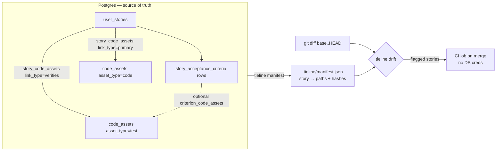

# tieline living spec: story → acceptance criteria → tests → code - Plan

**Product Contract preservation:** Product Contract unchanged. `ce-plan` added the Planning Contract, Implementation Units, Verification Contract, and Definition of Done below.

## Goal Capsule

- **Objective:** Evolve tieline from a product *map* into a *living verification spec*: each user story gains authored acceptance criteria ("what it should do"), links to the tests that verify it, and a deterministic drift check (CI on PR merge) that flags stories whose referenced code/tests changed — so the linkage never silently rots.
- **Product authority:** This document (from `ce-brainstorm`). Product decisions are settled; this plan is HOW.
- **Verification posture:** DB-backed paths verified offline against PGlite (no local Postgres); deterministic logic (drift, manifest, AC serialization) is unit-tested.

---

## Product Contract

### Problem frame

tieline maps a codebase into user stories linked to code and concepts, and that map is now a strong retrieval surface (semantic + lexical + structural). But the map answers "what exists and where" — not **"what should it do"** or **"is that still true."** Two concrete gaps today:

- **No acceptance criteria.** Stories are `title` + "As a…I want…so that" + actor + status + code paths. The behavioral nuance the drafting agent *does* produce (e.g. "owner-gated", "quota-gated") lives in a `_review.comment` sidecar that the importer strips — so intended behavior is generated and then discarded.
- **No verification linkage.** Nothing ties a story to the tests that prove it, and nothing catches when code/tests change out from under the map. The map can drift from reality with no signal.

The result: tieline can ground an agent in *where* a behavior lives, but not in *what it must do* or *whether that behavior is currently proven*. Closing that turns the map into a living spec.

### Actors

- **A1 — Maintainer (human):** onboards and reviews the map; acts on drift signals and coverage gaps; decides when a re-map is warranted.
- **A2 — Coding agent:** the primary *consumer* (pulls a story's AC + "is it verified" as grounding) and the *drafter* (reads code and tests, proposes AC + test links).
- **A3 — CI:** runs the deterministic drift check on PR merge and surfaces the result.

### Requirements

- **R1 — Authored acceptance criteria.** Persist acceptance criteria per story, capturing the behavioral nuance currently discarded at import.
- **R2 — Story↔test links.** Link stories to the tests that verify them, tests as first-class linked assets. A criterion may *optionally* cite the specific test(s) that cover it (hybrid precision).
- **R3 — First-class verification state.** Represent and query whether a story/behavior is **verified** (has a linked test), **unverified** (no linked test), or **stale** (a referenced file changed). "Unverified/unlinked" is a normal state, never an error.
- **R4 — Committed manifest.** Emit a lightweight, version-controlled manifest projecting each story's referenced **code + test paths and content hashes**, regenerated on import.
- **R5 — Deterministic drift check.** Given a git diff, flag — no LLM, pure set-math over the diff vs the manifest — the stories whose referenced code/test paths were modified, renamed, or deleted.
- **R6 — CI integration on merge.** A CI-runnable form of R5 (GitHub Action on merge) that surfaces flagged stories **without DB credentials in CI**.
- **R7 — Drafting extension.** The onboarding drafting flow reads test files, **derives AC from existing test behavior where tests exist**, authors AC for the gaps, and emits story↔test links (+ optional criterion citations).
- **R8 — Query surface.** Expose the new signals: "which stories have unverified behavior", "which tests verify this story", "which stories are stale."
- **R9 — Additive, backward-compatible.** Existing maps and imports keep working; stories without AC or tests remain valid.

### Acceptance examples

- **AE1 (R7):** An agent onboarding a *tested* repo produces stories whose AC is derived from the existing test descriptions, with those tests linked; *untested* areas get authored AC and are marked **unverified**.
- **AE2 (R4):** After `tieline import`, a manifest file in the repo is created/updated, listing each story's code + test paths and hashes.
- **AE3 (R5/R6):** A PR that deletes a file referenced by 3 stories, on merge, produces a drift signal naming exactly those 3 stories.
- **AE4 (R8):** Querying "unverified stories" returns stories whose AC have no linked test.
- **AE5 (R9):** A story with no AC and no tests imports successfully and appears as **unverified**, not an error.

### Key product decisions (from brainstorm)

- **KD1** v1 is the full loop (AC + test links + drift), not a links-only or AC-only MVP.
- **KD2** Hybrid unit of verification: AC rows on the story; tests link story-level; a criterion *may* cite its covering test.
- **KD3** Committed manifest is the drift source (map becomes a repo artifact); DB stays source-of-truth for content.
- **KD4** v1 drift = diff-based staleness only; mapping CI test *failures* to stories is deferred.
- **KD5** AC is derive-preferred (extract from tests where present; author the gaps).
- **KD6** Lean manifest: paths + hashes only; AC↔test citations stay DB-side.

### Scope Boundaries

**In scope (v1):** R1–R9 as detailed in the Implementation Units.

**Deferred for later:**
- **Test-result-based verification** — mapping CI test *failures* back to stories ("provably broken"). v1 stops at diff-based staleness.
- **Auto-remediation** — re-mapping a stale story stays a human/agent loop; v1 only detects and signals.
- **AC↔test citations in the committed manifest** — kept DB-side in v1 (KD6).
- **Skill↔handoff reconciliation** — the `backfill-stories` skill and generated `AGENT_HANDOFF.md` duplicate the drafting methodology; slimming the handoff to a pointer is a separate cleanup.

**Outside this product's identity:**
- tieline is **not a test runner** and **not a spec-authoring IDE**. It maps and verifies *linkage*; it does not execute tests, replace a test framework, or auto-write tests.

### Deferred to Follow-Up Work
- A dedicated review-UI surface for AC (this plan persists + queries AC; richer review rendering can follow).
- Backfilling AC/test links for *already-imported* maps (v1 targets the draft→import path; a re-map produces them).

### Success criteria

- A maintainer/agent can answer, from tieline, "which mapped behaviors are unverified?" and "which stories does this PR put at risk?"
- The drift check is deterministic and complete at the path level (every story referencing a changed/deleted file is flagged; no LLM in detection).
- The verification layer is additive — existing maps and imports are unaffected.

---

## Planning Contract

### Key Technical Decisions

**KTD1 — AC as first-class rows; tests reuse the existing code-asset infra.** A new `story_acceptance_criteria` table (one row per criterion) satisfies KD2's optional per-criterion citation. Tests are **not** a new entity: they are `code_assets` with `asset_type = 'test'`, linked to stories via `story_code_assets.link_type = 'verifies'` — the join, path-validation, and 1/df infra already exist. Optional criterion→test citation is a thin `criterion_code_assets` join. Rationale: minimal new surface, reuses proven patterns; AC rows are the only genuinely new table.

**KTD2 — Verification state is derived (structural), not stored.** A story/criterion is `verified` when it has ≥1 `verifies` link, `unverified` when it has none, `stale` when drift flags it (U5). No stored status column — it's a query over links, so it can't go out of sync with the links themselves. "Passing test" semantics await the deferred test-result signal (KD4); v1 `verified` means *a linked test exists*.

**KTD3 — Manifest is a derived, committed projection.** A `tieline manifest` command writes `.tieline/manifest.json` (each story's `story_key` → referenced code + test paths → per-path content hash). Regenerated on import and on demand. Lean (paths + hashes, KD6). The DB is source-of-truth for content; the manifest exists solely so CI can check drift without DB access (KD3).

**KTD4 — Drift is pure set-math over (git diff × manifest).** `tieline drift --base <ref>` reads the committed manifest, derives the changed/renamed/deleted path set from `git diff --name-status <base>`, and flags a story when any of its referenced paths is in that set OR its stored hash ≠ the current file hash. No LLM, no DB. Nonzero exit when drift is found (CI-friendly).

**KTD5 — Drafting change is prompt/contract, not model logic.** R7 is delivered by extending the generated handoff and the bundled skill's Phase 2 to read tests, derive AC, and emit the new draft fields — plus widening the import contract to carry them. No change to *how* the agent reasons, only what it's asked to produce and what import accepts.

**KTD6 — Backward compatibility is structural.** New draft fields (`acceptance_criteria`, test links) are optional in the import contract; absent → the story imports exactly as today and reads as `unverified`. No migration of existing rows required (R9).

### System-Wide Impact

- **Import contract widens** (`src/authoring/schema.ts`): downstream draft producers (the skill/handoff) and the merge/import path must agree on the new optional fields. Covered by U2 + U7.
- **New repo artifact** (`.tieline/manifest.json`): the map now partially lives in the repo. Teams must regenerate + commit it after import; drift CI depends on it being current. Documented in U6/U8.
- **New RLS/grants** for `story_acceptance_criteria` + the citation join, following the `mcp_reader`/`mcp_writer` model in `migrations/0009_mcp_writer_role_rls.sql`.
- **Port surface grows** (`src/domain/knowledge-store.ts`): new read methods ripple to the Postgres store and the test fake (as with the FTS work).

---

## High-Level Technical Design

The data model and the drift loop:

Verification state is a query, not a column: `verified` = has a `verifies` link, `unverified` = none, `stale` = drift-flagged.

---

## Implementation Units

### U1. Schema: acceptance criteria, test links, verification infra

**Goal:** Add the persistence for AC rows and the optional criterion→test citation; confirm tests reuse the existing code-asset/link infra.
**Requirements:** R1, R2, R3; KTD1.
**Dependencies:** none.
**Files:** Create `migrations/0020_acceptance_criteria_and_tests.sql`. Reference `migrations/0002_schema.sql` (code_assets/story_code_assets), `migrations/0009_mcp_writer_role_rls.sql` (role/RLS pattern).
**Approach:** `story_acceptance_criteria` (id, story_id FK on delete cascade, statement text, sort_order int, source text check in ('derived','authored'), timestamps). `criterion_code_assets` join (acceptance_criterion_id FK, code_asset_id FK, unique pair) for optional citation. No new story↔test table — `code_assets.asset_type='test'` + `story_code_assets.link_type='verifies'` already exist. Grants + RLS mirroring 0009 (mcp_writer insert/update, mcp_reader select). Idempotent (`if not exists`), host-agnostic.
**Patterns to follow:** the table/grant/RLS shape and idempotency in `0002`/`0009`.
**Test scenarios:**
- Migration applies cleanly on top of 0001–0019 and is idempotent on re-run. *Covers AE5 setup.*
- AC rows insert with `source` check enforced; cascade-delete with the story.
- A `verifies` link and a `criterion_code_assets` row insert and read back.
- mcp_reader can SELECT the new tables; mcp_writer can INSERT/UPDATE AC (verify via SET ROLE, as in prior PGlite checks).
**Verification:** migration applies + the above queries succeed against PGlite + pgvector; `\d story_acceptance_criteria` shows the columns/constraints.

### U2. Persist AC + test links through the import contract

**Goal:** Widen the draft/import contract so AC and test links are persisted (they're discarded today), backward-compatibly.
**Requirements:** R1, R2, R9; KTD5, KTD6.
**Dependencies:** U1.
**Files:** Modify `src/authoring/schema.ts` (import payload/story shape), `src/adapters/postgres/import-repository.ts` (persist AC rows, test code_assets, verifies links, criterion citations), `skills/backfill-stories/reference/draft-schema.md` (document the new fields). Test alongside `scripts/integration-import.ts` (or a focused offline serialization test for the contract).
**Approach:** Add optional `acceptance_criteria: [{statement, source, tests?: string[]}]` and test references (test file paths, either a distinct `test_paths` array or `code_paths` entries tagged as tests — decide in impl, see Open Questions) to the story shape. Import upserts AC rows, upserts test `code_assets(asset_type='test')`, creates `verifies` links, and `criterion_code_assets` citations. Validate test paths like code paths (exist, repo-relative, no escape). Absent fields → unchanged behavior.
**Execution note:** Extend the existing import validation/idempotency tests first, then implement — import is idempotency-sensitive (import_ref).
**Patterns to follow:** existing code-path persistence + path validation in `import-repository.ts`; the import_ref idempotency contract.
**Test scenarios:**
- *Covers AE1.* Importing a story with AC + linked tests persists AC rows, `test` code_assets, `verifies` links, and criterion citations.
- *Covers AE5.* Importing a story with no AC/tests succeeds and creates no AC rows/links.
- Re-import with the same import_ref is idempotent (no duplicate AC/links).
- A test path that is absolute / escaping / nonexistent is rejected with a clear error (mirrors code-path validation).
**Verification:** import integration (offline contract test + PGlite) shows AC/links persisted and idempotent; no-AC import unaffected.

### U3. Verification state + query surface

**Goal:** Expose the new signals to agents/humans: unverified stories, tests-for-story, verification state.
**Requirements:** R3, R8; KTD2.
**Dependencies:** U1 (schema), U2 (data to query).
**Files:** Modify `src/adapters/postgres/search-repository.ts` (new read queries), `src/domain/knowledge-store.ts` (port methods), `src/adapters/postgres/postgres-store.ts`, `src/domain/testing/fake-knowledge-store.ts`, `src/schemas.ts` (tool I/O), add tool handler(s) under `src/tools/`. Test alongside the ranking/query suites where offline-provable; PGlite for DB paths.
**Approach:** Derive verification state by query (KTD2): `unverified` = story/criterion with no `verifies` link; `verified` = has one. New read tool(s): "unverified stories" (optionally filtered by section/status), "tests verifying a story", and a verification field on existing story reads. Reuse the existing tool + port + fake pattern established by the FTS work.
**Patterns to follow:** `find_related`/`query_stories` tool + port + fake registration; the `StoryFilters` extension pattern from the FTS `keyword` addition.
**Test scenarios:**
- *Covers AE4.* "Unverified stories" returns stories/AC with no `verifies` link and excludes those with one.
- "Tests for story X" returns the linked test paths; empty (not error) when none.
- A story read reports its verification state consistently with its links.
- Existing retrieval (ranking/eval) is unaffected by the additions.
**Verification:** query results correct against seeded PGlite data; existing `test:ranking`/`test:retrieval` still pass.

### U4. Manifest emission (`tieline manifest`)

**Goal:** Emit the committed, lean manifest projecting each story's referenced paths + content hashes.
**Requirements:** R4; KTD3, KTD6.
**Dependencies:** U2 (test links exist to project).
**Files:** Create `src/commands/manifest.ts`, wire into `src/cli.ts`; add a manifest type/serializer (e.g. `src/tieline/manifest.ts`). Test alongside a focused offline test for the serializer + a PGlite-backed emit test.
**Approach:** Query each story's `story_key` → its code paths (`primary`) + test paths (`verifies`); for each referenced path, compute a content hash (of the file bytes at emit time). Write deterministic (stably ordered) JSON to `.tieline/manifest.json`. Regenerate on `tieline import` (call the same code) and on demand via the command. Missing files recorded (path present, hash null/`missing`) rather than crashing.
**Patterns to follow:** existing command structure in `src/commands/`; the `.tieline/` workspace-artifact convention.
**Test scenarios:**
- Manifest lists every story's code + test paths with a content hash per existing path; stable ordering across runs (byte-identical for unchanged input).
- A referenced path that doesn't exist on disk is recorded as missing, not a crash.
- Regeneration after a story/link change reflects the change.
- `Test expectation:` serializer determinism is unit-tested offline; the DB projection is PGlite-verified.
**Verification:** running the command writes a valid, deterministic manifest; re-running with no changes produces an identical file.

### U5. Deterministic drift check (`tieline drift`)

**Goal:** Flag stories whose referenced paths changed/were deleted, from a git diff vs the manifest — no LLM, no DB.
**Requirements:** R5; KTD4.
**Dependencies:** U4 (manifest to read).
**Files:** Create `src/commands/drift.ts`, wire into `src/cli.ts`; a pure `driftReport(manifest, changedPaths, currentHashes)` helper (offline-unit-testable). Test file for the pure helper.
**Approach:** `tieline drift --base <ref>` reads `.tieline/manifest.json`, gets changed/renamed/deleted paths via `git diff --name-status <base>`, and flags a story when any referenced path is in that set OR the current file hash ≠ the manifest hash. Emit the flagged stories + per-story reason (deleted / modified / renamed); nonzero exit when any drift found. Keep detection (pure) separate from git/IO (shell) so the core is unit-tested without a repo.
**Execution note:** Test-first on the pure `driftReport` set-math — it is the correctness core and is fully offline-testable.
**Patterns to follow:** the pure-logic-separated-from-IO split used in `src/ranking.ts` (pure) vs the adapters.
**Test scenarios:**
- *Covers AE3.* A deleted path referenced by 3 stories flags exactly those 3, reason `deleted`.
- A modified file (hash differs, path unchanged) flags its stories, reason `modified`.
- A renamed referenced file flags its stories, reason `renamed`.
- Changes to unreferenced files flag nothing; empty diff → no flags, zero exit.
- Nonzero exit code when ≥1 story flagged; zero when none.
**Verification:** the pure helper passes the scenarios offline; the command produces correct flags + exit code on a scratch git repo.

### U6. CI action on merge

**Goal:** A CI-runnable drift check on merge that needs no DB credentials.
**Requirements:** R6; KTD3.
**Dependencies:** U5.
**Files:** Add a workflow template (shipped as an example, e.g. `skills/backfill-stories/reference/tieline-drift.yml` or a documented snippet in `README.md`); no repo-specific `.github/workflows` committed unless the user wants tieline's own repo to dogfood it.
**Approach:** The action checks out the repo (which contains `.tieline/manifest.json`), installs tieline, and runs `tieline drift --base <merge-base>`; surfaces flagged stories in the job summary (and optionally fails the job or posts an annotation). Reads only the committed manifest — no DB.
**Patterns to follow:** standard GitHub Actions workflow shape.
**Test scenarios:**
- `Test expectation: none — CI config/template.` Validated indirectly: the command it invokes (U5) is tested, and the template is a thin wrapper. Document the required inputs (base ref, fail-vs-warn).
**Verification:** the template invokes `tieline drift` correctly and requires no DB secret; a maintainer can drop it into a repo.

### U7. Drafting flow: derive-then-author AC + emit test links

**Goal:** Make the onboarding drafting produce AC (derived from tests where present, authored for gaps) and story↔test links in the new draft shape.
**Requirements:** R7; KD5, KTD5.
**Dependencies:** U2 (import contract must accept the fields).
**Files:** Modify the generated-handoff producer under `src/tieline/` (the code that writes `AGENT_HANDOFF.md`), `skills/backfill-stories/SKILL.md`, `skills/backfill-stories/reference/draft-schema.md`.
**Approach:** Extend Phase 2 of the drafting instructions: read test files in each area, derive AC from test names/descriptions where tests exist, author AC for behaviors without tests (marking `source`), emit `verifies` links and optional criterion citations, and record test paths in the draft. Update the documented draft shape to include AC + test fields.
**Patterns to follow:** the existing Phase-2 mapping instructions in the handoff/skill.
**Test scenarios:**
- `Test expectation: none — prose/instruction change.` The resulting draft shape is validated by U2's import tests (a draft carrying AC + test links imports correctly). Note this linkage explicitly.
**Verification:** a draft produced under the updated instructions carries AC (`derived`/`authored`) + test links and imports via U2.

### U8. Documentation

**Goal:** Document the living-spec capability for users.
**Requirements:** R4, R7, R8, R9.
**Dependencies:** U4, U5, U6.
**Files:** Modify `README.md`.
**Approach:** Explain AC + test links, the manifest, the `tieline manifest`/`tieline drift` commands + the CI action, and the derive-from-tests drafting. State the v1 boundary (diff-based staleness; test-result signal deferred) so it doesn't over-promise "verified" (KTD2).
**Test scenarios:** Test expectation: none — documentation only.
**Verification:** README describes the capability, the commands, the CI wiring, and the v1 boundary.

---

## Verification Contract

- `migrations/0020` applies cleanly + idempotently on 0001–0019 (PGlite); new tables/constraints/grants present.
- Import persists AC rows, `test` code_assets, `verifies` links, and criterion citations; no-AC import unaffected; re-import idempotent.
- The `unverified stories` / `tests-for-story` queries return correct results; existing `npm run test:ranking` (25) and `npm run test:retrieval` (7) still pass.
- `tieline manifest` writes a deterministic manifest (byte-identical for unchanged input).
- `driftReport` pure helper passes the deleted/modified/renamed/unrelated/empty scenarios offline; `tieline drift` exits nonzero on drift.
- `npm run build` and `npm run typecheck:ui` pass.

## Definition of Done

Stories carry authored/derived acceptance criteria and links to the tests that verify them; verification state (verified/unverified/stale) is queryable; a committed manifest + a deterministic `tieline drift` command + a CI-action template surface drift on merge with no DB credentials; the drafting flow produces AC + test links; existing maps/imports and retrieval are unaffected; docs describe the capability and its v1 boundary.

---

## Risks & Dependencies

- **Manifest staleness vs the DB.** If the manifest isn't regenerated after import, drift checks a stale projection. *Mitigation:* regenerate on import (U4) + document the "commit the manifest" step (U8); consider a `tieline status` warning when the manifest is older than the last import (Open Question).
- **"Verified" over-promising.** v1 `verified` means *a linked test exists*, not *a passing test* (KTD2). *Mitigation:* wording in docs (U8) and the query surface; the passing-test semantics are the deferred test-result signal.
- **Test-path identification varies by stack.** What counts as a "test" file differs across frameworks/monorepos. *Mitigation:* the agent (U7) identifies tests during drafting; import (U2) validates paths but doesn't infer test-ness — the draft declares it.
- **Import-contract change is a compatibility surface.** *Mitigation:* new fields are optional (KTD6); U2 tests the no-AC path explicitly.
- **Reuses existing infra (verified this session):** `code_assets.asset_type`, `story_code_assets.link_type` exist; the role/RLS model in `0009` is the template for the new tables.

## Open Questions (deferred to implementation)

- **Test references in the draft shape:** a distinct `test_paths` array vs `code_paths` entries tagged `asset_type='test'`. Lean: a distinct field for clarity; decide when touching `src/authoring/schema.ts` (U2).
- **Drift signal form in CI:** job-summary vs PR annotation vs fail-the-job vs open-issue (U6) — pick a sensible default (job summary + configurable fail) at implementation.
- **Manifest freshness signal:** whether `tieline status` warns when the manifest predates the last import (U4) — nice-to-have, decide during U4.
- **Exact criterion→test citation ergonomics** in the draft (how a criterion references its test) — settle in U2 alongside the contract.

## Sources & Research

- Local, verified this session: `migrations/0002_schema.sql` (`code_assets.asset_type`, `story_code_assets.link_type`), `migrations/0009_mcp_writer_role_rls.sql` (role/RLS template), `src/adapters/postgres/import-repository.ts` + `src/authoring/schema.ts` (import contract; `_review` stripped), `src/commands/` + `src/cli.ts` (command structure), `src/domain/knowledge-store.ts` + `postgres-store.ts` + `src/domain/testing/fake-knowledge-store.ts` (port pattern), `skills/backfill-stories/SKILL.md` + `reference/draft-schema.md` and the generated `AGENT_HANDOFF.md` (drafting steering).
- External research: not run — internal architecture on a known codebase; AC/test-linkage and diff-based drift detection are settled patterns. The empirical check is PGlite + the pure drift-logic unit tests, not web docs.
