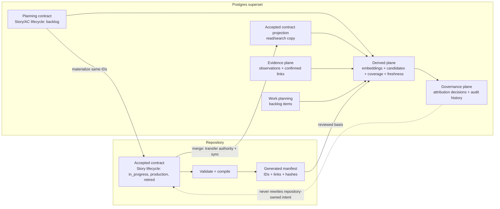
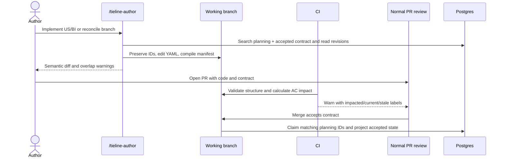
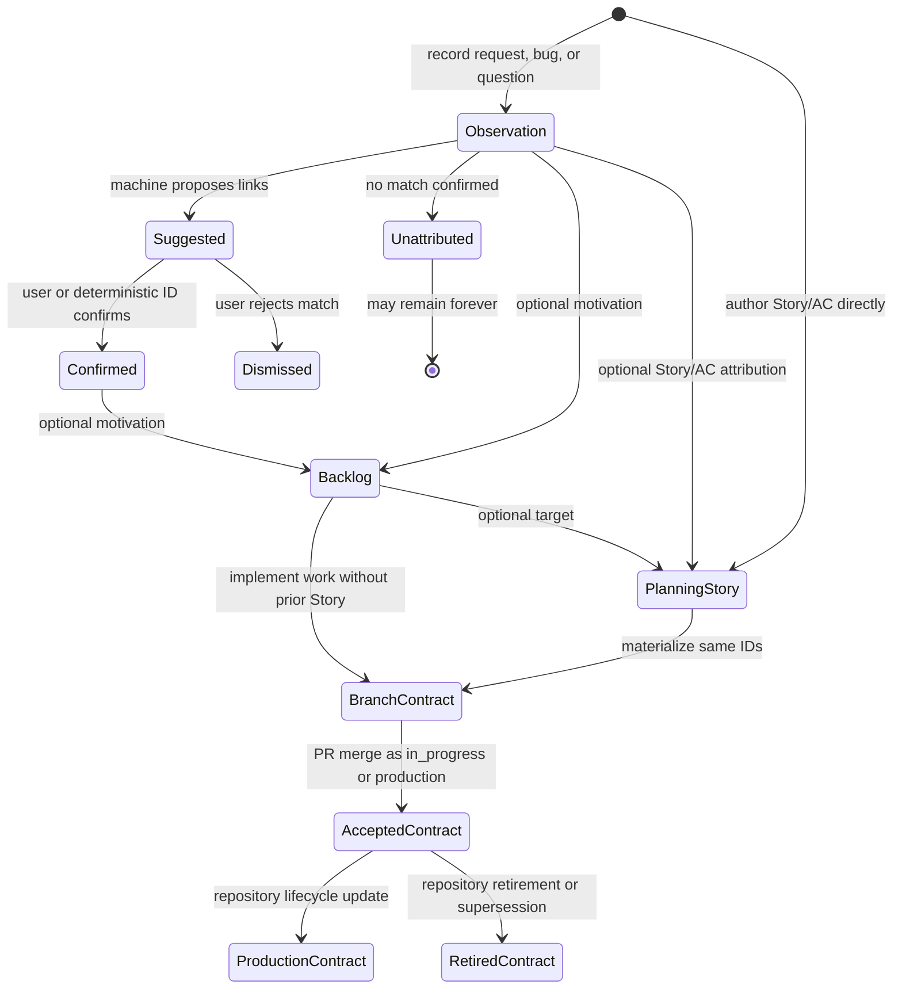
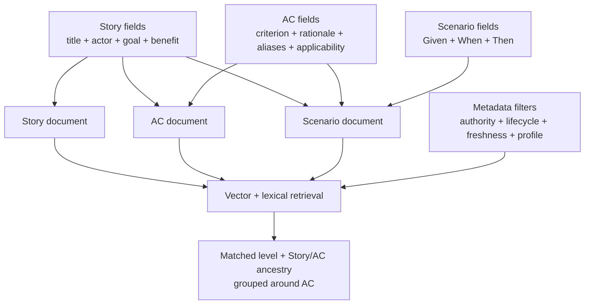

# Tieline Living Contract and Organization-Wide Semantic Graph - Plan

**Product Contract preservation:** Product Contract changed: A1–A5, R1–R15, F1–F5, and AE1–AE12. The source of truth, vocabulary, Story lifecycle, evidence intake, governance, and compatibility posture were redefined through session-settled discussion after the 2026-07-27 draft.

## Goal Capsule

- **Objective:** Make Tieline the shared semantic contract for how the business and product work, grounded in code but useful to engineering, support, product, sales, and agents.
- **Authority:** A Story and its ACs are Postgres-managed while their lifecycle is `backlog`. Merge transfers the same stable IDs to repository authority for `in_progress`, `production`, and `retired`.
- **Primary anchor:** Acceptance Criteria (AC) connect product intent to code, tests, help content, observations, and requested changes.
- **Change control:** A branch or open pull request is a proposed contract change. Normal pull-request review and merge accept it.
- **Verification posture:** Structural validation can fail. Semantic impact is warn-only in the MVP. Test execution receipts are deferred.

---

## Product Contract

### Summary

Tieline will use one User Story and Acceptance Criterion model across planning and delivery. Postgres owns Stories and ACs while they are in the `backlog` lifecycle. A pull-request merge transfers the same stable IDs to repository-owned YAML for `in_progress`, `production`, and `retired`, after which Postgres is a read/search projection rather than a second writer.

Postgres also holds observations, optional Backlog Items, search indexes, and machine-maintained relationships. A Backlog Item tracks work that may create or change one or more Stories or ACs; it is not a second representation of a Story.

### Problem Frame

Tieline currently maps user stories to code and help content, but its accepted product meaning is stored primarily in Postgres. The local authoring path uses JSON shards, a separate review state, an import step, and another database approval lifecycle. Those layers make it difficult to answer which representation is authoritative and allow contract changes to land separately from the code they describe.

The current feature-request model also requires a request to identify a primary story. That assumption fails when the request describes unbuilt work, when the relevant definition does not exist, or when one signal spans several possible behaviors. It also conflates raw evidence, possible work, and accepted behavior.

The target system needs distinct planning and accepted authorities without inventing different product vocabulary for each stage. A Story remains a Story while it moves from ideation to delivery. Its lifecycle determines the current writer: Postgres during `backlog`, then the repository after merge.

Postgres must also preserve original organizational evidence and work records that may never belong in a repository. Machine matching should connect those records to Stories and ACs while preserving authority and lifecycle labels.

Duplicate phrasing is expected in raw inputs and possible during authoring. Tieline must help consolidate equivalent contract definitions without deleting raw observations or allowing a similarity score to rewrite accepted intent.

### Actors

- A1. A maintainer or developer authors and reviews code-backed semantic definitions with the code they describe.
- A2. A support, product, sales, or operations user records a request, bug, or question without editing a repository.
- A3. An agent searches the graph, drafts contract changes, and proposes links while preserving authority boundaries.
- A4. CI validates contract structure and reports the acceptance criteria affected by a code or contract diff.
- A5. An MCP consumer retrieves current behavior, planning context, evidence, or all of them through an explicit retrieval profile.

### Requirements

#### Contract and vocabulary

- R1. Accepted code-backed contract records must live as strict YAML under `.tieline/spec/`, and the version on `main` is the accepted definition.
- R2. The contract hierarchy must be Capability → User Story → Acceptance Criterion → optional Scenario/Example, and every accepted user story must contain at least one AC.
- R3. An accepted User Story must store title, actor, goal, and benefit separately so clients can render `As a … I want … so that …`, while each accepted AC must state one observable outcome as `<subject> must <outcome> [when <condition>]`.
- R4. Contract records must have stable IDs, aliases, optional applicability, and explicit supersession so equivalent phrasing can converge without recycling identity.
- R5. Code, test, help, bug, request, and question links must target the most specific known AC; a story-level link remains a coarse fallback or shared entry point.
- R6. Tieline must report implementation-link, test-link, and help-link coverage as `none`, `partial`, or `complete`, separately from freshness.
- R15. A Story and its ACs must keep the same stable IDs and semantic fields when their lifecycle moves from Postgres-managed `backlog` to repository-managed `in_progress`, `production`, or `retired`.

#### Evidence and planning

- R7. An observation must be an append-only request, bug, or question under normal write APIs, with a common envelope and schema-versioned payload; it may remain unattributed forever.
- R8. A Backlog Item must represent optional consolidated work with stage `open`, `planned`, `in_progress`, `done`, or `declined`, and it may target zero or more Stories or ACs without becoming their lifecycle container.
- R9. Tieline must store an observation before matching it, and must search Stories, ACs, Backlog Items, and similar observations before creating a planning record or suggesting an attribution with state `suggested`, `confirmed`, or `dismissed`.

#### Authoring and governance

- R10. A manually invoked semantic-authoring workflow, exposed as an MCP prompt and bundled skill, must create or edit planning Stories, ACs, and Backlog Items in Postgres, reconcile the current branch, and materialize selected planning records into repository YAML with their stable IDs preserved.
- R11. Normal pull-request review and merge must be the semantic approval boundary, with no separate semantic approver, tied owner, or proposal entity.
- R12. A pull-request check must identify impacted ACs and report their separate `current` or `stale` freshness without blocking merge when the semantic mapping was not refreshed.

#### Projection and retrieval

- R13. Postgres must hold planning Stories and ACs plus a one-way projection of repository-owned contract records, and must support versioned retrieval profiles plus explicit narrowing filters that preserve authority and lifecycle labels.
- R14. Tieline must report mapped and unmapped repository surface against configured source roots and exclusions so the path to 100% mapping coverage has an explicit denominator.

### Key Flows

- F1. **Reconcile a branch:** A maintainer invokes `/tieline-author`; the skill searches repository-owned and planning definitions, edits YAML, validates it, compiles the manifest, and summarizes the semantic diff before the PR is opened.
- F2. **Capture an observation:** A user or automation records a request, bug, or question; Tieline stores it first, then returns suggested Story, AC, Backlog Item, and similar-observation matches.
- F3. **Plan and implement work:** A user may start with a planning Story/AC, a Backlog Item, an Observation, or a branch change; `/tieline-author implement …` searches for overlap and writes the selected Story/AC IDs into repository YAML.
- F4. **Review and synchronize:** CI validates the contract, warns about affected ACs, and allows normal review to decide the PR; merge accepts the repository contract, transfers matching planning IDs to repository authority, and triggers an idempotent Postgres projection.
- F5. **Retrieve with intent:** A caller selects a retrieval profile and optional filters; Tieline returns the applied profile version, authority, Story lifecycle or Backlog Item stage, attribution state, coverage, and freshness for every result.

### Acceptance Examples

- AE1. A planning Story and AC created in Postgres appear after merge as repository-owned projections with the same stable IDs, one implementation link, one custom-script test link, and complete implementation-link and test-link coverage.
- AE2. When an author phrases an existing AC differently, `/tieline-author` presents the existing AC as a likely equivalent and lets the author reuse its ID or add an alias instead of silently creating a duplicate.
- AE3. A bug ticket with no known product definition is stored successfully as an unattributed observation and remains searchable.
- AE4. Three observations may motivate one Backlog Item, while one of those observations may also be confirmed against an existing planning or repository-owned AC.
- AE5. `/tieline-author implement US-014` can materialize a Postgres-managed Story and its ACs into YAML without changing their IDs; any linked Backlog Items and observations remain DB records after merge.
- AE6. A PR that changes `src/contract/manifest.ts` reports every directly linked AC as impacted and shows its freshness; the check exits successfully even when the committed manifest was not refreshed.
- AE7. After that unrefreshed change merges, repository sync projects the AC as stale until a later PR updates its reviewed content basis.
- AE8. A test implemented by `scripts/test-tieline.ts` is a valid test locator with `framework_hint: custom-script`; Vitest or Playwright is not required.
- AE9. The `support` profile excludes planning Stories, Backlog Items, and unconfirmed attributions, while the `discovery` profile can return them with explicit authority and lifecycle labels.
- AE10. A configured source root with ten eligible files, eight referenced by accepted Story or AC links, and two unreferenced files reports 80% mapping coverage and names both gaps; a root with no eligible files reports coverage as unmeasured rather than 100%.
- AE11. Recording an unattributed bug succeeds before matching runs, then returns suggested planning or repository-owned ACs, Backlog Items, and similar observations without auto-confirming a semantic-only match.
- AE12. Story, AC, and Scenario embedding documents can all match a query; each result identifies the matched level and returns its Story/AC ancestry without embedding lifecycle or authority labels into the semantic text.

### Key Product Decisions

- KD1. The product uses four explicit planes: Contract, Evidence, Derived, and Governance. Contract records may be planning- or repository-owned, but evidence and derived data cannot silently rewrite repository-owned intent. Governs R1, R7–R15. (session-settled: user-approved — chosen over a single undifferentiated graph: the same graph needs different authority rules for accepted behavior, raw signals, machine output, and decisions)
- KD2. Agile-familiar Capability, User Story, AC, and Scenario terms replace generic Statement or Behavior entities. AC is the primary graph anchor. Governs R2–R6, R14. (session-settled: user-directed — chosen over a flat statement model: familiar product language makes the contract usable outside engineering)
- KD3. Feature requests are observations, possible work is an optional Backlog Item, and desired behavior is expressed with the same Story/AC model in every lifecycle. There is no top-level Idea, Candidate Story, or persistent Proposal entity. Governs R2, R7–R10, R15. (session-settled: user-approved — chosen over separate idea, candidate-story, and proposal schemas: lifecycle and authority distinguish planning from accepted behavior without changing product vocabulary)
- KD4. Raw observations are never destructively consolidated. Contract duplicates converge through aliases or supersession, and backlog duplicates converge through an auditable successor link. Governs R4, R7–R9. (session-settled: user-approved — chosen over automatic semantic merging: similarity is evidence for a decision, not authority to erase identity)
- KD5. The PR itself is the proposal and merge is semantic approval. No additional semantic approval step or owner routing exists in the MVP. Governs R1, R10–R12, R15. (session-settled: user-directed — chosen over a database proposal queue and dedicated approver role: intent and implementation should be accepted in one review boundary)
- KD6. Semantic impact is warn-only in the MVP. A change may merge and deploy with stale mappings, but Tieline must label that state. Governs R12. (session-settled: user-directed — chosen over a blocking ratchet: the project needs visibility before it has enough operating history to justify enforcement)
- KD7. Test links are framework-agnostic evidence locators, not proof that a test passed. Execution receipts, CI-result ingestion, mutation testing, and verification grades are deferred. Governs R5, R6. (session-settled: user-directed — chosen over test-run receipts in the MVP: durable linkage is valuable without coupling the core model to test infrastructure)
- KD8. Retrieval views are configurable, versioned profiles plus explicit narrowing filters. A profile is not an authorization mechanism. Governs R13. (session-settled: user-approved — chosen over prompt-only filtering or one hard-coded production view: callers need different safe scopes without hiding state)
- KD9. Story lifecycle controls semantic authority: `backlog` is Postgres-managed, while `in_progress`, `production`, and `retired` are repository-managed after PR merge. Governs R1–R4, R10, R13, R15. (session-settled: user-directed — chosen over different candidate and accepted Story entities: the Story and its ACs should preserve identity and familiar Agile structure across ideation and delivery)

### Scope Boundaries

#### In Scope

- The complete contract, evidence, matching, governance, and retrieval loop described by R1–R15.
- A clean database baseline and removal of the pre-release compatibility layers that conflict with the new authority model.
- A manually invoked authoring skill and MCP write tools for planning Stories/ACs, observations, Backlog Items, and attribution decisions.
- Deterministic structural validation, manifest compilation, impact detection, and one-way repository synchronization.
- Initial self-hosting examples and documentation for this repository.

#### Deferred to Follow-Up Work

- Test execution receipts, CI test-result ingestion, mutation testing, verification grades, and pass/fail history.
- Vitest, Playwright, pytest, or other framework adapters beyond the generic locator contract.
- Automatic authoring triggers, scheduled semantic sweeps, automatic PR edits, and a blocking semantic gate.
- Human owner routing, dual approval, semantic-review dashboards, and deployment approval integration.
- Production telemetry, error-monitoring, ticket-system, and help-center connectors; the MVP supplies the generic observation/write contracts they will call.
- Bidirectional synchronization with an external project-management system.
- A general applicability expression language; the MVP uses string-array dimensions.

#### Outside This Product’s Identity

- Tieline is not a test runner, ticketing system, deployment gate, or project-management replacement.
- Tieline does not infer that merged code is deployed; Story `lifecycle` remains explicit contract metadata.
- Tieline does not allow an embedding score or a planning-authority MCP write to change repository-owned intent.

### Success Criteria

- An agent or person can find accepted behavior, its AC, implementing code, linked tests, and relevant help without treating backlog ideas as production behavior.
- A request, bug, or question can be captured before any matching Story, AC, or Backlog Item exists.
- A Story and its ACs can be shaped in Postgres and retain their stable IDs when merge transfers them to repository authority.
- The authoring flow detects likely overlap before creating accepted contract records and preserves aliases or supersession when records are consolidated.
- Every accepted Story has at least one AC, and link coverage is measurable without calling a linked test “verified.”
- Configured source roots have a reproducible mapping-coverage percentage and an explicit list of unmapped files.
- A code diff produces a deterministic, AC-level impact report without database access or a model call.
- Repository synchronization is repeatable and cannot overwrite original observations, Backlog Items, or planning revision history.

---

## Planning Contract

### Key Technical Decisions

- KTD1. Parse human-authored YAML with the `yaml` package into Zod discriminated unions, then validate cross-file IDs, links, aliases, applicability, and supersession in a second pass. Governs R1–R5. (session-settled: user-directed — chosen over JSON authoring: YAML is easier for people to review in a code diff)
- KTD2. Replace the migration chain with one `migrations/0001_baseline.sql` and require existing pre-baseline databases to be recreated. Do not add upgrade SQL, dual reads, or compatibility aliases. Governs R7–R13, R15. (session-settled: user-directed — chosen over additive migrations: this pre-user OSS stage is the cheapest point to establish a coherent baseline)
- KTD3. Enforce source ownership with separate domain ports, row authority, and technical database roles. Planning writers may mutate only `backlog` Stories/ACs, observations, Backlog Items, and attribution decisions; repository sync may claim matching planning IDs and write repository-owned projections; readers cannot mutate either; an admin connection remains outside the MCP server. Governs R11, R13, R15.
- KTD4. Compile `.tieline/manifest.json` as a deterministic lockfile containing contract IDs, link locators, contract hashes, and reviewed content hashes. CI compares the committed lockfile with the branch without accepting new hashes on its own. Governs R1, R5, R6, R12, R14.
- KTD5. Implement `/tieline-author` as the only MVP semantic-authoring workflow. It edits planning Stories/ACs and Backlog Items through MCP, materializes planning IDs into YAML, or reconciles YAML directly on a branch; it does not create a second draft or approval store. Governs R9–R11, R15. (session-settled: user-directed — chosen over automatic authoring and a `.tieline/drafts` lifecycle: a manual skill is sufficient while the contract and matcher stabilize)
- KTD6. Represent code and test evidence with one locator shape: repository key, repo-relative path, optional selector, and optional framework hint. Link relation supplies the meaning. Governs R5, R6. (session-settled: user-approved — chosen over framework-specific schemas: custom scripts and future adapters must share the same core contract)
- KTD7. Persist match suggestions in typed attribution tables and keep them `suggested` until an explicit decision. Observation intake commits before matching; planning Story and Backlog creation run match-before-create. Trusted exact-ID or source-mapping auto-confirmation is deferred beyond the MVP. Governs R9.
- KTD8. Seed `support`, `engineering`, `discovery`, and `all` as versioned rows in `retrieval_profiles`; `tieline profile put` creates an audited version through the admin connection, and query code applies the selected profile before caller filters. Governs R13.
- KTD9. Remove unrestricted and repository-owned Story mutation tools, story-change proposal tools, approval roles, specialized feature-request tools, and JSON draft/review/import commands. Replace them with lifecycle-aware planning Story/AC writes and the branch/PR handoff. Governs R1, R7–R13, R15.
- KTD10. Generate separate derived embedding documents for each Story, AC, and Scenario. Child documents include compact parent context; lifecycle, authority, IDs, freshness, coverage, and locators remain filter or lexical metadata; source-text hashes and embedding-model versions control regeneration. Governs R9, R13. (session-settled: user-approved — chosen over one aggregate Story embedding: focused documents preserve retrieval specificity and avoid re-embedding unrelated criteria)
- KTD11. Materialization records the planning record ID and revision in repository metadata. Repository sync claims an existing planning row only when that origin matches; an unproven stable-ID collision fails atomically. Merge makes repository content authoritative even if the planning row changed while the PR was open; synchronization preserves revision history and surfaces a handoff conflict instead of silently discarding the later planning edit. Governs R11, R15.

### Authority Matrix

| Record | Canonical location | Write path | Rebuildable from repo |
|---|---|---|---|
| Planning Story, AC, Scenario (`lifecycle=backlog`) | Postgres | MCP/API or `/tieline-author` | No |
| Accepted Capability, Story, AC, Scenario, applicability | `.tieline/spec/**/*.yaml` | Branch + PR | Yes |
| Accepted code, test, and help links | `.tieline/spec/**/*.yaml` | Branch + PR | Yes |
| Manifest and reviewed content hashes | `.tieline/manifest.json` | `/tieline-author` or contract compiler | Yes |
| Accepted contract search projection | Postgres | Repository sync only | Yes |
| Observation | Postgres | MCP/API/connector; privileged retention override | No |
| Backlog Item | Postgres | MCP/API/connector | No |
| Attribution decision | Postgres | MCP/API/authorized automation | No |
| Embedding document, candidate match, coverage, freshness | Postgres or local computation | Derived jobs | Yes |
| Retrieval profile | Postgres, seeded by baseline | `tieline profile put` through admin connection | No |

### Contract Shape

The Story and AC semantic fields are shared across Postgres planning records and repository YAML. Repository YAML is the strict accepted form. This example demonstrates the agreed language and link granularity against code that exists in the current repository. If the legacy shard-merging feature is removed by U5, U10 must not commit this example as a production Story.

```yaml
version: 1
capability:
  key: TIELINE-AUTHORING
  name: Semantic authoring
  description: Maintainers can build and maintain the product contract with the code.
stories:
  - key: TIELINE-MERGE-001
    title: Merge area drafts safely
    actor: maintainer
    goal: merge independently authored areas into one reviewable result
    benefit: parallel mapping work does not lose or corrupt human decisions
    lifecycle: production
    aliases:
      - combine mapping shards
    acceptance_criteria:
      - key: TIELINE-MERGE-001-AC1
        criterion: Tieline must namespace shard-local review IDs when drafts are merged.
        rationale: Identical local IDs must not collide during import.
        links:
          - relation: implements
            target:
              kind: code
              repository: tieline
              path: src/tieline/merge.ts
              selector: shardReviewId
          - relation: tests
            target:
              kind: test
              repository: tieline
              path: scripts/test-tieline.ts
              selector: merge namespaces shard review ids so two shards can both mint d-0001
              framework_hint: custom-script
      - key: TIELINE-MERGE-001-AC2
        criterion: Tieline must preserve existing review decisions and comments when unchanged drafts are merged again.
        links:
          - relation: tests
            target:
              kind: test
              repository: tieline
              path: scripts/test-tieline.ts
              selector: re-merging preserves human review decisions and is idempotent
              framework_hint: custom-script
      - key: TIELINE-MERGE-001-AC3
        criterion: Tieline must require an explicit prune choice before removing reviewed stories that are absent from current shards.
        links:
          - relation: tests
            target:
              kind: test
              repository: tieline
              path: scripts/test-tieline.ts
              selector: merge refuses to silently drop reviewed stories without --prune
              framework_hint: custom-script
      - key: TIELINE-MERGE-001-AC4
        criterion: Tieline must reject conflicting definitions of the same section across shards.
        links:
          - relation: tests
            target:
              kind: test
              repository: tieline
              path: scripts/test-tieline.ts
              selector: merge rejects conflicting section definitions across shards
              framework_hint: custom-script
```

| YAML record | Required fields | Optional fields |
|---|---|---|
| Capability | `key`, `name`, `description`, `stories` | `aliases`, `applies_to`, `supersedes` |
| User Story | `key`, `title`, `actor`, `goal`, `benefit`, `lifecycle`, `acceptance_criteria` | `aliases`, `applies_to`, `motivated_by`, `links`, `supersedes`, `planning_origin` |
| Acceptance Criterion | `key`, `criterion` | `rationale`, `aliases`, `applies_to`, `scenarios`, `links`, `supersedes` |
| Scenario | `given`, `when`, `then` | `name` |
| Link | `relation`, discriminated `target` | Locator fields allowed by the target kind |

`lifecycle` is `backlog`, `in_progress`, `production`, or `retired`. Postgres planning records use `backlog`; accepted YAML rejects that value and uses one of the repository-managed states. Planning Stories may omit actor, goal, benefit, or ACs while they are being shaped, but materialization must satisfy the accepted YAML requirements before a PR can merge. `planning_origin` is optional for repository-native Stories and required when YAML is intended to claim an existing planning record. ACs inherit their parent Story’s lifecycle and authority.

Clients render the structured Story fields as `As a <actor>, I want <goal>, so that <benefit>`. The database and YAML keep `actor`, `goal`, and `benefit` as semantic fields rather than storing English grammar fragments as column names.

A Backlog Item remains a separate optional work record. It may target planning or repository-owned Stories and ACs, but it is never serialized into contract YAML. `applies_to` is a map of organization-defined string keys to string arrays; dimensions combine with AND and values within one dimension combine with OR. An omitted applicability map means general applicability.

Authority transfer is one-way in the MVP. Returning work to planning changes a linked Backlog Item’s stage; it does not make a merged Story DB-writable again. Withdrawing accepted behavior requires a repository PR that retires or supersedes the Story or AC.

Code and test targets use repository, repo-relative path, and optional selector; tests also accept an optional framework hint. Help targets use source plus external ID and may include a URL snapshot. A missing help article does not invalidate the contract link; synchronization stores the locator and hydrates article content when it becomes available.

AC phrasing borrows only the useful constraints from NASA-style requirements guidance: one subject, one observable outcome, consistent terminology, unique identity, and separate rationale. Tieline uses Agile-familiar `must`, not NASA’s `shall`, and optional Given/When/Then scenarios when an example adds clarity.

### High-Level Technical Design

#### Four-plane architecture



#### Branch authoring and PR acceptance



#### Evidence and planning lifecycle



#### Hierarchical retrieval documents



### Data Model Boundaries

- Contract tables are `capabilities`, `user_stories`, `acceptance_criteria`, `scenarios`, typed alias tables, `code_assets`, `story_code_assets`, `criterion_code_assets`, `help_articles`, `story_help_articles`, and `criterion_help_articles`.
- Contract natural identity is `(repository_id, stable_id)`. A planning Story chooses its intended contract repository before receiving stable Story/AC IDs; unassigned possible work remains a Backlog Item.
- `user_stories` stores title, actor, goal, benefit, lifecycle, source authority, optimistic revision, optional applicability, and planning-origin metadata. Rendered Agile story text is derived.
- `acceptance_criteria` stores stable ID, criterion, optional rationale, optional applicability, order, and the parent Story’s source authority. Scenario rows are children of an AC.
- Planning Stories may have incomplete semantic fields and zero ACs. Repository synchronization accepts only structurally complete Stories and atomically changes matching Story/AC rows from planning to repository authority.
- Planning Story and AC revisions remain in audit history after authority transfer. Repository sync claims a planning record only when `planning_origin` identifies it; the same stable ID without a valid origin is an atomic collision rather than an implicit claim. A later planning revision that diverges from the revision materialized into a merged PR produces a visible handoff-conflict event while the merged repository content still wins.
- Story-level asset links are coarse fallback links. Only direct AC links count toward AC-level coverage.
- Asset links use `implements`, `enforces`, `tests`, or `documents`. Observation attributions use `violates`, `requests_change`, `asks_about`, or `supports`.
- `observations` stores `id`, `kind`, `schema_key`, `schema_version`, `summary`, `source`, optional `external_id` and `external_url`, `observed_at`, `recorded_at`, `payload jsonb`, and optional `supersedes_observation_id`.
- A partial unique constraint on `(source, external_id)` makes sourced observation intake idempotent. A privileged retention path may redact or delete protected payload data while leaving a non-sensitive tombstone; this exception is unavailable to normal MCP writers.
- `backlog_items` stores stable key, title, summary, stage, revision, timestamps, and optional `superseded_by`. It is a work record rather than a Story lifecycle table.
- Typed observation-to-Story, observation-to-AC, and observation-to-Backlog tables store `suggested`, `confirmed`, or `dismissed`, plus method, confidence, and audit metadata.
- Typed Backlog-to-Story and Backlog-to-AC tables preserve implementation lineage after repository sync.
- Repository sync records `motivated_by` links but never advances a Backlog Item stage; a person or authorized automation changes planning stage through MCP.
- `embedding_documents` stores entity kind, entity ID, source-text hash, embedding model/version, vector, matched-level metadata, and filter metadata. Story documents contain title plus rendered actor/goal/benefit; AC documents add compact Story context; Scenario documents add compact Story and AC context. A remote embedding provider receives only canonical document text, sanitized observation search text, or an explicit caller query plus provider-required identifiers; raw payloads, external URLs, audit fields, and retrieval metadata stay local. Configuration and README guidance must make this egress boundary explicit.
- Coverage and freshness are derived. They do not become mutable truth columns on accepted contract records.

### Coverage and Freshness Semantics

- **Implementation-link coverage:** `none` when no AC has a direct `implements` or `enforces` link, `complete` when every AC has one, and `partial` otherwise.
- **Test-link coverage:** `none` when no AC has a direct `tests` link, `complete` when every AC has one, and `partial` otherwise.
- **Help-link coverage:** `none` when no AC has a direct `documents` link, `complete` when every AC has one, and `partial` otherwise.
- **Impacted:** a transient PR flag that means the current diff touches a locator linked to the AC; it is independent of freshness.
- **Current:** the committed manifest’s reviewed content hash matches every linked repository artifact.
- **Stale:** at least one linked artifact in the evaluated checkout differs from its reviewed content hash; after merge, Postgres exposes that same freshness against `main`.
- **Contradicted:** reserved for future evidence that demonstrates a behavioral conflict; the MVP does not infer this state from a changed file or failing test.

### Retrieval Profiles

- `support`: repository-backed Stories and ACs with `lifecycle=production`, confirmed evidence, and explicit freshness labels.
- `engineering`: repository-backed contract records in every accepted lifecycle, their evidence links, and impact/freshness data.
- `discovery`: planning and repository-backed contract records, Backlog Items, observations, and suggested attributions with visible authority and lifecycle labels.
- `all`: every record allowed by authorization, without lifecycle exclusions.

Explicit filters narrow the selected profile. They cannot broaden it. A caller that needs a broader corpus selects a broader profile. Every semantic-search response identifies the applied profile key and version; results expose authority, Story lifecycle or Backlog Item stage, attribution state when applicable, coverage, and freshness.

Cross-type `search_knowledge` requires an explicit profile, while `find_related` defaults to `engineering`. Exact contract and help lookups do not use retrieval profiles; they report their explicit filters and return only their typed record surface.

### Mapping Coverage

- Eligible repository surface is the set of files under configured source roots after explicit exclusions.
- A file is mapped when an accepted Story or AC has a direct repository locator for it.
- Mapping coverage is mapped eligible files divided by all eligible files; reports always include the unmapped paths.
- AC link coverage and repository mapping coverage are separate. Reaching 100% path coverage does not claim that every runtime behavior is correct or fully described.

---

## Implementation Units

Units are listed in dependency order. U5 follows U6 and U7 because the
authoring workflow composes the evidence and matching surfaces they establish.

| Unit | Outcome | Key files | Depends on |
|---|---|---|---|
| U1 | Shared Story/AC model and accepted YAML validation | `src/contract/`, `src/types.ts` | — |
| U2 | Clean Postgres baseline and lifecycle-aware authority roles | `migrations/0001_baseline.sql`, `src/adapters/postgres/connections.ts` | U1 |
| U3 | Manifest compiler, authority handoff, and repository synchronization | `src/contract/manifest.ts`, `src/contract/sync.ts` | U1, U2 |
| U4 | AC-centered domain model and read/query surfaces | `src/domain/`, `src/adapters/postgres/` | U2, U3 |
| U6 | Observation, Backlog Item, and attribution write surfaces | `src/tools/observations.ts`, `src/tools/backlog-items.ts` | U2 |
| U7 | Hierarchical embeddings, matching, and consolidation | `src/embeddings.ts`, `src/ranking.ts` | U4, U6 |
| U5 | Lifecycle-aware semantic-authoring skill and legacy authoring removal | `skills/tieline-author/`, `src/tieline/` | U1–U4, U6, U7 |
| U8 | Warn-only impact and freshness check | `src/contract/impact.ts`, `src/commands/check.ts` | U3, U4 |
| U9 | Retrieval profiles and organization-wide search | `src/tools/search-knowledge.ts`, `src/adapters/postgres/profile-repository.ts` | U4–U7 |
| U10 | Self-hosting contract, end-to-end cleanup, and documentation | `.tieline/spec/`, `README.md` | U5–U9 |

### U1. Define the shared Story/AC model and validate accepted YAML

**Goal:** Establish one Story/AC semantic model across planning and accepted lifecycles, with strict repository validation.

**Requirements:** R1–R6, R14, R15; KTD1, KTD6.

**Flows and examples:** F1; AE1, AE2, AE8, AE10.

**Dependencies:** None.

**Files:** Create `src/contract/schema.ts`, `src/contract/load.ts`, `src/contract/validate.ts`, `src/contract/coverage.ts`, `src/contract/index.ts`, and `scripts/test-contract.ts`. Modify `package.json` and `src/types.ts`.

**Approach:** Define shared domain schemas for Story, AC, and Scenario, then add the YAML dependency and accepted-contract Zod schemas for Capability, applicability, aliases, supersession, motivation pointers, and discriminated link locators. Keep title, actor, goal, and benefit as semantic fields and derive the familiar Agile sentence for display. Run cross-file validation after parsing so IDs and relation targets are globally unique and resolvable. Accepted YAML permits `in_progress`, `production`, or `retired`, requires one-or-more ACs, and enforces the `must` criterion form; the planning variant permits `backlog` and incomplete fields. Emit normalized-text duplicate warnings separately from structural errors; semantic matching remains in U7.

**Test scenarios:**

- Parse the merge-shards example and preserve scalar, array, and locator values.
- Render `actor`, `goal`, and `benefit` as a conventional `As a … I want … so that …` sentence without storing the grammar fragments.
- Accept an incomplete planning Story with `lifecycle=backlog` through the shared domain schema.
- Reject repository YAML with `lifecycle=backlog`, a missing actor/goal/benefit, or no AC.
- Reject duplicate IDs, broken supersession targets, absolute paths, escaping paths, and relation/target-kind mismatches.
- Accept a custom-script test locator with no Vitest or Playwright metadata.
- Accept a help locator whose article has not yet been ingested.
- Warn, but do not fail, when two ACs normalize to the same criterion text under different IDs.

**Verification:** The parser produces a stable typed contract, structural failures are actionable, and overlap warnings do not mutate the input.

### U2. Replace the database migration chain with one lifecycle-aware baseline

**Goal:** Create a coherent schema for planning and repository-owned contract rows plus the evidence, derived, and governance planes.

**Requirements:** R7–R9, R11, R13, R15; KTD2, KTD3, KTD7, KTD8, KTD10, KTD11.

**Flows and examples:** F2, F4, F5; AE1, AE3, AE4, AE9.

**Dependencies:** U1.

**Files:** Replace `migrations/0001_extensions.sql` through `migrations/0018_explicit_repository_identity.sql` with `migrations/0001_baseline.sql`. Create `scripts/integration-baseline.ts` and `scripts/test-baseline.ts`. Modify `src/config.ts`, `src/cli.ts`, `src/tieline/setup.ts`, `src/tieline/profile.ts`, `src/tieline/preflight.ts`, `src/adapters/postgres/connections.ts`, `src/commands/migrate.ts`, and `scripts/integration.ts`. Remove `src/db.ts` and `scripts/integration-approval-mode.ts`.

**Approach:** Build the typed tables named in Data Model Boundaries, contract revision history, repository-sync metadata, derived embedding documents, attribution audit fields, and versioned retrieval profiles. Scope contract keys by intended repository and use typed alias/link tables with real foreign keys. Store source authority as protected metadata and enforce valid lifecycle combinations: planning writers may mutate only `backlog` Story/AC rows, while sync may claim those rows and maintain repository-owned projections. Standardize configuration on `DATABASE_URL` for reads, `DATABASE_URL_WRITE` for evidence and planning writes, `DATABASE_URL_SYNC` for authority transfer and contract projection, and `DATABASE_URL_ADMIN` for DDL, profile versions, and privileged retention. The MCP server never loads the admin URL. Grant normal readers access to a sanitized observation search view instead of raw payloads. Make migration bootstrap detect legacy migration history and stop with recreate instructions instead of dropping data automatically.

**Test scenarios:**

- Apply the baseline to a disposable Postgres-with-pgvector database, then prove a second migration run is a no-op.
- Reject a database that contains a legacy migration history with a clear recreate message.
- Create and revise an incomplete `backlog` Story and AC through the planning role.
- Prove the sync role can claim matching planning IDs and upsert contract projections but cannot write observations or Backlog Items.
- Prove the planning writer can append observations and edit `backlog` Stories/ACs and Backlog Items but cannot mutate repository-owned rows.
- Prove observations cannot be updated or deleted through the supported writer role.
- Prove a privileged retention operation can remove protected payload content without granting that capability to MCP writers.
- Keep all database credentials in the private workspace profile and out of repository configuration.
- Seed all four retrieval profiles with explicit versions.

**Verification:** A clean database exposes only the new baseline, lifecycle-aware roles enforce source ownership, and no semantic approver role remains.

### U3. Compile the manifest, transfer authority, and synchronize repository truth

**Goal:** Make the repository contract usable offline and transfer matching planning Story/AC identities to repository authority without losing DB-native history.

**Requirements:** R1, R4–R6, R12–R15; KTD3, KTD4, KTD11.

**Flows and examples:** F1, F4; AE1, AE6, AE7, AE10.

**Dependencies:** U1, U2.

**Files:** Create `src/contract/manifest.ts`, `src/contract/sync.ts`, `src/commands/contract.ts`, `src/adapters/postgres/contract-sync-repository.ts`, `scripts/test-manifest.ts`, `scripts/test-contract-command.ts`, and `scripts/integration-contract-sync.ts`. Modify `src/cli.ts` and `package.json`. Remove `src/adapters/postgres/import-repository.ts`.

**Approach:** Add `tieline contract validate`, `tieline contract compile`, `tieline contract coverage`, and `tieline contract sync`. Compile stable JSON ordering with schema version, repository identity, contract file hashes, stable IDs, planning-origin record IDs and revisions, relations, and linked-artifact hashes. Synchronize contract tables by repository and stable ID in one transaction. A matching planning row becomes repository-owned only when its origin metadata matches; otherwise sync fails with a collision instead of claiming unrelated planning work. If its planning revision advanced after materialization, the repository version still wins and sync records and returns a handoff-conflict event with both revisions. Use a per-repository sync checkpoint with an expected previous commit so a delayed job cannot overwrite a newer projection; a mismatched job aborts and only a job running against current `main` is retried. Mark repository-owned projections absent from the accepted source as retired or superseded; never hard-delete DB-native evidence, Backlog Items, or history and never update columns owned by another writer.

**Test scenarios:**

- Compile byte-identical manifests for unchanged YAML and repository content.
- Change an AC link and observe only its deterministic manifest entry change.
- Sync the same commit twice without duplicate rows or audit events.
- Materialize a planning Story and AC, then prove sync preserves their stable IDs while changing authority and lifecycle.
- Reject, without partial writes, a repository Story whose stable ID collides with a planning row but whose `planning_origin` does not identify that row.
- Advance the planning revision after materialization, merge the older reviewed YAML, and preserve the later revision in a handoff-conflict event while projecting the merged version.
- Return the handoff conflict from sync and expose it to the next status or authoring reconciliation instead of leaving it only in audit storage.
- Run newer and older sync jobs out of order and prove the older job cannot replace the newer projection.
- Remove a repository AC and preserve observations while retiring its projection.
- Fail sync atomically when a referenced contract ID cannot be resolved.
- Keep an unresolved help locator while leaving article content empty.
- Complete validate and compile without a database connection.

**Verification:** The manifest is deterministic, sync is idempotent, authority transfer preserves identity and history, and repository projection writes cannot alter unrelated DB-native data.

### U4. Make AC the primary read and graph anchor

**Goal:** Expose Stories, ACs, evidence locators, coverage, applicability, aliases, and supersession through the domain port and MCP reads.

**Requirements:** R2, R4–R6, R13, R15; KTD6.

**Flows and examples:** F1, F5; AE1, AE2, AE8, AE9.

**Dependencies:** U2, U3.

**Files:** Create `src/domain/contract-read-store.ts`, `src/domain/repository-sync-store.ts`, `src/adapters/postgres/contract-read-repository.ts`, and `scripts/test-contract-read.ts`. Modify `src/types.ts`, `src/schemas.ts`, `src/domain/knowledge-store.ts`, `src/domain/testing/fake-knowledge-store.ts`, `src/adapters/postgres/postgres-store.ts`, `src/tools/query_stories.ts`, `src/tools/find_related.ts`, `scripts/test-ranking.ts`, and `scripts/evaluate-retrieval.ts`. Remove the superseded `src/adapters/postgres/story-repository.ts`, `src/adapters/postgres/relationship-repository.ts`, and `src/tools/explore_graph.ts`.

**Approach:** Split the current broad `KnowledgeStore` boundary so read tools cannot obtain planning-write, evidence-write, or repository-sync capabilities. Replace rendered `story_text` as the storage contract with structured title, actor, goal, and benefit while retaining a rendered Agile form in results. Return planning and repository-owned AC records with authority and lifecycle labels plus their direct links. Compute story footprints as story-level links plus the union of child AC links. Compute coverage only for repository-owned direct AC links and freshness from the manifest basis.

**Test scenarios:**

- Fetch a planning or repository-owned Story and receive its lifecycle, authority, ordered ACs, aliases, effective applicability, direct links, fallback story links, and rendered Agile sentence.
- Compute `none`, `partial`, and `complete` coverage for mixed AC link sets.
- Keep a Story-level code link searchable without treating it as direct AC coverage.
- Traverse AC → test, AC → help, and superseded AC → successor in both the fake and Postgres stores.
- Preserve existing lexical, semantic, entity, and path ranking behavior for accepted Stories.

**Verification:** Read tools expose AC-centered graph data and do not use “verified” as a synonym for linked.

### U6. Generalize feature requests into observations and Backlog Items

**Goal:** Provide safe DB-native write paths for raw evidence and optional planning records.

**Requirements:** R7–R9, R13; KTD3, KTD7, KTD9.

**Flows and examples:** F2, F3; AE3, AE4, AE11.

**Dependencies:** U2.

**Files:** Create `src/domain/evidence-write-store.ts`, `src/tools/observations.ts`, `src/tools/backlog-items.ts`, `src/adapters/postgres/observation-repository.ts`, `src/adapters/postgres/backlog-repository.ts`, `scripts/test-evidence.ts`, and `scripts/integration-evidence.ts`. Modify `src/schemas.ts`, `src/server.ts`, `src/resources.ts`, `src/adapters/postgres/postgres-store.ts`, `scripts/smoke.ts`, and `scripts/integration.ts`. Remove `src/tools/feature_requests.ts` and `src/adapters/postgres/feature-request-repository.ts`.

**Approach:** Add MCP operations to record an observation, create or update a Backlog Item with optimistic revision, target Stories or ACs from a Backlog Item, and confirm or dismiss an attribution. Commit an observation before matching and expose the committed record to the orchestration added in U7, so a matcher failure cannot lose the signal. Expose a pre-create integration point for Backlog Items; U7 attaches match-before-create behavior, presents credible candidates, and requires an explicit continue choice when none is selected. Use `(source, external_id)` as an idempotency key when supplied. Bound summaries to 4,000 UTF-8 bytes and serialized payloads to 256 KiB. Build a sanitized `search_text` only from summary and payload fields allowlisted by the declared schema; remote embedding providers never receive the raw payload. Store external URLs as pointers without fetching them, and log observation IDs rather than payloads. Corrections append a new observation with an optional `supersedes_observation_id`; they never rewrite the original payload. Backlog consolidation sets `superseded_by` and preserves history. Any declared Backlog Item stage may move to another declared stage with optimistic revision and an audit event.

**Test scenarios:**

- Record an unattributed request, bug, and question with different schema-versioned payloads.
- Retry the same external source ID and return the existing observation without duplication.
- Append a correction that supersedes but does not modify the original observation.
- Reject direct self-supersession and cycles in observation or Backlog Item successor chains.
- Reject oversized observations and payload fields that are not valid for the declared schema version.
- Prove raw payload content is absent from search results, embedding requests, and application logs.
- Create a Backlog Item with zero observations and link multiple observations later.
- Link one observation to multiple Backlog Items.
- Target multiple planning or repository-owned Stories and ACs from one Backlog Item without copying their semantic fields.
- Accept movement between declared Backlog Item stages and reject unknown stages or stale revisions without partial writes.

**Verification:** Evidence intake never requires a Story, AC, or Backlog Item and preserves immutable source history.

### U7. Add hierarchical embeddings, machine matching, and auditable consolidation

**Goal:** Use focused semantic documents and graph signals to propose reuse and links before people create duplicate contract or planning records.

**Requirements:** R4, R7–R9, R13, R15; KTD7, KTD10.

**Flows and examples:** F1–F3; AE2–AE5, AE11, AE12.

**Dependencies:** U4, U6.

**Files:** Create `src/adapters/postgres/semantic-repository.ts`, `src/adapters/postgres/search-context.ts`, `src/derived/embedding-documents.ts`, `src/domain/semantic-search-store.ts`, `src/semantic-matching.ts`, `src/backlog-advisor.ts`, `src/tools/attributions.ts`, and `testdata/semantic-retrieval-eval.json`. Modify `src/ranking.ts`, `src/embeddings.ts`, `src/tools/find_related.ts`, `src/tools/search-knowledge.ts`, `scripts/test-embeddings.ts`, `scripts/test-ranking.ts`, `scripts/integration-evidence.ts`, and `scripts/evaluate-retrieval.ts`. Remove the superseded `src/adapters/postgres/search-repository.ts`.

**Approach:** Build deterministic Story, AC, and Scenario embedding text per KTD10. Retrieve candidates with vectors, lexical terms, entity/applicability overlap, aliases, shared artifacts, and graph proximity. Apply authority and lifecycle predicates as metadata filters rather than embedding them into natural-language text. Treat a remote embedding provider as an explicit data-egress boundary: send only canonical document text, sanitized observation search text, or the caller’s explicit query plus provider-required identifiers, and document that those semantic inputs leave the deployment when a remote provider is configured. Return the matched level and ancestry, then group child hits around AC as the primary behavioral anchor. Let `search_knowledge` accept optional typed Story, AC, Backlog Item, or Observation anchors plus code, test, or help artifacts; use them only to rerank the candidate set already authorized by the selected profile and filters. Bound graph traversal to three hops and include only structural, repository-declared, and confirmed attribution edges. Observation intake invokes matching after persistence; planning Story and Backlog creation invoke matching before the write and may continue without selecting a suggestion. Persist the method and score on suggestions. All machine matches remain suggestions until an explicit decision; trusted exact-ID and source-mapping auto-confirmation is deferred beyond the MVP. Provide separate actions to reuse an existing ID, add an alias, supersede a repository-owned contract record through a PR, or supersede a planning record in Postgres.

**Test scenarios:**

- Rank the correct existing AC in the top five for each paraphrased bug fixture and return the features that produced the match.
- Match a broad intent through the Story document, a specific outcome through its AC document, and an edge case through its Scenario document.
- Return Story and AC ancestry plus `matched_level` for an AC or Scenario hit, then collapse duplicate child hits without hiding the best match reason.
- Change one AC and regenerate its document and child Scenario documents without regenerating sibling ACs; change only lifecycle metadata and regenerate no embedding.
- Prove canonical embedding text excludes stable IDs, lifecycle, authority, freshness, coverage, and locators while preserving aliases, rationale, and applicability.
- Capture the exact remote-provider request and prove it excludes raw observation payloads, external URLs, audit fields, and retrieval metadata.
- Prefer an applicable AC over a semantically similar but inapplicable AC.
- Keep an exact AC ID supplied by a source as a suggestion until an explicit decision; defer trusted-source auto-confirmation.
- Never auto-confirm a semantic-only match, even above the evaluation threshold.
- Rerank close semantic candidates using explicit artifact overlap and a maximum of three confirmed graph hops.
- Give dismissed and suggested attributions zero graph proximity.
- Force a matcher error after an observation commit; the observation remains available for retry without duplication.
- Return credible candidates before creating a Backlog Item or planning Story, and require an explicit continue choice before insertion when none is selected.
- Keep dismissed suggestions out of subsequent default review queues while preserving their audit rows.
- Cluster duplicate observations without merging or deleting them.

**Verification:** Evaluation fixtures show useful candidate ordering at every semantic level, derived documents regenerate by source hash, and every persisted relationship has explicit provenance and state.

### U5. Replace draft/review/import authoring with lifecycle-aware `/tieline-author`

**Goal:** Let people shape Stories and ACs in Postgres, then use the working branch and PR as the only acceptance lifecycle.

**Requirements:** R9–R12, R14, R15; KTD5, KTD9, KTD11.

**Flows and examples:** F1, F3, F4; AE1, AE2, AE5, AE6.

**Dependencies:** U1–U4, U6, U7.

**Files:** Create `skills/tieline-author/SKILL.md`, its contract reference, `src/prompts.ts`, `src/domain/planning-contract-write-store.ts`, `src/tools/planning-stories.ts`, and `src/adapters/postgres/planning-story-repository.ts`. Modify `src/tieline/init.ts`, `src/tieline/workspace.ts`, `src/tieline/profile.ts`, `src/tieline/setup.ts`, `src/tieline/status.ts`, `src/schemas.ts`, `src/server.ts`, `src/resources.ts`, `src/cli.ts`, `scripts/test-tieline.ts`, `scripts/integration.ts`, and `README.md`. Remove or replace `skills/backfill-stories/`, `src/tieline/merge.ts`, `src/commands/review.ts`, `src/commands/import-stories.ts`, `src/authoring/schema.ts`, `src/authoring/import.ts`, `src/authoring/review-ui/`, `src/tools/create_user_story.ts`, `src/tools/update_user_story.ts`, `src/tools/story_change_proposals.ts`, and their obsolete tests.

**Approach:** Support four modes: create or edit a planning Story/AC, create or edit a Backlog Item, implement a planning Story or Backlog Item, and reconcile the current branch. Expose the workflow through both the bundled skill and a discoverable MCP prompt. Planning modes call U7 before creating a new record and write through lifecycle-aware MCP tools without modifying the worktree. Repository modes read configured descriptions and permitted local/website context, search local accepted YAML plus Postgres candidates when database-backed matching is configured, and disclose a local-only duplicate check when it is not. They preserve planning Story/AC IDs and source revisions when materializing, validate and compile canonical YAML, and print the semantic diff plus mapping-coverage delta. A reconciliation also surfaces unresolved handoff conflicts so the preserved later planning revision can be compared and intentionally carried into a new PR or superseded. Implementing a Backlog Item may reuse existing Stories/ACs, materialize a linked planning Story, or create a new Story/AC in the branch. Repository metadata records `motivated_by` IDs without copying observation or Backlog Item payloads. Init writes only shareable product context, source roots, paths, and runtime defaults to the repository; clone-local setup completion and credentials stay in the private profile. It leaves the spec empty until the authoring workflow derives repository-specific capabilities, surfaces detected source scope and preflight warnings, and writes a repository-relative MCP template without claiming that a host has connected it.

**Test scenarios:**

- Initialize a workspace with `.tieline/spec/` and no `.tieline/drafts/`, `stories.draft.json`, or review state.
- Initialize the same tracked workspace from a second clone-local config home and require independent runtime setup without mutating tracked config.
- Report configured source roots, preflight limitations, missing/complete local profile state, and configured/unconfigured matching and planning-write capabilities separately.
- Invoke `tieline_author` through MCP and receive the same context-aware, offline-capable authoring instructions as the bundled skill.
- Create and revise a `backlog` Story and its ACs through MCP without modifying the worktree.
- Reconcile a branch and produce valid YAML plus a deterministic manifest.
- Materialize a planning Story and AC into YAML with the same stable IDs and the planning revision recorded.
- Reconcile after a handoff conflict and show both the merged repository definition and the preserved later planning revision.
- Start from a Backlog Item with no Story, reuse a suggested existing AC or create a new Story/AC, and retain the Backlog Item as a separate DB record.
- Detect likely duplicate Stories or ACs before adding a new stable ID.
- Name newly mapped and still-unmapped files under each configured source root.
- Reject a planning-writer edit after merge transfers the Story to repository authority.
- Confirm no CLI or MCP path remains for unrestricted mutation of repository-owned Stories.

**Verification:** Planning authoring uses the shared Story/AC model, repository acceptance has one branch/PR lifecycle, and the old draft, import, proposal, and semantic-approval paths are unreachable.

### U8. Add warn-only AC impact and freshness checks

**Goal:** Report semantic drift at PR time without coupling CI to Postgres or a test framework.

**Requirements:** R5, R6, R12; KTD4, KTD6.

**Flows and examples:** F4; AE6, AE7.

**Dependencies:** U3, U4.

**Files:** Create `src/contract/impact.ts`, `src/commands/check.ts`, `scripts/test-impact.ts`, and a GitHub Actions example under `docs/examples/`. Modify `src/cli.ts`, `src/tieline/status.ts`, and `README.md`.

**Approach:** Add `tieline check --base <ref>`. Compare changed, renamed, and deleted paths with manifest locators and compare current content hashes with the reviewed basis. Report repository-owned AC IDs, Stories, relations, and reasons; Postgres-managed `backlog` records have no code freshness until materialized. Return success when semantic impact or staleness exists; return failure only when the YAML or manifest is structurally invalid and cannot be evaluated.

**Test scenarios:**

- A changed implementation path reports every directly linked AC as impacted.
- A renamed or deleted test path reports the correct AC and reason.
- Updating the manifest through the authoring flow makes the AC current while the PR still reports it as impacted.
- Merging without a refreshed manifest causes the next repository sync to project stale freshness.
- A planning Story that has not been materialized produces no code-impact or freshness claim.
- An unrelated file produces an empty impact report.
- Impact findings exit zero, while an unreadable manifest exits nonzero.

**Verification:** The check is deterministic, offline, framework-agnostic, and warn-only for semantic findings.

### U9. Add versioned retrieval profiles and cross-type semantic search

**Goal:** Let callers choose current production truth, engineering context, discovery material, or the full authorized graph.

**Requirements:** R6, R9, R13, R15; KTD8, KTD10.

**Flows and examples:** F2, F5; AE3, AE4, AE9.

**Dependencies:** U4, U6, U7.

**Files:** Create `src/tools/search-knowledge.ts`, `src/adapters/postgres/profile-repository.ts`, and `src/commands/profile.ts`. Modify `src/schemas.ts`, `src/server.ts`, `src/resources.ts`, `src/cli.ts`, `src/tools/query_stories.ts`, `src/tools/find_help.ts`, `scripts/evaluate-retrieval.ts`, `scripts/integration-evidence.ts`, and `scripts/smoke.ts`.

**Approach:** Resolve the requested profile and version before building search queries. Apply its authority, Story lifecycle, Backlog Item stage, observation, attribution, and freshness predicates in SQL before vector or lexical ranking. Apply explicit caller filters afterward as additional predicates. Accept optional typed retrieval context: one Observation, Backlog Item, Story, or AC anchor and up to 50 code, test, or help artifacts. Context only reranks the bounded candidate set that survives profile and caller filters; it does not broaden retrieval or mutate attribution state. Return heterogeneous results through a discriminated result schema with common state metadata, matched semantic level, Story/AC ancestry, and the artifact/graph ranking features. `tieline profile list` uses the read connection; `tieline profile put` validates a filter definition and atomically inserts a new active version through the admin connection while retaining prior versions.

**Test scenarios:**

- `support` returns accepted production ACs and confirmed evidence but no Backlog Items or suggestions.
- `engineering` returns repository-owned non-production contract records and stale labels but excludes Postgres-managed planning Stories by default.
- `discovery` returns planning Stories/ACs, Backlog Items, observations, and suggested attributions with explicit types, authority, and lifecycle.
- `search_knowledge` rejects an omitted profile instead of guessing the caller’s intent.
- An explicit filter narrows a profile and cannot re-include a record excluded by it.
- An unauthorized caller receives the same authorization boundary regardless of profile.
- Every response reports the applied profile key and version.
- Every result exposes artifact-overlap and confirmed graph-proximity features plus a typed anchor that can be reused as search context. The response does not claim that unresolved caller-supplied artifact locators were applied.
- An unknown context anchor fails explicitly, and a dismissed or suggested attribution contributes no graph proximity.
- A Scenario vector hit returns its parent AC and Story without allowing lifecycle metadata to affect semantic similarity.
- Publishing profile version 2 makes it active for new queries and leaves version 1 readable for audit.

**Verification:** Profile behavior is deterministic and state is visible in every cross-type search result.

### U10. Dogfood the contract and remove obsolete surfaces

**Goal:** Finish with one coherent product, a self-hosted semantic contract, and no shadow lifecycle.

**Requirements:** R1–R15; all KTDs.

**Flows and examples:** F1–F5; AE1–AE12.

**Dependencies:** U5–U9.

**Files:** Add `.tieline/spec/**/*.yaml`, `.tieline/manifest.json`, `.tieline/config.json`, `.tieline/mcp.json`, and `docs/examples/tieline-check.yml`. Modify `README.md`, `package.json`, `Dockerfile`, `scripts/smoke.ts`, `scripts/test-tieline.ts`, and `scripts/integration.ts`. Remove `docker-compose.yml`, `scripts/integration-import.ts`, plus obsolete proposal, approval, feature-request, JSON draft, review UI, seed-data, completed-todo, and migration surfaces throughout the repository.

**Approach:** Author contract records for the enduring planning, authority-transfer, observation, matching, impact, and retrieval flows introduced by this plan. Use the merge-shards example as an early schema fixture only; omit it from the accepted production contract if U5 removes that feature. Update CLI help, MCP instructions, package scripts, and examples to use one Story/AC vocabulary with explicit lifecycle and authority, plus Observation, Backlog Item, and attribution terminology.

**Test scenarios:**

- Run the authoring flow against Tieline’s own branch and compile its committed manifest.
- Produce a deterministic self-hosted mapping-coverage report with an explicit gap list.
- Query each retrieval profile against the self-hosted contract and seeded evidence.
- Record an observation, return suggestions after persistence, create a planning Story/AC and optional Backlog Item, materialize the same IDs on a branch, and transfer them to repository authority in one integration scenario.
- Search at Story, AC, and Scenario granularity and verify profile filters use metadata rather than embedding text.
- Search the built package and documentation for obsolete `feature_request` Story status, proposal approval, `.tieline/drafts`, and “linked test = verified” semantics.
- Start the MCP server and exercise read/write role boundaries with the clean baseline.

**Verification:** The package documents and exposes only the new model, and the repository demonstrates the contract it asks adopters to maintain.

---

## System-Wide Impact

- **CLI:** `review`, JSON Story import, Story merge, and semantic approval surfaces are removed or replaced by `contract validate`, `contract compile`, `contract sync`, and `check`.
- **MCP writes:** Unrestricted Story writes and specialized feature-request writes disappear. Lifecycle-aware planning Story/AC, Observation, Backlog Item, and attribution writes replace them.
- **MCP reads:** Story reads become AC-aware and lifecycle-aware, and cross-type search receives a retrieval profile plus narrowing filters.
- **Database configuration:** Approval credentials and roles disappear. Read, planning/evidence-write, repository-sync, and offline-admin connections have non-overlapping responsibilities.
- **Authoring UI:** The review and graph UIs are removed; MCP reads and the authoring skill are the maintained interaction surfaces.
- **Persistence:** Repository history is the audit log for accepted intent. Postgres backups become required because planning Story revisions, observations, Backlog Items, profile configuration, and attribution decisions are original data.
- **Failure propagation:** A failed sync leaves the merged repository authoritative and the DB ownership transition or projection behind. A later idempotent sync must recover without losing planning revisions or other DB-native records.
- **CI:** Structural invalidity can fail because no impact result can be trusted. Semantic impact and stale mappings remain successful warnings in the MVP.
- **Deployment:** Tieline does not stop deployment after merge. Teams may add a stronger deployment policy later without changing the semantic approval model.

---

## Verification Contract

- `npm run build`
- Add and pass `npm run test:contract` for YAML parsing, cross-file validation, and manifest determinism.
- Cover shared Story/AC rendering, incomplete planning records, accepted-contract completeness, and `backlog` lifecycle rejection in `npm run test:contract`.
- Include deterministic mapping-coverage and unmapped-path cases in `npm run test:contract`.
- Add and pass `npm run test:impact` for modified, renamed, deleted, current, stale, and invalid-manifest cases.
- Update and pass `npm run test:tieline` for the new workspace and CLI lifecycle.
- Update and pass `npm run test:ranking` and `npm run test:retrieval` for Story/AC/Scenario embedding documents, observations, Backlog Items, lifecycle filters, and profile ranking.
- Update and pass `npm run test:smoke` for MCP registration, schemas, and role-safe operations.
- Replace the legacy approval/import integration scripts with clean-baseline planning-write, authority-transfer, contract-sync, and evidence-write integration tests.
- Run the full integration suite against a blank database and a deliberately legacy-marked database.
- Confirm the repository’s own `.tieline/manifest.json` is byte-stable after a second compile.
- Run `npm pack --dry-run` and a container build to prove deleted legacy modules are absent and the packaged migration is available at runtime.
- Test execution receipts and test-framework runs are not part of this verification contract.

---

## Definition of Done

- Stories and ACs use one semantic schema and stable identity across the Postgres-managed `backlog` and repository-managed `in_progress`, `production`, and `retired` lifecycles.
- `.tieline/spec/**/*.yaml` is the only repository-owned semantic source, and every accepted Story has actor, goal, benefit, and at least one AC.
- `.tieline/manifest.json` is deterministic and sufficient for offline AC impact checks.
- Postgres permits writes only to planning Stories/ACs and projects repository contracts without becoming a second writer after authority transfer.
- Observations are append-only under normal writers, may remain unattributed, and do not require Backlog Items.
- Backlog Items are optional consolidated work records with the agreed stages, typed Story/AC targets, and auditable supersession.
- Machine matching runs after Observation persistence and before planning-record creation, proposing existing definitions, Backlog Items, and similar observations without auto-confirming semantic-only matches.
- Story, AC, and Scenario embedding documents use parent context and source hashes while lifecycle and authority remain retrieval metadata.
- The authoring skill supports planning Story/AC and Backlog Item writes, same-ID materialization, and branch reconciliation.
- Normal PR merge is the only semantic approval boundary; semantic impact is warn-only.
- Link coverage and freshness are separate, and no surface labels a linked test as verified.
- Retrieval profiles expose production, engineering, discovery, and full authorized views with explicit authority, lifecycle, attribution, coverage, and freshness metadata.
- Configured source roots expose deterministic mapping coverage and unmapped paths without presenting path coverage as behavioral correctness.
- The old migration chain, JSON draft/review/import lifecycle, story proposal approval, unrestricted accepted-Story mutation, and specialized feature-request model are removed.
- README and MCP resources explain the authority matrix, vocabulary, workflows, and deferred test-receipt boundary.

---

## Risks and Dependencies

- **Destructive baseline change:** Existing development databases cannot upgrade in place. Mitigation: detect legacy history, refuse automatic destruction, and provide explicit recreate instructions.
- **Warning fatigue:** A warn-only check can become background noise. Mitigation: report exact ACs and reasons, keep output deterministic, and measure unresolved stale duration before considering enforcement.
- **False duplicate matches:** Similar language can describe distinct applicability or outcomes. Mitigation: include applicability and match reasons, and keep semantic matches suggested until confirmed.
- **Contract under-coverage:** Authors may link only at Story level. Mitigation: keep fallback links useful for retrieval but exclude them from direct AC coverage so gaps stay visible.
- **DB projection lag:** Search can temporarily trail `main`. Mitigation: return projected commit/freshness metadata and make sync idempotent and retryable.
- **Authority-handoff race:** A planning Story may change while its materializing PR is open, or unrelated work may reuse its stable ID. Mitigation: require matching `planning_origin` metadata before claiming a row, fail unproven collisions atomically, preserve all revisions, and surface handoff conflicts in sync and authoring status while treating merged content as authoritative.
- **Story/Backlog confusion:** Both can appear in planning views. Mitigation: define Story/AC as desired behavior, Backlog Item as optional work, and return distinct lifecycle, stage, authority, and relationship labels.
- **Embedding dilution or churn:** Aggregate text can hide specific ACs and cause broad re-embedding. Mitigation: derive separate Story, AC, and Scenario documents, hash their canonical text, and regenerate only affected documents.
- **Embedding-provider disclosure:** Planning semantics and caller queries may leave the deployment when a remote provider is configured. Mitigation: document the boundary, send only the canonical or sanitized text required for matching, and test the exact provider request for prohibited fields.
- **Observation sensitivity:** Ticket payloads may contain private customer or operational data. Mitigation: keep a minimal common envelope, preserve source pointers when possible, validate payload schemas, prohibit direct contact or payment data in summaries, and reserve a privileged retention path that can redact payloads while preserving audit tombstones.
- **Applicability ambiguity:** Free-form applicability keys can drift across repositories. Mitigation: use a typed string-array shape now and expose observed keys for later organization-level governance.
- **Skill quality:** The authoring workflow depends on agent judgment for semantic equivalence. Mitigation: separate structural failures from similarity warnings and make the PR diff the final human-readable decision surface.

---

## Sources and Research

- Pre-implementation repository architecture, replaced by this plan: `src/authoring/schema.ts`, `src/tieline/merge.ts`, `src/commands/review.ts`, the former PostgreSQL adapter set, and the former Story mutation tools.
- Pre-implementation persistence and lifecycle, replaced by the clean baseline: migrations `0002_schema.sql`, `0008_feature_requests.sql`, `0009_mcp_writer_role_rls.sql`, `0010_story_lifecycle_and_approval.sql`, and `0011_typed_story_relationships.sql`.
- Prior planning context, superseded and removed during cleanup: the feature-request linking and Story-lifecycle hardening plans dated 2026-06-29 and 2026-07-13.
- [NASA Appendix C: How to Write a Good Requirement](https://www.nasa.gov/reference/appendix-c-how-to-write-a-good-requirement/) informed the one-subject, one-outcome, unambiguous, uniquely identified AC guidance; Tieline intentionally uses Agile-familiar `must` instead of NASA’s `shall`.
- [NASA SWE-050: Software Requirements](https://swehb.nasa.gov/spaces/SWEHBVB/pages/32604503/SWE-050%2B-%2BSoftware%2BRequirements) supports keeping rationale separate, baselining approved requirements in configuration management, and maintaining links between requirements, code, and tests.
