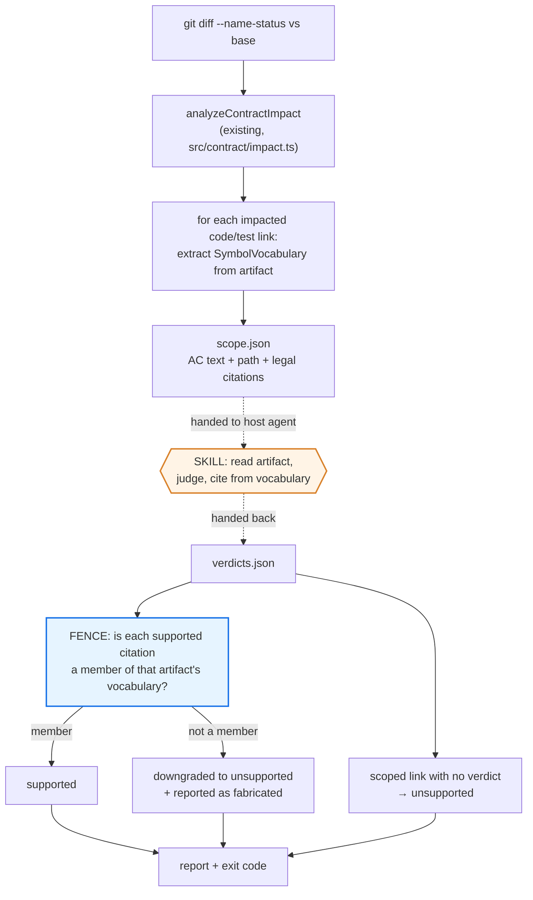

# Contract grade — agent-graded evidence for contract links

**Product Contract preservation:** Product Contract created by this plan (`ce-plan-bootstrap`). No upstream brainstorm exists.

## Goal Capsule

- **Objective:** Give Tieline a way to answer *"is this AC↔code link actually true?"* — a question nothing in the system asks today.
- **Judgment source:** The host agent, invoked through a skill. Tieline supplies deterministic scaffolding and a deterministic fence; it never calls a model itself.
- **Grades:** `supported` · `partial` · `unsupported`. Three discrete states, no numeric confidence.
- **Durability:** Grades are ephemeral. The durable "which symbol serves this AC" fact belongs in the contract's `selector` field, owned by separate in-flight work.
- **Verification posture:** `grade` is advisory by default and gates only under `--strict`. It runs fully offline.

---

## Product Contract

### Summary

Tieline links Acceptance Criteria to code by repository-relative path. `compileContractManifest` proves the path exists and is a file inside the repo, and `reviewed_content_hash` proves the bytes have not changed since review. Nothing proves the file has anything to do with the AC.

That gap is tolerable when a human reads the PR. It is not tolerable when agents author and maintain the contract, because no one is checking. This plan adds a grading step that converts an unfalsifiable claim ("this file implements this AC") into a falsifiable one ("this named symbol does, and the symbol demonstrably exists").

### Problem Frame

Three facts, all verified against the current codebase:

1. **Link semantics are unverified.** `validateAcceptedContractDocuments` in `src/contract/validate.ts` checks only that a path is repository-relative and does not escape the checkout. `compileContractManifest` in `src/contract/manifest.ts` additionally rejects missing / not-a-file / outside-repository artifacts. Neither examines whether the artifact relates to the AC.
2. **Drift signals are advisory and were ignored.** `runCheckCommand` in `src/commands/check.ts` returns `0` unconditionally. The committed manifest on `main` records commit `5fc640d` while `HEAD` is `42b630d`; 14 link hashes are stale. Nothing blocked the merge.
3. **Tieline has no LLM invocation path.** `src/embeddings.ts` calls an embedding endpoint. There is no chat, completions, or MCP-sampling code anywhere in `src/`. "An agent grades the link" is therefore an architectural addition, not a feature toggle.

### Actors

- **A1 — Authoring agent.** Runs inside a coding assistant on a branch. Creates and maintains contract YAML via `skills/tieline-author`. The primary grading caller.
- **A2 — Reviewing human.** Reads the PR. Consumes grade output as review input, not as a gate.
- **A3 — CI.** Runs `tieline contract grade --verify --strict` where a deterministic pass/fail is wanted. Has no model available, so it consumes verdicts produced upstream rather than producing them.

### Requirements

- **R1.** Grading must scope to links impacted by a git diff rather than grading every link in the contract.
- **R2.** Grading must run with no database, no network, and no credentials — the same posture as `validate`, `compile`, `coverage`, and `check`.
- **R3.** A `supported` grade must cite a symbol drawn from a deterministically extracted vocabulary for that artifact.
- **R4.** A citation absent from that vocabulary must be downgraded to `unsupported`, and the downgrade must be reported rather than applied silently.
- **R5.** Grades must be exactly `supported`, `partial`, or `unsupported`. No numeric confidence scores.
- **R6.** `unsupported` must be an expected, surfaced outcome. It must never be dropped, hidden, or inferred away.
- **R7.** A scoped link with no submitted verdict must be treated as `unsupported`, not skipped.
- **R8.** Grading must not persist grades to disk or to Postgres.
- **R9.** Tieline must not acquire an LLM client, provider configuration, or model credential.
- **R10.** Grading must be advisory by default and exit non-zero only under an explicit `--strict` flag.
- **R11.** The new capability must be represented in `.tieline/spec/` as Tieline's own contract, per its self-hosting rule.

### Key Product Decisions

- **KD1. The host agent grades; Tieline never calls a model.** Preserves R2 and R9. Full rationale in KTD1.
- **KD2. Grades are ephemeral.** The one durable fact a grade produces — the symbol that serves the AC — is what `selector` already exists to hold. Persisting it separately would create two sources of truth for one fact, and the non-reviewed one would win on convenience. Where grading finds a symbol, it surfaces it as a proposed `selector` value for the author to accept through normal PR review.
- **KD3. Three discrete grades, no floats.** Comparable prior art documents a production failure where continuous confidence ranges collapsed bimodally (over half of edges returned exactly `0.5`). Discrete rubrics with an explicit refusal state avoid this.
- **KD4. The fence is vocabulary membership, not substring presence.** A symbol that appears only inside a comment or a string literal is not in the vocabulary and does not satisfy a `supported` grade.
- **KD5. Advisory by default.** Grade quality varies by host model. Gating before the false-positive rate is known would poison trust in the tool. `--strict` is opt-in.

### Scope Boundaries

**In scope**
- Two deterministic CLI modes under a new `contract grade` action
- A deterministic symbol-vocabulary extractor behind a swappable port
- One new skill that orchestrates the host agent through the grading loop
- Tieline's own contract entries for the new capability

**Deferred to Follow-Up Work**
- Swapping the regex vocabulary adapter for a real parser — the in-flight `selector` work introduces symbol resolution; the port defined in U1 is the seam it plugs into
- Writing accepted `selector` values back to YAML automatically. U4 surfaces proposals; a human or the authoring skill applies them
- Grading base-vs-head to detect grade regressions across a PR
- Gating CI on grade results. Revisit after observing false-positive rates

**Outside this product's identity**
- Persisted grade history, grade dashboards, or grade-based metrics. Grades are a check, not a record
- Any Tieline-owned model client, provider abstraction, or prompt-tuning surface

### Success Criteria

- `tieline contract grade --base origin/main --emit-scope --json` runs offline on this repository and emits a work list whose size matches the diff, not the contract
- A verdict citing a fabricated symbol is downgraded to `unsupported` and the downgrade appears in the report
- `tieline contract validate .` and `tieline contract compile .` both pass with the new capability present in `.tieline/spec/`
- No new runtime dependency appears in `package.json`

---

## Planning Contract

### Key Technical Decisions

**KTD1. Grading is a skill plus deterministic CLI scaffolding — not an LLM client in the CLI.** Governs R2, R9.

The alternative is a chat/completions client inside `src/`. Rejected on four grounds:

1. **It breaks the property that makes grading adoptable.** `validate`, `compile`, `coverage`, `review`, and `check` all run with zero infrastructure — verified by executing them with every `DATABASE_URL*` variable unset. An LLM client would make the one plane that works everywhere depend on a credential and a network.
2. **The precedent already exists.** `skills/tieline-author/` has the host agent authoring contract YAML today. Grading is the same posture with a narrower question.
3. **It matches the authority model.** The PR is the proposal and merge is acceptance. A grade produced by the host agent inside that loop is a reviewable claim. A grade produced by a server-side model call is an opaque assertion arriving from outside the review boundary.
4. **Cost and failure land on the caller.** No provider config, no key rotation, no new CLI failure mode.

**Cost, stated honestly:** grade quality varies with whatever host model runs the skill, and Tieline cannot guarantee reproducibility. The fence bounds the damage asymmetrically — a weak model can emit `unsupported` noise, but it cannot manufacture a false `supported`, because the citation is checked against a vocabulary the CLI extracted. Noise is visible and cheap; a false confirmation is invisible and expensive. The design trades toward the former.

**KTD2. The CLI/skill seam is two modes of one contract action.** Governs R1, R3, R4, R7.

```
tieline contract grade --base <ref> --emit-scope [--json]     # deterministic: what to grade + legal citations
tieline contract grade --verify <verdicts.json> [--strict]    # deterministic: fence + report
```

`--emit-scope` and `--verify` are mutually exclusive. Everything semantic happens between them, in the skill. Both modes are pure functions of (manifest + working tree + git diff) and are unit-testable without a model. This mirrors the existing single-word contract actions (`validate`, `review`, `compile`, `coverage`, `sync`) rather than adding two new verbs.

**KTD3. Vocabulary extraction sits behind a port with a regex adapter.** Governs R3, R4.

The fence needs a set of legal citations per artifact. Tieline has no parser and adding one duplicates the in-flight `selector` work. Define `SymbolVocabulary` in `src/contract/` with a declaration-matching regex implementation now, and let the selector work swap the adapter later — the same ports-and-adapters shape used for `KnowledgeStore` in `src/store.ts`.

Error direction matters: a regex that *misses* a symbol wrongly downgrades a valid grade, which is safe and visible. A regex cannot *invent* a symbol that is not in the file, which is the dangerous direction. Comments and string literals are stripped before extraction so KD4 holds.

**KTD4. `--verify` treats a missing verdict as `unsupported`.** Governs R6, R7. A skill that dies halfway, or an agent that quietly skips a hard link, must not read as success. Absence is the refusal path, not a gap.

**KTD5. Grading introduces a new `GRADING` capability, not a story under `CONTRACT`.** Governs R11. Evidence quality is a distinct observable product area with its own actors and lifecycle, and `skills/tieline-author/SKILL.md` forbids generic starter capabilities but not genuine new ones. The alternative — folding it under `CONTRACT` — is noted in Alternatives.

### High-Level Technical Design

The pipeline, with the trust boundary made explicit:



The shaded orange node is the only step Tieline does not control. Everything entering it is deterministic, and everything leaving it passes through the blue fence before it can affect an exit code.

**Grade semantics:**

| Grade | Citation | Reason | Meaning |
| --- | --- | --- | --- |
| `supported` | **required**, must be a vocabulary member | optional | A named symbol in the artifact serves this AC |
| `partial` | not permitted | **required** | The artifact participates; no single symbol carries the AC |
| `unsupported` | not permitted | **required** | No support found — the refusal path |

**Verdict shape** *(directional guidance, not a specification — U3 owns the schema)*:

```
{ acceptance_criterion_stable_id, path, relation,
  grade: "supported" | "partial" | "unsupported",
  symbol?: string,        // required iff grade === "supported"
  reason?: string }       // required iff grade !== "supported"
```

### Alternatives Considered

**A. LLM client inside the CLI.** Rejected — see KTD1. Would make grading the only Tieline command requiring a credential.

**B. MCP sampling (server asks the client to sample).** Rejected on layering. Sampling lives in `src/server.ts`, which requires Postgres through `getStore()`. Grading is a CLI/offline concern; routing it through the MCP server would couple the offline plane to the database plane and invert the dependency the four-planes model establishes.

**C. Fold grading into `tieline check`.** Rejected. `check` is a pure function of (manifest + git diff) with no external dependency and no judgment. Introducing a model-mediated step into it would make its exit code non-reproducible — and that reproducibility is exactly what the separate `--strict` manifest-currency gate depends on. Keeping them separate keeps one gate deterministic.

**D. Grade every link, not just impacted ones.** Rejected on cost and signal. 113 links on this repository versus a handful per PR. `analyzeContractImpact` already computes the impacted set, so the diff supplies incrementality without a cache.

**E. Add `GRADING` stories under the existing `CONTRACT` capability.** Viable and cheaper. Rejected because grading has its own actors (a grading agent, CI) and its own lifecycle independent of contract compilation. Reconsider if `GRADING` stays at one story after implementation.

---

## Implementation Units

### U1. Symbol vocabulary port and regex adapter

**Goal:** Produce the closed set of legal citations for an artifact, deterministically.

**Requirements:** R3, R4 · **Dependencies:** none

**Files:**
- `src/contract/symbol-vocabulary.ts` (new)
- `scripts/test-symbol-vocabulary.ts` (new)

**Approach:** Export a `SymbolVocabulary` interface with a single `extract(path): Set<string>` method plus a default regex adapter. Strip line comments, block comments, and string/template literals before matching, so KD4 holds. Match TypeScript declaration forms: `function`, `class`, `interface`, `type`, `enum`, `const`/`let`/`var` bindings, and exported forms of each. Return an empty set for unreadable, empty, or non-TypeScript artifacts rather than throwing — an empty vocabulary correctly makes `supported` unreachable for that artifact.

**Patterns to follow:** The port-plus-adapter shape in `src/store.ts` (`getStore()` / `setStore()` seam). Pure-function module style as in `src/contract/coverage.ts`.

**Test scenarios:**
- Exported `function`, `class`, `interface`, `type`, and `const` declarations each appear in the vocabulary
- Non-exported declarations also appear (a private helper is a legitimate citation)
- An identifier occurring only inside a `//` comment is absent
- An identifier occurring only inside a `/* */` block comment is absent
- An identifier occurring only inside a string or template literal is absent
- An identifier occurring only as an imported name is absent (it is defined elsewhere)
- An empty file yields an empty set without throwing
- A file with unbalanced braces yields best-effort results without throwing
- A `.sql` or `.yaml` artifact yields an empty set
- A missing file yields an empty set without throwing

**Verification:** `npx tsx scripts/test-symbol-vocabulary.ts` passes; `npx tsc --noEmit` clean.

---

### U2. `contract grade --emit-scope`

**Goal:** Emit the deterministic work list — which links need grading, the AC text they must be judged against, and the legal citations for each.

**Requirements:** R1, R2 · **Dependencies:** U1

**Files:**
- `src/contract/grade.ts` (new — scope construction)
- `src/commands/contract.ts` (add the `grade` action branch)
- `src/cli.ts` (register `grade` in the `contractAction` helper; add `--base`, `--emit-scope`, `--verify`, `--strict`)
- `scripts/test-grade.ts` (new)

**Approach:** Reuse `analyzeContractImpact` from `src/contract/impact.ts` rather than reimplementing diff scoping. Filter to `code` and `test` targets (help links have no local artifact). For each impacted link, emit the AC stable ID, the AC criterion text, the relation, the artifact path, and the extracted vocabulary. Exclude impacts whose `link_scope` is `contract` — those signal that the spec directory itself changed and carry no artifact to grade.

**Patterns to follow:** `runCheckCommand` in `src/commands/check.ts` for workspace resolution, `git diff --name-status --find-renames` invocation, and the `--json` output convention.

**Test scenarios:**
- A diff touching a linked artifact emits exactly that (AC, path) pair
- A diff touching an unlinked file emits nothing
- A renamed linked artifact is emitted, keyed to its new path
- A deleted linked artifact is emitted with an empty vocabulary
- An empty diff emits an empty scope and exits 0
- Emitted entries carry AC criterion text, relation, path, and vocabulary
- `help`-kind links never appear in scope
- `link_scope: "contract"` impacts never appear in scope
- Story-level fallback links appear, attributed to each AC under that story
- `--emit-scope` and `--verify` together are rejected as mutually exclusive

**Verification:** `npx tsx scripts/test-grade.ts` passes; `npx tsx src/cli.ts contract grade . --base origin/main --emit-scope --json` runs with all `DATABASE_URL*` unset.

---

### U3. `contract grade --verify` and the fence

**Goal:** Accept host-agent verdicts, reject fabricated citations, and report without ever silently dropping a negative.

**Requirements:** R3, R4, R5, R6, R7, R10 · **Dependencies:** U1, U2

**Files:**
- `src/contract/grade.ts` (extend — verdict schema and fence)
- `src/commands/contract.ts` (verify branch)
- `scripts/test-grade.ts` (extend)

**Approach:** Define the verdict schema with zod alongside the existing contract schemas. Re-derive scope from the same `--base` inputs so verify cannot be handed a stale or hand-widened work list. For each scoped pair, locate its verdict; absent → `unsupported` (KTD4). For `supported`, require `symbol` and test membership in that artifact's vocabulary; non-member → downgrade to `unsupported` with an explicit `fabricated_citation` reason in the report. Report counts by grade plus every non-`supported` entry with its reason. Exit non-zero under `--strict` when any `unsupported` remains; otherwise always exit 0.

**Patterns to follow:** Zod schema style in `src/contract/schema.ts`; the warn-list output shape in `src/commands/check.ts`.

**Test scenarios:**
- `supported` citing a vocabulary member is retained
- `supported` citing a symbol absent from the vocabulary is downgraded and the downgrade is reported
- `supported` citing an identifier that exists only in a comment is downgraded
- `supported` with no `symbol` field is rejected as malformed
- `partial` with a reason is retained; `partial` carrying a `symbol` is rejected
- `unsupported` is retained and appears in the report
- A scoped pair with no submitted verdict is reported as `unsupported`
- A verdict referencing an (AC, path) pair absent from scope is rejected as malformed
- Duplicate verdicts for one pair are rejected rather than last-write-wins
- `--strict` exits non-zero when any `unsupported` remains
- `--strict` exits 0 when all grades are `supported` or `partial`
- Without `--strict`, `unsupported` entries still print and the command exits 0

**Verification:** `npx tsx scripts/test-grade.ts` passes; a hand-written verdicts file with one fabricated citation produces a downgrade in the report.

---

### U4. `skills/tieline-grade` skill

**Goal:** Orchestrate the host agent through scope → judge → verify, with auditability and a mandatory refusal path.

**Requirements:** R3, R5, R6 · **Dependencies:** U2, U3

**Files:**
- `skills/tieline-grade/SKILL.md` (new)
- `skills/tieline-grade/references/grading.md` (new)

**Approach:** The skill instructs the agent to run `--emit-scope`, read each artifact, and judge each link against its AC text. Constraints modelled on the closed-vocabulary pattern from comparable prior art, adapted to Tieline's vocabulary:

- Cite **only** symbols present in that artifact's emitted vocabulary. Never invent a symbol name.
- If no vocabulary symbol serves the AC, grade `partial` or `unsupported` — never stretch a citation to fit.
- Print the grade and citation for each link **before** running `--verify`, so the judgment is auditable independent of the tool's own report.
- `unsupported` is an expected outcome, not a failure of the run. State it plainly.
- Where a `supported` grade identifies a symbol, surface it as a proposed `selector` value for the author to accept through normal PR review (KD2). Do not edit YAML from this skill.

**Patterns to follow:** `skills/tieline-author/SKILL.md` for frontmatter, tone, and the SKILL-plus-`references/` split.

**Test expectation:** none — `SKILL.md` is a prompt asset with no executable behavior. Verified by the end-to-end run in U5.

**Verification:** Running the skill against this repository produces a report whose grade count equals the scope count, and whose printed citations all appear in the emitted vocabularies.

---

### U5. Self-hosted contract entries

**Goal:** Represent the new capability in Tieline's own contract, as its rules require.

**Requirements:** R11 · **Dependencies:** U1–U4

**Files:**
- `.tieline/spec/grading.yaml` (new)
- `.tieline/manifest.json` (recompiled, not hand-edited)

**Approach:** One `GRADING` capability with two stories: grading impacted links (scope emission and verdict verification), and rejecting fabricated citations (the fence). Every AC carries `implements` links to the new source files and `tests` links to the new test scripts. Criterion text must contain "must" per `acceptanceCriterionSchema`. Verify every new stable ID is unused across all of `.tieline/spec/`.

**Patterns to follow:** `skills/tieline-author/references/contract.md` for YAML shape; the neighbouring capability files for link formatting and `framework_hint: custom-script` on test targets.

**Test scenarios:**
- `tieline contract validate .` passes with zero warnings
- `tieline contract compile .` succeeds, proving every newly linked path exists
- Every new stable ID is unique across all spec files
- `tieline contract coverage .` reports every new AC as having direct evidence links
- Mapping coverage does not regress — new source files under `src/` are linked

**Verification:** All four offline contract commands pass; coverage percentage does not decrease.

---

## Verification Contract

Run offline, with every `DATABASE_URL*` variable unset:

1. `npx tsc --noEmit` — clean
2. `npx tsx scripts/test-symbol-vocabulary.ts` — passes
3. `npx tsx scripts/test-grade.ts` — passes
4. `npx tsx src/cli.ts contract validate .` — passes, zero warnings
5. `npx tsx src/cli.ts contract compile .` — succeeds
6. `npx tsx src/cli.ts contract coverage .` — no regression in AC evidence or mapping coverage
7. `npx tsx src/cli.ts contract grade . --base origin/main --emit-scope --json` — emits scope sized to the diff
8. `git diff --stat package.json` — no new runtime dependency

## Definition of Done

- `contract grade` supports `--emit-scope` and `--verify`, both fully offline
- A fabricated citation is downgraded to `unsupported` and reported, proven by a test
- A scoped link with no verdict is reported as `unsupported`, proven by a test
- `--strict` is the only path to a non-zero exit
- `skills/tieline-grade/` exists and instructs citation-from-vocabulary, pre-verify printing, and the refusal path
- `.tieline/spec/grading.yaml` validates and compiles
- No LLM client, provider config, or model credential exists anywhere in `src/`

---

## Risks

- **R-1. Host-model variance.** Grade quality depends on whichever model runs the skill; Tieline cannot guarantee reproducibility. *Mitigation:* the fence makes false `supported` grades structurally unreachable; advisory-by-default (KD5) keeps variance out of exit codes until the false-positive rate is observed.
- **R-2. Regex vocabulary misses symbols.** Valid grades get wrongly downgraded. *Mitigation:* the error direction is safe and visible; U1's port is the swap point for the in-flight selector work's resolver.
- **R-3. `--strict` adopted too early.** Noisy `unsupported` results block merges and the team routes around the tool. *Mitigation:* `--strict` stays out of CI in this plan; the deterministic manifest-currency gate is the separate change that CI adopts first.
- **R-4. Overlap with in-flight `selector` work.** Both touch symbol identity. *Mitigation:* this plan writes no YAML and defines the vocabulary port as the seam. If selector lands first, U1's adapter is replaced rather than reworked.

## Open Questions

- **Q1 (deferred to implementation).** Should `--emit-scope` include the artifact's contents, or only its path and vocabulary? Path-only keeps the CLI output small and lets the agent read files with its own tools; contents make the skill a single round-trip. Decide when U4 is written against real output.
- **Q2 (deferred).** Should `partial` be reported separately in `contract coverage`, or only in `grade` output? Coverage currently reports link presence, not link quality; mixing them may confuse the existing percentage. Revisit after the first real grading runs.
- **Q3 (deferred to follow-up).** Does `GRADING` stay a distinct capability, or fold into `CONTRACT`? Reassess after U5 — if it holds only one story in practice, Alternative E becomes the better shape.

## Sources & Research

- **Codebase, verified this session:** `src/contract/{schema,validate,manifest,impact,coverage}.ts`, `src/commands/{check,contract}.ts`, `src/cli.ts`, `src/store.ts`, `src/embeddings.ts`, `skills/tieline-author/`, `migrations/`. Offline command behavior confirmed by execution with all database environment variables unset.
- **Drift evidence:** committed manifest records `5fc640d`; `HEAD` is `42b630d`; 14 link hashes stale; `check --base origin/main` exits 0; no `.github/workflows/` present.
- **Prior art — graphify** (`Graphify-Labs/graphify`, Apache-2.0, Python, tree-sitter AST). Load-bearing on three decisions: the closed-vocabulary constraint with mandatory refusal informs U4 and KTD3; their documented bimodal-confidence failure informs KD3; their skill-plus-deterministic-CLI split informs KTD1. Their `graphify-out/` persistence model was considered and *rejected* for Tieline (KD2) because `selector` already owns the durable fact.
