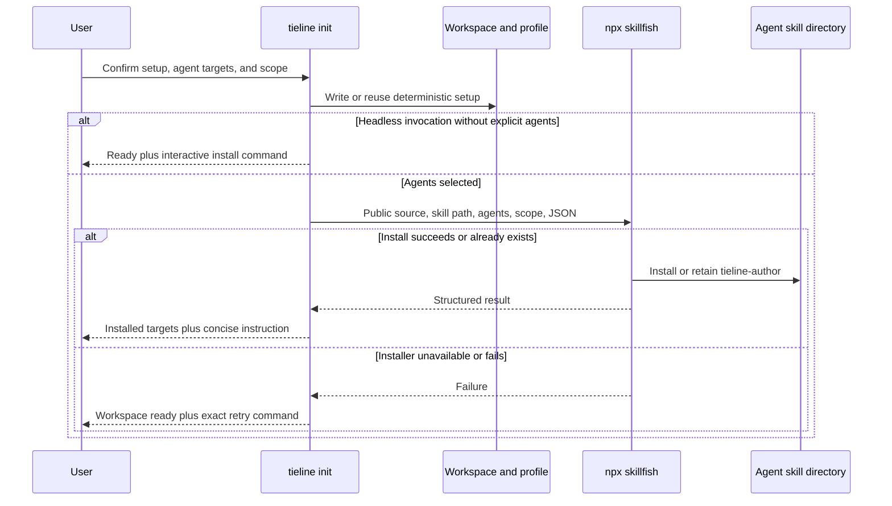

# CLI-First Agent Onboarding - Plan

## Goal Capsule

- **Objective:** Make `tieline init` the complete deterministic setup flow, install `tieline-author` into user-selected coding agents through Skillfish, and end with one concise instruction instead of warnings plus a duplicated fallback prompt.
- **Authority:** Tieline owns onboarding questions and workspace state. Skillfish owns agent-specific installation paths and writes. The installed skill owns semantic onboarding.
- **Execution profile:** Preserve non-interactive initialization, keep the workspace usable when requested skill installation fails, and make every external write require an explicit agent and scope choice.
- **Stop conditions:** Do not auto-detect agents, launch a coding agent, author generic contract YAML, store agent choices in shared workspace configuration, or remove the packaged skill used by the MCP prompt.
- **Tail ownership:** Normal pull-request review accepts the CLI contract, documentation, self-hosted runtime contract, and regenerated manifest together.

---

## Product Contract

### Summary

Tieline will collect the deterministic repository setup that an agent should not rediscover, require interactive users to select where `tieline-author` is installed, and leave the repository ready for semantic onboarding. Expected offline limitations become concise readiness information, while the next action becomes `Use $tieline-author to onboard this repository.`

### Problem Frame

The current interactive flow asks only for product and repository names even though `init` already supports product description, context, source-root, database, and embedding flags. It then presents normal offline limitations as several warnings and prints a long agent brief that duplicates the packaged skill.

This makes a successful initialization look incomplete and asks the user to move implementation instructions between tools manually. The repository already contains the authoritative `tieline-author` skill, and the public GitHub repository is a valid Skillfish source. Tieline can therefore keep deterministic setup in the CLI and use the normal Agent Skills installation path for the semantic handoff.

### Actors

- A1. A maintainer initializes a repository interactively and chooses where the authoring skill is installed.
- A2. An automation caller initializes a repository with flags and must not receive hidden prompts or network activity.
- A3. A coding agent discovers the installed skill and performs repository-specific semantic onboarding against the shared `.tieline` workspace.

### Requirements

#### Deterministic setup

- R1. Interactive `tieline init` must capture or confirm product identity, stable repository identity, an optional product description, detected source roots, database mode, and embedding provider before writing the workspace; context sources must be supplied explicitly with repeatable `--context` flags and validated as existing repository paths or explicit HTTP(S) URLs before mutation.
- R2. Repository-derived defaults must remain editable, with the stable repository name preferring Git remote metadata over the checkout directory name when usable metadata exists.
- R3. Existing flags and `--yes` must retain a prompt-free path, and omitted optional values must resolve to documented defaults without triggering skill installation.

#### Skill installation

- R4. Interactive initialization must directly require one or more supported coding agents and project or global scope for `tieline-author`; cancellation must stop before mutation.
- R5. Non-interactive installation must require at least one repeatable `--agent` value and an explicit `--skill-scope project|global`, and reject missing, unsupported, or conflicting combinations before starting `npx`.
- R6. Tieline must invoke the unpinned latest Skillfish CLI through `npx --yes --package=skillfish@latest` without a Tieline package dependency, using `skillfish add knoxgraeme/tieline --path skills/tieline-author`, one `--agent` per selected target, exactly one of `--project` or `--global`, and `--yes --json`; it must omit a Git ref so Skillfish reads the repository default branch.
- R7. Tieline must show the source, agents, and scope before an interactive external write, then pass Skillfish its non-interactive and JSON flags so the user confirms only once.
- R8. Tieline must run Skillfish with the Tieline workspace root as its working directory, must not pass clone-local database credentials, embedding secrets, GitHub tokens, or npm authentication tokens through the child environment, must preserve the user's `DO_NOT_TRACK` and `CI` telemetry controls, and must not interpolate user-provided values through a shell command.

#### Recovery and handoff

- R9. Workspace and runtime setup must complete before Skillfish runs; a missing `npx`, network failure, malformed Skillfish response, or rejected requested install must leave the valid workspace intact, return a non-zero command result, and print the exact Tieline retry shape `tieline init <repository> --yes --agent <id>... --skill-scope <scope>` with the original targets and scope.
- R10. Re-running `tieline init` against an existing workspace with explicit agents must retry installation without replacing shared configuration or repeating completed runtime setup; a bare real-TTY rerun on an empty contract must open the same required interactive skill-install step.
- R11. Successful initialization and human-readable status must group expected offline limitations as optional readiness information and must not print the current full fallback prompt.
- R12. JSON status must expose structured onboarding state, the skill name, the concise instruction, and `tieline init .` as the interactive install command while the contract has no Stories; onboarding fields must clear after the first Story exists.
- R13. The packaged `tieline-author` skill and `tieline_author` MCP prompt must remain available as authoring surfaces even though the CLI no longer prints their full instructions.

### Key Flows

- F1. **Interactive first initialization:** A1 confirms repository setup, chooses agents and scope, Tieline creates the workspace and runtime profile, Skillfish installs the skill, and Tieline prints the installed targets plus the concise invocation.
- F2. **Prompt-free initialization:** A2 supplies `--yes` and deterministic setup flags. Tieline performs no skill installation unless at least one `--agent` and an explicit `--skill-scope` are also supplied.
- F3. **Install recovery:** Skillfish fails after workspace creation. Tieline reports that workspace setup succeeded, prints the Tieline retry command with repository, agents, and scope, and a later invocation retries only the missing integration.
- F4. **Semantic handoff:** A3 reloads or starts its coding agent, invokes `$tieline-author`, reads `.tieline/config.json`, and authors repository-specific contract content through the maintained skill workflow.

### Acceptance Examples

- AE1. **Covers F1.** Given a new repository and an interactive user who selects Codex and Claude Code at project scope, initialization maps both Tieline IDs to canonical Skillfish selectors in one invocation and reports both targets as installed or already present.
- AE2. **Covers F2.** Given `tieline init . --yes` with no `--agent`, initialization writes the workspace and runtime profile without invoking `npx`.
- AE3. **Covers F2.** Given `--yes --agent codex --skill-scope global`, initialization invokes the latest-tag Skillfish package once with the Codex selector and global scope.
- AE4. **Covers F3.** Given a non-zero Skillfish exit or invalid JSON, initialization preserves `.tieline/config.json` and the private runtime profile, exits non-zero, identifies skill installation as incomplete, and prints a runnable retry command without the full authoring brief.
- AE5. **Covers F3.** Given an existing initialized workspace and explicit agent flags, a rerun leaves the config bytes unchanged and attempts only required runtime recovery plus skill installation.
- AE6. Given offline mode with no database URLs or local embedding package, the final summary describes local authoring as ready and organization-wide matching or embeddings as optional capabilities rather than emitting three warnings.
- AE7. **Covers F4.** Given an empty contract, `tieline status --json` returns the concise `$tieline-author` instruction and no self-contained fallback prose.
- AE8. Given a contract with at least one Story, status clears its onboarding instruction and returns the existing compile or reconcile action appropriate to manifest state.
- AE9. Given an empty existing workspace and a bare interactive `tieline init .`, the CLI requires agent and scope selection, leaves the stored config and completed runtime untouched, and makes `tieline init .` from status a runnable recovery path.

### Interaction Contract

1. **Repository setup:** Show detected product, remote-derived repository name, source roots, database mode, and embedding provider as defaults. Prompt only for values not supplied by flags, allow a blank description and zero or more additional context paths, and make detected source roots editable rather than forcing manual re-entry.
2. **Runtime guidance:** Describe `offline` as local authoring without organization-wide matching, `local` as Docker PostgreSQL, and the stored `existing` value as hosted / remote PostgreSQL. Do not offer the development-only `hash` provider interactively. When `local` or `existing` prerequisites are absent, show the requirement before the final confirmation; do not relabel a configured runtime blocker as optional readiness.
3. **Agent setup:** Open a required curated agent multiselect with no inferred targets, then a project/global scope select with project preselected. Cancelling either prompt stops initialization.
4. **Single review:** Before mutation, show one grouped review of the shared `.tieline` write, private runtime setup, public skill source, selected agents, and external scope. One confirmation authorizes both deterministic setup and the requested Skillfish write; Tieline then passes `--yes --json` so Skillfish does not ask again.
5. **Terminal states:** Interactive cancellation writes nothing. A requested install succeeds with the concise skill invocation, or fails non-zero after reporting that the workspace remains ready and printing the exact Tieline retry. Headless initialization without explicit agents remains network-free.

Piped stdin keeps the legacy product/repository text questions only. `--yes` remains fully prompt-free, uses detected or flag-provided setup defaults, and performs no network or external agent write unless both agent and scope flags are explicit.

The successful terminal summary should have this information hierarchy (copy may follow the existing palette):

```text
Workspace: ready at .tieline
Runtime: offline — local contract authoring ready
Optional capabilities: organization-wide duplicate checks and semantic search are not configured
Skill: tieline-author installed for Codex (project)
Next: Restart or reload Codex, then use $tieline-author to onboard this repository.
```

When installation is skipped, replace the Skill and Next lines with `Skill: not installed` and `Install later: tieline init .`. When a requested install fails, retain the ready workspace/runtime lines, label the skill incomplete, print the Tieline retry command, and return non-zero.

### Scope Boundaries

#### In Scope

- The interactive `init` questions, command flags, supported-agent presentation, Skillfish subprocess boundary, rerun behavior, readiness summary, status schema, documentation, and self-hosted runtime contract.
- A curated initial agent list with stable IDs for Claude Code, Codex, Cursor, Gemini CLI, GitHub Copilot, OpenCode, and Windsurf.
- Project and global installation scope, with project scope as the interactive default.

| Tieline `--agent` ID | Display and Skillfish selector |
| --- | --- |
| `claude-code` | Claude Code |
| `codex` | Codex |
| `cursor` | Cursor |
| `gemini-cli` | Gemini CLI |
| `github-copilot` | GitHub Copilot |
| `opencode` | OpenCode |
| `windsurf` | Windsurf |

#### Deferred to Follow-Up Work

- A Skillfish library API, `skillfish agents --json`, or shared agent-registry package.
- Pinning the Skillfish package, a Git branch, tag, or commit.
- Automatic Skillfish updates, install-health polling, or persistent records of which user-level agents currently have the skill.
- Agent-specific MCP registration or automatic coding-agent launch.

#### Outside This Product's Identity

- Copying the skill into `.tieline/skills` as a private skill system.
- Generating generic starter capabilities, Stories, or Acceptance Criteria during deterministic initialization.

---

## Planning Contract

### Key Technical Decisions

- KTD1. **Tieline owns the questions; Skillfish owns installation.** Tieline will collect the user's agent and scope choices, then call Skillfish once with explicit targets. It will not reproduce agent directory rules. Governs R4-R7. (session-settled: user-approved — chosen over copying skills under `.tieline`: native agent directories make the skill directly discoverable)
- KTD2. **Run the latest Skillfish through `npx`.** Tieline will spawn `npx --yes --package=skillfish@latest` followed by `skillfish add knoxgraeme/tieline --path skills/tieline-author`, repeated `--agent` arguments, one scope flag, and `--yes --json`. It will not add Skillfish to `package.json`. The explicit package selector avoids accidentally resolving an unrelated project-local binary without pinning a release. Governs R6, R9. (session-settled: user-directed — chosen over a direct or pinned package dependency: Skillfish is a one-shot installer and the first release should follow its latest CLI)
- KTD3. **Install the skill from Tieline's default branch.** The command will use the public `knoxgraeme/tieline` repository and explicit skill path without a ref. Governs R6. (session-settled: user-directed — chosen over a release tag or commit ref: the authoring workflow should receive fixes from `main` immediately)
- KTD4. **Manual selection is authoritative.** Tieline will maintain the small stable-CLI-ID-to-canonical-Skillfish-selector registry above and will not gate installation on agent detection. Skillfish remains responsible for resolving and creating native target paths. Governs R4, R5. (session-settled: user-approved — chosen over local agent detection: explicit selection avoids false negatives and makes the external write understandable)
- KTD5. **Agent choices remain local and ephemeral.** Tieline will pass mapped agent selectors and scope to Skillfish but will not store them in `.tieline/config.json` or the private runtime profile. Status describes how to continue, not whether every external agent directory is currently healthy. Governs R4, R10, R12.
- KTD6. **Installation cannot roll back deterministic setup.** The install adapter will return a structured installed, skipped, or failed result. A requested failed result makes the overall command non-zero while the orchestrator preserves the completed workspace and renders a Tieline-owned retry path. Governs R9, R10.
- KTD7. **Status carries an instruction, not a workflow copy.** Replace `agent_onboarding_prompt` with `onboarding: { required: true, skill: "tieline-author", instruction: "Use $tieline-author to onboard this repository.", install_command: "tieline init ." }` while the contract is empty, and `onboarding: null` after the first Story. Support the install command on empty existing workspaces. The human renderer uses the same concise instruction. Governs R11-R13. (session-settled: user-approved — chosen over a self-contained fallback prompt: the installed skill is the maintained semantic workflow)
- KTD8. **The bundled skill remains package content.** `src/prompts.ts` will continue reading the packaged skill for the MCP prompt. The GitHub-installed copy and MCP prompt are two delivery surfaces for the same maintained workflow. Governs R13.

### High-Level Technical Design



### Implementation Constraints

- Collect all interactive choices before the first workspace mutation so cancellation does not leave a partially answered configuration.
- Keep piped and `--yes` invocations deterministic. Rich Clack selection prompts apply only to a real interactive terminal.
- Build the Skillfish argv as an array and launch without user-controlled shell interpolation. Use a cross-platform executable strategy for `npx` and `npx.cmd`.
- Set the Skillfish child's `cwd` to the resolved Tieline workspace root so `--project` can never target the directory from which `tieline init <other-path>` happened to be launched.
- Build the child environment from an allowlist after runtime setup. Retain only executable lookup, platform home/config, npm registry/cache, certificate, proxy, locale, temporary-directory, and the user's `DO_NOT_TRACK`/`CI` controls needed to run `npx`; explicitly exclude all Tieline profile keys plus GitHub and npm authentication-token variables.
- Parse Skillfish JSON defensively. Treat non-zero exits, empty output, invalid JSON, or a reported unsuccessful result as an incomplete requested integration.
- Keep config schema version 1 because agent installation preferences are not persisted.

### System-Wide Impact

- **CLI contract:** `init` gains agent and skill-scope flags, and `status --json` replaces a recently added prose field with structured onboarding data.
- **Agent context:** Agents receive the full workflow through their native skill or MCP prompt instead of a pasted duplicate. The skill continues to operate on the same `.tieline` files and runtime capabilities as the user.
- **Security:** The latest npm package receives permission to write agent directories. Tieline must disclose the source and targets before invoking it and must not forward repository runtime secrets through the child environment.
- **Repository state:** Project-scope installation may add agent-specific skill files to the worktree. Global scope writes under the user's agent configuration. Skillfish, not Tieline, determines those paths and overwrite behavior.
- **Compatibility:** The status JSON change is intentionally breaking while Tieline is pre-release. README and MCP resource text must change in the same pull request.

### Risks and Dependencies

- **Latest-installer drift:** A future Skillfish release could change flags or JSON. Keep the adapter narrow, validate its response, test the expected command contract, and always provide a manual retry command.
- **Agent ID drift:** The curated Tieline list can diverge from Skillfish. Keep IDs in one module and test every displayed ID through command construction; coordinate changes across the two owned repositories.
- **Default-branch skill drift:** The current skill may adopt commands unsupported by an older Tieline CLI. Keep `tieline-author` backward-compatible across supported CLI releases and make unsupported capabilities fail with an upgrade instruction.
- **Network and npm availability:** `npx` and GitHub access are not guaranteed. Interactive users must select a target, headless installation remains opt-in, and the external install happens only after durable setup.
- **Nested output noise:** Tieline must capture Skillfish JSON and render its own summary instead of forwarding banners, confirmations, or raw stderr into the onboarding UX.
- **Release ordering:** This Tieline work assumes the `skillfish@latest` release already accepts repeatable `--agent` values for `add`. Verify that published command contract before merging Tieline; if it is absent, publish the owned Skillfish change first rather than adding detection or path logic here.

### Sources and Research

- `src/cli.ts`, `src/cli-ui.ts`, `src/tieline/init.ts`, `src/tieline/preflight.ts`, and `src/tieline/status.ts` define the current two-question flow, warning rendering, runtime resume path, and duplicated handoff.
- `scripts/test-tieline.ts` is the existing custom-script seam for CLI initialization, profile isolation, status JSON, piped input, and authoring-skill assertions.
- `.tieline/spec/runtime.yaml` owns the current requirement for a copyable self-contained prompt and must change with the product behavior.
- `docs/plans/2026-07-27-002-feat-tieline-living-spec-plan.md` establishes that deterministic setup belongs in `init`, semantic interpretation belongs in the authoring skill, and an empty initial spec is intentional.
- [npm `npx` documentation](https://docs.npmjs.com/cli/v7/commands/npx/) establishes that a missing package is installed into npm's cache for command execution and that `--yes` suppresses npm's install prompt.
- [Skillfish's command reference](https://github.com/knoxgraeme/skillfish#add) confirms the existing `add`, `--path`, `--project`/`--global`, `--yes`, and repository-wide `--json` contracts; this plan assumes the discussed repeatable `--agent` support is published before Tieline consumes it. Its documented `DO_NOT_TRACK` and `CI` controls must survive environment sanitization.
- [Vercel Skills CLI](https://github.com/vercel-labs/skills) and [GitHub `gh skill install`](https://cli.github.com/manual/gh_skill_install) provide current prior art for explicit agent targets, project or user scope, non-interactive flags, and public GitHub skill sources.

---

## Implementation Units

### U1. Add the Skillfish installation boundary

- **Goal:** Provide one testable adapter that builds and runs the latest-tag Skillfish command without leaking runtime secrets.
- **Requirements:** R5-R10; KTD2-KTD6.
- **Dependencies:** None.
- **Files:** Create `src/tieline/skill-install.ts` and `scripts/test-skill-install.ts`. Modify `package.json` to include the focused test in the Tieline test suite.
- **Approach:** Define the curated agent registry, project/global scope type, exact `add` command builder, workspace-root working directory, sanitized child environment, Skillfish JSON validation, normalized result, and Tieline retry-command renderer in one module. Accept an injected process runner so tests never invoke npm or GitHub. Do not import Skillfish or add it to runtime dependencies.
- **Execution note:** Start with command-contract and failure-path tests because the external process boundary is the highest-risk part of the change.
- **Patterns to follow:** Mirror the dependency injection used by `configureWorkspaceRuntime` in `src/tieline/setup.ts`, the argument-array subprocess pattern used throughout setup, and Zod-backed strict external-data validation used by workspace configuration.
- **Test scenarios:**
  - Build one latest-tag `add` command for multiple supported agents at project scope, with the explicit skill path, one `--agent` occurrence per target, `--yes --json`, and no fixed package version or Git ref.
  - Build the corresponding global-scope command while preserving deterministic agent ordering and de-duplicating repeated IDs.
  - Reject an unsupported agent and an empty target set before calling the runner.
  - Set `cwd` to the initialized workspace even when Tieline was launched elsewhere.
  - Exclude Tieline database and embedding credentials plus GitHub/npm auth tokens while retaining non-secret process and network configuration and `DO_NOT_TRACK`/`CI` required for `npx` and user telemetry preference.
  - Normalize Skillfish installed and already-present entries from valid JSON.
  - Convert a missing executable, non-zero exit, empty stdout, malformed JSON, or unsuccessful JSON result into an incomplete result containing a safely rendered Tieline retry command with the same repository, agents, and scope.
  - Ensure stderr and retry rendering never expose values removed from the child environment.
- **Verification:** The adapter's tests prove exact argv, environment isolation, result parsing, and every recovery branch without network access.

### U2. Expand deterministic interactive input and automation flags

- **Goal:** Capture the setup choices that belong in the CLI while keeping non-interactive behavior explicit and stable.
- **Requirements:** R1-R5; KTD1, KTD4, KTD5.
- **Dependencies:** U1.
- **Files:** Modify `src/cli-ui.ts`, `src/cli.ts`, `src/tieline/init.ts`, and `scripts/test-tieline.ts`.
- **Approach:** Add testable optional-text/list, confirmation, select, and multiselect wrappers around Clack. Implement the Interaction Contract as two grouped sections—repository/runtime and agent setup—followed by one review confirmation. Confirm an optional description, keep detected source roots editable, hide the development-only hash embedding provider from interactive choices, label the `existing` database value as hosted/remote, and require supported agents plus scope. Leave semantic context discovery to `tieline-author`; retain repeatable `--context` only for explicit existing repository paths or HTTP(S) URLs. Prefer a usable Git remote repository name before the checkout basename. Add repeatable `--agent`, `--skill-scope project|global`, and `--skip-skill-install` flags with conflict validation. Preserve the current piped-input contract and make `--yes` skip installation unless both agents and scope are explicit.
- **Patterns to follow:** Preserve `TielineCliIO` injection, Commander choices and conflicts in `buildProgram`, `collect` for repeatable options, repository-relative path normalization in `src/tieline/init.ts`, and buffered piped input in `createQuestioner`.
- **Test scenarios:**
  - An interactive new repository accepts detected values, records an optional description, confirms source roots, selects offline database and a production embedding provider, and returns explicit agent and scope choices before mutation without prompting for context sources.
  - Repeatable `--context` flags accept existing repository paths and explicit HTTP(S) URLs while rejecting missing paths and scheme-less websites before mutation.
  - CLI-provided product, repository, context, source roots, runtime, agents, or scope bypass only their corresponding prompts.
  - A GitHub-style origin URL yields the remote repository name, while missing or malformed remote metadata falls back to the checkout basename.
  - `--yes` with no agents performs no interactive prompts and marks skill installation as skipped.
  - Repeatable supported `--agent` flags imply installation; unsupported IDs, skip/install conflicts, scope without an agent, and a headless agent without scope fail before workspace creation.
  - Piped stdin retains the existing product and repository question behavior and does not attempt rich terminal selections.
  - Cancelling required agent selection or the final confirmation leaves no `.tieline` directory.
- **Verification:** CLI tests prove prompt routing, default detection, flag precedence, validation, cancellation safety, and backward-compatible automation behavior.

### U3. Orchestrate setup, installation, recovery, and concise status

- **Goal:** Join deterministic setup and requested installation into an idempotent lifecycle with a small, truthful final summary.
- **Requirements:** R3, R7-R13; KTD1, KTD5-KTD8.
- **Dependencies:** U1, U2.
- **Files:** Modify `src/cli.ts`, `src/tieline/init.ts`, `src/tieline/preflight.ts`, `src/tieline/status.ts`, `src/resources.ts`, and `scripts/test-tieline.ts`.
- **Approach:** Remove preflight calculation from workspace file creation and render readiness only after runtime setup. Distinguish blocking setup failures from expected offline limitations. Run the install adapter after the workspace and profile are durable, and summarize installed, already-present, skipped, or incomplete outcomes. Let explicit agents trigger installation on an existing workspace without rewriting config; when an empty existing workspace is opened through a bare real-TTY `tieline init .`, run only the required agent-install section and keep completed setup untouched. Replace the long status field with the KTD7 onboarding object, set its install command to that real rerun path, keep `next_action` concise, and remove duplicated fallback references from the MCP guide resource.
- **Patterns to follow:** Preserve config/profile separation in `src/tieline/profile.ts`, current readable-manifest recovery in `src/tieline/status.ts`, byte-stable existing config behavior in `scripts/test-tieline.ts`, and the existing rule that an empty spec is intentional.
- **Test scenarios:**
  - **Covers AE1.** A successful multi-agent project install occurs after config and profile creation, and the summary names both agents plus the concise invocation.
  - **Covers AE2.** Offline `--yes` initialization with no agents never calls the installer and reports local authoring as ready.
  - **Covers AE3.** Explicit global Codex installation calls the adapter once with the selected scope.
  - **Covers AE4.** Every requested installer failure preserves the config and profile, returns a non-zero init result, omits the fallback brief, and prints the retry command; an explicit user skip remains successful.
  - **Covers AE5.** An existing workspace rerun with agents preserves config bytes, skips completed runtime work, and invokes only the installer.
  - **Covers AE6.** Offline mode no longer emits separate database-admin, database-read, and local-embedder warnings; optional capability limits remain visible in one readiness section.
  - **Covers AE7.** Empty-contract JSON and human status expose the concise instruction and install command without `agent_onboarding_prompt`.
  - **Covers AE8.** A first Story clears onboarding fields and preserves unreadable-manifest compile recovery followed by normal reconcile guidance.
  - **Covers AE9.** A bare interactive rerun on an empty workspace requires agent installation choices without repeating repository questions or runtime setup, while a non-interactive bare rerun remains prompt- and network-free.
  - A Skillfish already-present result is treated as ready rather than a warning or failure.
- **Verification:** End-to-end CLI tests prove the ordering of durable setup and requested installation, rerun idempotency, output size, status schema, and state-dependent next actions.

### U4. Align the maintained skill, documentation, and self-hosted contract

- **Goal:** Make every public instruction describe the CLI-first installed-skill workflow and regenerate Tieline's own accepted runtime manifest.
- **Requirements:** R11-R13; KTD3, KTD7, KTD8.
- **Dependencies:** U3.
- **Files:** Modify `README.md`, `skills/tieline-author/SKILL.md`, `.tieline/spec/runtime.yaml`, `.tieline/manifest/RUNTIME.json`, `.tieline/manifest/index.json`, and `scripts/test-tieline.ts`.
- **Approach:** Replace handoff-copy documentation with interactive and headless initialization examples, supported agents and scope behavior, the automatic Skillfish command, restart/reload guidance, and the manual retry command. Keep the full semantic workflow in the packaged skill and MCP prompt. Restructure `RUNTIME-001-AC3` so it owns deterministic setup and the empty-spec boundary, then add specific criteria for explicit Skillfish installation and concise recovery/status output. Recompile the committed manifest instead of editing generated JSON by hand.
- **Execution note:** Treat contract YAML as the behavioral source, then regenerate the manifest and update output assertions.
- **Patterns to follow:** Use one observable `<subject> must <outcome>` per self-hosted criterion, attach code and test links to the most specific criterion, and preserve the package `files` entry for `skills`.
- **Test scenarios:**
  - README examples use `npx --yes --package=skillfish@latest skillfish` without a fixed package version or Git ref and show repeatable agent targeting through Tieline.
  - Repository search finds no claim that `init` or status emits a self-contained fallback prompt.
  - The bundled skill still tells agents to read configured context, search before creating stable IDs, and run validation, compile, coverage, reconciliation, and check.
  - The MCP smoke test still retrieves the full `tieline_author` prompt from packaged files.
  - Contract validation and compilation produce a byte-current runtime shard and index after the new criteria are accepted.
- **Verification:** Documentation, skill assertions, MCP smoke coverage, self-hosted contract validation, and manifest-current checks all agree on the installed-skill workflow.

---

## Verification Contract

| Gate | Applies to | Done signal |
| --- | --- | --- |
| `npm run build` | U1-U4 | TypeScript compiles with the new CLI options, status schema, and installer adapter. |
| `npm run test:tieline` | U1-U4 | Deterministic setup, prompt routing, subprocess contracts, reruns, output, and status transitions pass without live network access. |
| `npm run test:smoke` | U4 | The MCP server still exposes the complete packaged `tieline_author` prompt. |
| `npm run test:contract` | U4 | Contract schema, manifest, impact, reconciliation, and grading regressions remain green. |
| `node dist/cli.js contract validate .` | U4 | The revised runtime acceptance criteria are structurally valid. |
| `node dist/cli.js contract compile .` followed by the repository manifest-current check | U4 | The committed runtime manifest and index are byte-current. |
| Manual TTY smoke | U2, U3 | A fresh temporary repository shows the expanded Clack flow, performs the selected install or a controlled simulated failure, and ends with one concise next action. |

---

## Definition of Done

- `tieline init` captures the deterministic repository and runtime inputs defined by R1 without asking an agent to rediscover them.
- Interactive users can select supported agents and project/global scope; non-interactive callers install only through explicit agent flags.
- Tieline invokes the unpinned latest Skillfish through `npx` against `knoxgraeme/tieline` without adding a package dependency or Git ref.
- The Skillfish process receives explicit targets and a sanitized environment, and its output is normalized behind tests.
- Requested install failure never removes or corrupts the completed workspace and always provides an exact retry command.
- A rerun can install the skill into an existing workspace without changing tracked configuration or repeating completed runtime setup.
- Init and status no longer print the self-contained fallback prompt or portray expected offline authoring limits as a wall of warnings.
- Empty-contract status tells the user to invoke `$tieline-author`; onboarded status returns compile or reconcile guidance as appropriate.
- The bundled skill and MCP prompt remain complete and discoverable.
- README, MCP resource text, self-hosted runtime criteria, generated manifest, CLI tests, smoke tests, and contract tests describe and verify the same workflow.
- No abandoned prompt, status, subprocess, or compatibility scaffolding remains in the diff.
