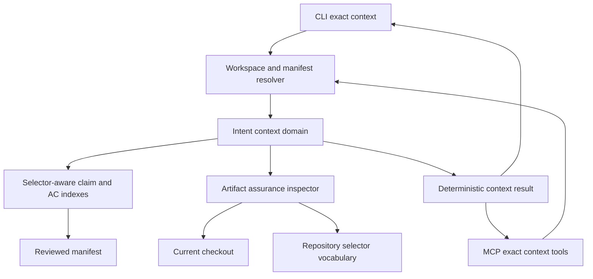
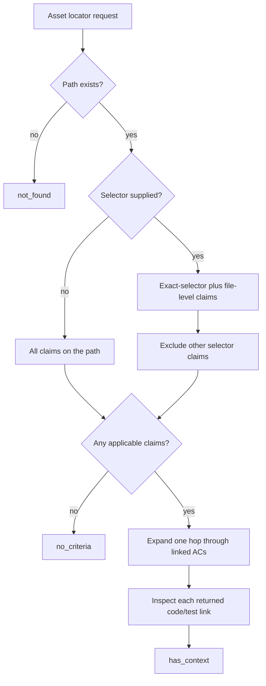
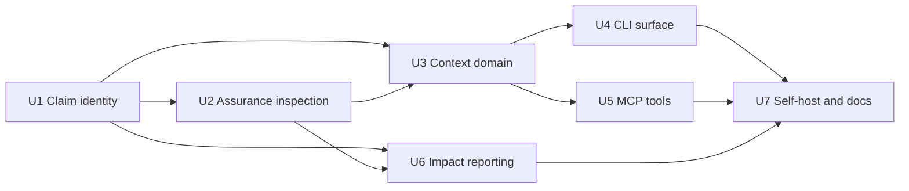

# Precise Intent Context - Plan

## Goal Capsule

- **Objective:** Let an agent start from an exact code/test locator or Acceptance Criterion and retrieve the reviewed business intent, directly associated implementation and test assets, and current assurance state without semantic ranking or a database dependency.
- **Authority:** Repository YAML and its compiled manifest define accepted intent. Current checkout inspection supplies derived freshness and locator state but cannot alter contract links.
- **Execution profile:** Implement the selector-aware claim model first, then the exact context domain, CLI and MCP reads, selector-aware impact reporting, and self-hosted documentation.
- **Stop conditions:** Stop if implementation requires persisted grades, test execution history, recursive code dependency discovery, source parsing beyond the existing selector resolver, or a second manifest traversal that conflicts with the shared claim index.
- **Tail ownership:** The implementation is complete after focused and aggregate tests pass, the accepted contract records the new behavior, and the sharded manifest is regenerated and byte-current.

---

## Product Contract

### Summary

Tieline will expose selector-aware intent context around accepted Acceptance Criteria and repository assets. The result will distinguish exact contract coupling from runtime dependency and will report provenance, freshness, locator resolution, and unassessed semantic support as separate facts.

### Problem Frame

Tieline can currently answer which Acceptance Criteria name a repository path and can separately return complete Story records. The reverse path index drops selector identity, so different symbols in one file collapse into the same claim neighborhood. An agent must then compose multiple reads and cannot tell whether a result matched the requested symbol, only the containing file.

The existing contract also carries enough data to report structural assurance, but it is split across provenance, reviewed hashes, current content measurement, and selector resolution. Without one exact context result, an agent can mistake a present link for a current or semantically verified link.

### Actors

- A1. **Implementing agent:** asks what accepted behavior applies before changing a code or test asset.
- A2. **Reviewing agent:** starts from an Acceptance Criterion or changed asset and inspects related implementation, tests, and drift signals.
- A3. **Maintainer:** uses CLI prose or JSON to debug the same exact results returned to agents.

### Requirements

#### Exact asset context

- R1. Tieline must accept an exact repository-relative code/test asset locator containing a path and optional kind and selector, and must preserve the canonical locator in its result.
- R2. A selector-qualified asset query must return exact-selector claims and file-level claims that apply to the whole file, while excluding claims for different selectors in the same file.
- R3. A path-only asset query must return every matching claim on that path without discarding each claim's kind, selector, framework hint, relation, provenance, or direct-versus-Story-fallback scope.
- R4. Every asset query must return an explicit `has_context`, `no_criteria`, or `not_found` result instead of using an empty collection as an ambiguous negative.

#### Acceptance Criterion context and neighborhood

- R5. Tieline must accept an exact Acceptance Criterion stable ID and return its Capability, Story, lifecycle, criterion text, rationale, applicability, scenarios, direct links, and Story-fallback links.
- R6. Asset context must traverse only from the requested asset to its linked Acceptance Criteria and then to the code/test assets directly linked to those criteria or their Story fallback.
- R7. Acceptance Criterion context must return the same directly associated code/test assets, preserving relation and scope, without recursively traversing code-to-code relationships.
- R8. Results must call this relationship an intent neighborhood or contract coupling and must not describe it as a runtime dependency or comprehensive blast radius.

#### Assurance and drift

- R9. Every returned code/test claim must report provenance, link scope, content freshness, and selector locator state as separate fields.
- R10. A local selector must report `resolved`, `unresolved`, or `not_checked` using the existing conservative resolver; a file-level link must report locator resolution as not applicable.
- R11. Missing, non-file, or repository-escaping local targets must remain visible as broken claims with a named cause instead of disappearing from the neighborhood.
- R12. Cross-repository targets returned through Acceptance Criterion context or its neighborhood, and local targets in unsupported languages, must remain visible with honest `unknown` or `not_checked` states and must never be reported as unresolved solely because Tieline could not inspect them.
- R13. Every returned claim must report semantic support as `not_assessed`; this phase must not persist a grade, grader, confidence score, or test execution result.
- R14. Diff impact output must preserve selector-aware target identity and report locator state for affected links without changing the existing advisory semantic posture.

#### Agent and maintainer access

- R15. Tieline must expose primitive read-only MCP tools for asset-to-intent and Acceptance-Criterion-to-asset context, backed by the compiled manifest and usable without Postgres, embeddings, or network access.
- R16. Tieline must expose equivalent CLI prose and stable JSON output for both exact entry points.
- R17. Every MCP and CLI result must include the repository key and content-derived manifest digest that identified the reviewed contract used to answer.
- R18. Missing workspace, missing manifest, malformed locator, and unknown Acceptance Criterion states must produce named, actionable results or errors appropriate to the existing exact-read conventions.
- R19. Results must be deterministic: identical manifest and checkout content must produce the same ordering, match classifications, neighborhood membership, and structured output.

### Key Flows

- F1. **Inspect an asset before editing**
  - **Trigger:** A1 supplies a path and optional selector.
  - **Steps:** Tieline normalizes the locator, finds applicable direct and file-level claims, inspects each linked asset, and returns the linked Acceptance Criteria plus their directly associated code and tests.
  - **Outcome:** The agent sees the accepted behavior and a bounded intent neighborhood before changing code.
  - **Covered by:** R1-R4, R6, R8-R13, R17-R19.
- F2. **Inspect evidence for an Acceptance Criterion**
  - **Trigger:** A2 supplies an Acceptance Criterion stable ID.
  - **Steps:** Tieline returns the owning product context and inspects each direct or fallback code/test link against the checkout.
  - **Outcome:** The reviewer sees precise locators and separate assurance dimensions without a stored semantic verdict.
  - **Covered by:** R5, R7-R13, R17-R19.
- F3. **Use exact context through an agent or CLI**
  - **Trigger:** A1, A2, or A3 invokes the MCP or CLI surface inside a Tieline workspace.
  - **Steps:** The surface resolves the workspace lazily, reads the manifest, delegates to the shared domain, and renders the same structured result.
  - **Outcome:** Agent and maintainer reads agree and do not require database configuration.
  - **Covered by:** R15-R19.

### Acceptance Examples

- AE1. **Covers F1.** Given a file with `function:first` and `function:second` claims, when `function:first` is queried, Tieline returns the first-symbol and file-level claims but excludes the second-symbol claim.
- AE2. **Covers F1.** Given a path-only query for that file, Tieline returns both selector-qualified claims and preserves their selectors instead of collapsing them.
- AE3. **Covers F1.** Given a Story-level implementation link and an AC-level test link, when the implementation asset is queried, the result identifies the implementation claim as `story_fallback` and includes the directly linked test in the AC neighborhood.
- AE4. **Covers F2.** Given an exact Acceptance Criterion ID, when its context is requested, the result includes its Story, Capability, scenarios, direct links, fallback links, and inspected code/test assurance.
- AE5. **Covers F1 / F2.** Given a selector that no longer names a recognized declaration, when context or diff impact is calculated, the claim remains present with `unresolved` locator state and advisory handling.
- AE6. **Covers F1 / F2.** Given a selector in an unsupported source language, when the asset is inspected, the result reports `not_checked` with `unsupported_language` and does not claim the selector is absent.
- AE7. **Covers F1.** Given an existing path with no applicable claim for the requested selector, when context is requested, Tieline returns `no_criteria`; given a missing path, it returns `not_found`.
- AE8. **Covers F2.** Given a current resolved implementation link, when AC context is returned, provenance, freshness, and locator resolution are positive while semantic support remains `not_assessed`.
- AE9. **Covers F3.** Given no database configuration and a readable compiled manifest, equivalent MCP and CLI requests return the same neighborhood and manifest digest.

### Success Criteria

- An agent can retrieve accepted intent from either a code/test locator or an Acceptance Criterion without semantic search or Postgres.
- Symbols in the same file remain distinct throughout claim identity, lookup, grading scope, impact output, and context results.
- Every returned link communicates what is authored, what is structurally current, what was or was not resolved, and what has not been semantically assessed.
- Existing file-level path lookup remains backward-compatible while gaining selector-preserving claim details.
- No result implies runtime dependency, test execution, or semantic proof.

### Scope Boundaries

#### In Scope

- Accepted repository contract context from the compiled manifest.
- Exact path, kind, and optional selector matching for code/test assets.
- Exact Acceptance Criterion lookup and a single bounded AC-mediated neighborhood.
- Current-checkout hash and selector inspection using existing deterministic primitives.
- MCP, CLI prose, and CLI JSON parity.
- Selector-aware diff impact reporting.

#### Deferred to Follow-Up Work

- Persisted semantic grades or grade history.
- CI test execution receipts, pass/fail history, and mutation testing.
- Additional language-specific selector resolvers.
- Source ranges, extracted snippets, and symbol-body capture.
- Postgres-backed organization-wide intent-neighborhood queries across repositories.
- Suggested relocation of broken links after file or symbol renames.

#### Outside This Product Increment

- Import, call, inheritance, or runtime dependency topology.
- Recursive code-to-code traversal or a comprehensive blast-radius claim.
- Automatic rewriting of accepted links from derived inspection.
- A new user interface.

---

## Planning Contract

### Product Contract Preservation

The Product Contract was created from the confirmed session scope. It preserves the existing authority, provenance, freshness, and ephemeral grading boundaries recorded in `.tieline/spec/contract.yaml`, `.tieline/spec/grading.yaml`, and the earlier living-contract plan.

### Key Technical Decisions

- KTD1. **Keep exact repository context manifest-backed.** Both new entry points will read the reviewed manifest and current checkout directly. Postgres remains the organization/planning projection, not a requirement for pre-edit repository context. Governs R15, R17, R18.
- KTD2. **Evolve the shared claim traversal into one intent index.** One criterion-bearing manifest walk will produce both path-bucketed claims and stable-ID-bucketed AC records. `buildContractClaimIndex` remains a compatibility view over that shared index for reconciliation, path lookup, and grading rather than becoming one of two independent walks. Governs R1-R7, R19.
- KTD3. **Use the full locator for claim identity.** Claim deduplication and downstream grade/impact identities will distinguish target kind, repository, normalized path, canonical selector, and framework hint before relation and link scope. Governs R1-R3, R14. (session-settled: user-approved — chosen over path-only identity because symbols in one file must not collapse into the same intent claim)
- KTD4. **Expose two primitive exact reads.** Asset context and Acceptance Criterion context will be separate composable domain operations and MCP tools that share one result model. A generic graph traversal query is not part of this increment. Governs R4-R8, R15-R19. (session-settled: user-approved — chosen over recursive graph traversal because the immediate requirement is bounded intent context rather than code dependency discovery)
- KTD5. **Include file-level claims as an explicit fallback.** A selector-qualified query will match the same selector and unqualified links for the file, tag their match precision, and exclude different selector-qualified links. Governs R2, R4, R19.
- KTD6. **Inspect assurance without merging its dimensions.** One shared inspector will combine existing artifact hashing, repository selector vocabulary, and conservative selector resolution while keeping provenance, freshness, locator state, and semantic assessment separate. Governs R9-R13.
- KTD7. **Keep semantic grades ephemeral.** Context will state `not_assessed` and will not read or write grade history. The existing grading workflow remains the separate on-demand semantic judgment path. Governs R13. (session-settled: user-approved — chosen over stored grades because a trustworthy validity and invalidation lifecycle is outside this phase)
- KTD8. **Selector drift remains advisory.** Impact output will surface unresolved and not-checked states for affected claims, but selector findings will not change exit behavior in this phase. Broken paths and stale-manifest gates keep their existing behavior. Governs R10-R14.
- KTD9. **Keep MCP and CLI results equivalent.** MCP handlers and CLI rendering will delegate to the same exact context domain; schemas and prose may differ in presentation but not in membership or status semantics. Governs R15-R19. (session-settled: user-approved — chosen over an agent-only surface because CLI/JSON parity is required for debugging and CI use)

### High-Level Technical Design

The new reads reuse the repository-owned exact-read path and add a shared assurance inspection step. The compiled manifest remains immutable; only the returned derived state reflects the current checkout.

Asset matching is intentionally narrower than path lookup while retaining file-level intent that applies to the whole file.

### Existing Patterns to Follow

- `src/contract/reconciliation.ts` owns the shared path-to-criterion traversal used by reconciliation, path lookup, and grading.
- `src/contract/path-criteria.ts` establishes deterministic exact-read statuses, normalized paths, manifest identity, and explicit negative results.
- `src/contract/selector.ts` owns canonical selectors, repository-safe source reads, and the `resolved | unresolved | not_checked` contract.
- `src/contract/manifest.ts` owns reviewed and current artifact hashes; current hashes must never be serialized back into the reviewed manifest.
- `src/contract/impact.ts` owns freshness and broken-link semantics for current-checkout inspection.
- `src/domain/contract-read-store.ts` provides the selector-preserving code/test target and graph vocabulary used by database-backed Story reads.
- `src/tools/path-criteria.ts` establishes lazy workspace resolution and a manifest-backed MCP tool that works without a database.
- `src/tools/query-stories.ts` establishes read-only MCP annotations and complete structured contract records.
- `scripts/test-path-criteria.ts`, `scripts/test-grade.ts`, `scripts/test-impact.ts`, and `scripts/test-contract-read.ts` provide the fixture and assertion conventions for this work.

### System-Wide Impact

- **Contract identity:** Complete target identity will propagate through shared claims and any IDs derived from those claims. Existing path-only calls keep their path grouping but no longer lose selector metadata.
- **Agent context:** The MCP instructions and bundled onboarding skill must direct agents to exact context before semantic search when they already know a locator or AC ID.
- **Drift reporting:** Selector status joins freshness in diff output, but no new blocking gate is introduced.
- **Authority:** The current checkout contributes derived assurance only. It cannot add, remove, or rewrite links in the reviewed manifest.
- **Performance:** Context building may inspect several linked files. The implementation must reuse path hash and source-read caches within one request and enforce the existing source-size safeguards.

### Risks and Mitigations

- **False dependency claims:** Shared ACs do not prove code calls. Name the output intent neighborhood and keep traversal to one AC-mediated hop.
- **Selector over-collapse:** A path-keyed map can still deduplicate distinct symbols if downstream keys remain path-only. Add identity tests across reconciliation, grade scope, and context results before exposing tools.
- **False unresolved findings:** The resolver is conservative and supports a limited language set. Preserve `not_checked`, never convert it to `unresolved`, and keep selector impact advisory.
- **File-level overbreadth:** An unqualified link can legitimately apply to any symbol in its file. Include it as an explicit file-level match so the agent can weigh its lower precision.
- **Duplicate filesystem work:** A large neighborhood can re-read the same file for several AC claims. Cache hash and selector inspection by normalized locator during one request.
- **Schema drift between surfaces:** Separate CLI and MCP shaping could diverge. Test both against the same domain fixture and compare structured membership and status fields.
- **Stale reviewed manifest:** Exact reads answer from the committed manifest by design. Return its digest and keep the existing stale-manifest check as the authority gate.

### Dependencies and Sequencing

---

## Implementation Units

### U1. Preserve selector-aware claim identity

- **Goal:** Produce one selector-aware intent index that carries complete code/test target identity through every existing and new exact-read consumer.
- **Requirements:** R1-R7, R14, R19; KTD2, KTD3.
- **Dependencies:** None.
- **Files:** Modify `src/contract/reconciliation.ts`, `src/contract/path-criteria.ts`, `src/contract/grade.ts`, `src/schemas.ts`, `scripts/test-reconciliation.ts`, `scripts/test-path-criteria.ts`, and `scripts/test-grade.ts`.
- **Approach:**
  1. Refactor the current manifest walk to emit one internal index containing AC records by stable ID and non-help claims by normalized path.
  2. Keep `buildContractClaimIndex` as a derived compatibility view so reconciliation, path criteria, and grading continue to share the same traversal and ordering.
  3. Add target kind, repository, selector, and framework hint to each concrete claim while retaining normalized `linked_path` as the path bucket.
  4. Widen claim deduplication, comparison, and grade-scope identity to distinguish complete locators without changing direct versus Story-fallback semantics.
  5. Return complete target metadata from path criteria so current callers gain precision without losing the existing path statuses or manifest digest.
  6. Preserve external code/test targets in AC records for context output while excluding them from local repository-path claim buckets; keep help links outside this increment's context results.
- **Execution note:** Add failing same-file/different-selector tests before changing the shared identity because a regression here would contaminate every later unit.
- **Patterns to follow:** `buildContractClaimIndex` as the sole manifest traversal; existing canonical selector serialization from `src/contract/schema.ts`.
- **Test scenarios:**
  1. Two direct claims with the same path, relation, and scope but different selectors both survive indexing and receive different grade-scope identities.
  2. An unqualified file claim and a selector-qualified claim both survive and retain their provenance and scope.
  3. Identical claims still deduplicate deterministically.
  4. A test target retains its framework hint while a code target reports no framework hint.
  5. Existing path-only `has_criteria`, `no_criteria`, and `not_found` ordering and counts remain unchanged.
  6. Story-fallback and direct claims for the same full locator remain separate claims.
  7. Building the path view and AC view together performs one ordered contract walk and both views reference the same normalized claim records.
  8. An external code target is present in the AC view but absent from the local path bucket.
- **Verification:** Focused reconciliation, path-criteria, and grade suites prove complete target preservation and stable deterministic identities.

### U2. Centralize current artifact assurance inspection

- **Goal:** Produce one honest, cached structural assurance result for each returned code/test locator.
- **Requirements:** R9-R13, R19; KTD6-KTD8.
- **Dependencies:** U1.
- **Files:** Create `src/contract/artifact-assurance.ts` and `scripts/test-artifact-assurance.ts`; modify `src/contract/impact.ts`, `src/contract/manifest.ts`, `src/contract/validate.ts`, and `package.json` only where sharing existing primitives requires an exported seam.
- **Approach:**
  1. Reuse current artifact hashing and repository selector vocabulary rather than adding a second file reader or symbol extractor.
  2. Report freshness, broken cause, locator resolution, and semantic `not_assessed` independently.
  3. Treat local file-level links as locator-not-applicable, cross-repository links as freshness unknown and locator not checked, and unsupported languages as `not_checked`.
  4. Cache file hash/source inspection by repository and normalized locator for the duration of one context or impact analysis.
  5. Preserve the existing maximum source size, binary detection, and repository-boundary checks.
- **Execution note:** Build the status matrix test-first; the value of this unit is preventing one uncertain state from being misreported as another.
- **Patterns to follow:** `createArtifactHashResolver`, `selectorVocabularyForRepository`, and `resolveSelector`; current freshness and broken-cause wording from `src/contract/impact.ts`.
- **Test scenarios:**
  1. A matching reviewed hash and resolved selector report current and resolved while semantic support remains not assessed.
  2. A changed file reports stale even when the selector still resolves.
  3. A removed symbol reports unresolved without removing the authored claim.
  4. A missing file reports freshness as broken with broken cause `missing`, while a selector-qualified claim reports locator state `not_checked` with reason `file_missing`.
  5. A file-level link reports locator resolution as not applicable.
  6. A JavaScript/TypeScript file with no recognized declarations reports `not_checked`, not unresolved.
  7. An unsupported extension reports `not_checked` with `unsupported_language`.
  8. A cross-repository target remains visible with unknown/not-checked assurance and is never read from the local checkout.
  9. Repeated claims for one file reuse the request-local inspection cache while returning claim-specific metadata.
- **Verification:** The focused assurance suite proves every state transition and the TypeScript build proves shared type compatibility.

### U3. Build exact asset and Acceptance Criterion context

- **Goal:** Assemble deterministic, bounded intent neighborhoods from the reviewed manifest.
- **Requirements:** R1-R13, R17-R19; F1, F2; KTD1-KTD7.
- **Dependencies:** U1, U2.
- **Files:** Create `src/contract/intent-context.ts` and `scripts/test-intent-context.ts`; modify `package.json`.
- **Approach:**
  1. Consume both views of U1's shared intent index; do not traverse manifest capabilities, Stories, and criteria again.
  2. Implement asset matching per KTD5, preserving exact-selector versus file-level match precision in each returned claim.
  3. Expand one hop from matching claims to each linked AC's direct and Story-fallback code/test assets, deduplicating output by full locator plus relation and scope.
  4. Return Capability, Story, lifecycle, applicability, rationale, and scenarios alongside each AC.
  5. Inspect every returned code/test asset through U2 and preserve broken or uncertain links.
  6. Sort by stable IDs, relation, scope, and full locator so serialized output is reproducible.
- **Execution note:** Implement the domain independently of CLI and MCP so both surfaces can prove parity against the same fixtures.
- **Patterns to follow:** Explicit negative results and repository path normalization from `src/contract/path-criteria.ts`; graph node identity from `buildContractGraph` without adopting its generic traversal API.
- **Test scenarios:**
  1. Covers AE1. A selector-qualified asset returns exact and file-level claims and excludes another selector in the same file.
  2. Covers AE2. A path-only asset returns every selector-qualified claim with selectors intact.
  3. Covers AE3. A Story fallback reaches each owning AC and includes each AC's direct tests without reclassifying fallback as direct.
  4. Covers AE4. An AC lookup returns complete product ancestry, scenarios, direct links, and fallback links.
  5. Duplicate routes to the same AC or asset collapse deterministically without losing distinct relations or scopes.
  6. Existing unlinked path, missing path, malformed selector, and unknown AC ID produce distinct explicit results.
  7. A broken or unresolved linked asset remains in the neighborhood with its assurance state.
  8. The same manifest and checkout produce byte-equivalent JSON after repeated construction.
  9. No result or description uses runtime-dependency or comprehensive-blast-radius semantics.
- **Verification:** The focused intent-context suite proves both entry points, matching precision, one-hop bounds, negative results, and deterministic ordering.

### U4. Expose CLI context with stable JSON parity

- **Goal:** Give maintainers and automated callers both exact entry points without requiring MCP.
- **Requirements:** R16-R19; F3; KTD9.
- **Dependencies:** U3.
- **Files:** Modify `src/cli.ts`, `src/commands/contract.ts`, `scripts/test-contract-command.ts`, and `scripts/test-tieline.ts`.
- **Approach:**
  1. Add one contract context command with mutually exclusive asset-locator and Acceptance-Criterion modes.
  2. Reuse `resolveCommandContext`, manifest reading, repository-relative path handling, and existing JSON/prose conventions.
  3. Render match precision and assurance dimensions without collapsing them into a single confidence or verified flag.
  4. Keep empty and error states actionable and stable for scripts.
- **Execution note:** Start with JSON contract assertions, then add prose rendering over the same domain result.
- **Patterns to follow:** Direct `criteria` and `grade` action registration in `src/cli.ts`; rendering and manifest error handling in `src/commands/contract.ts`.
- **Test scenarios:**
  1. Asset mode accepts a path-only locator and emits every selector-preserving claim.
  2. Asset mode accepts a canonical selector and emits exact/file-level match classifications.
  3. AC mode returns complete ancestry and associated assets.
  4. Supplying both modes or neither produces an actionable usage error.
  5. JSON retains all domain fields and manifest digest without prose-only information.
  6. Prose distinguishes freshness, locator status, and unassessed semantic support.
  7. Missing manifest, unknown AC, no-criteria asset, and missing path follow their specified negative contracts.
- **Verification:** CLI tests prove both modes, JSON/prose parity, argument validation, and errors; `test:tieline` proves the packaged command path.

### U5. Expose primitive manifest-backed MCP context tools

- **Goal:** Make exact intent context a first-class agent capability that works in an offline workspace.
- **Requirements:** R15-R19; F3; KTD1, KTD4, KTD9.
- **Dependencies:** U3.
- **Files:** Create `src/tools/intent-context.ts`; modify `src/schemas.ts`, `src/server.ts`, `src/resources.ts`, `scripts/test-intent-context.ts`, `scripts/smoke.ts`, and `package.json` if a focused MCP test script is separated.
- **Approach:**
  1. Register separate read-only tools for exact asset context and exact Acceptance Criterion context.
  2. Resolve the workspace and compiled manifest lazily inside handlers so server startup remains independent of repository and database state.
  3. Use strict bounded input and output schemas that preserve locator, match precision, neighborhood, and assurance states.
  4. Update server orientation so agents use exact context before semantic search when they already know a path, selector, or AC ID.
  5. Keep `get_path_criteria` available for existing callers and direct it toward the richer asset tool when selector-aware neighborhood context is required.
- **Execution note:** Test handlers with the knowledge store configured to throw, proving these reads never touch Postgres.
- **Patterns to follow:** Registration, lazy workspace resolution, annotations, and errors from `src/tools/path-criteria.ts`; result shaping from `src/tools/query-stories.ts`.
- **Test scenarios:**
  1. Covers AE9. Both tools return structured results with no database environment or store access.
  2. MCP asset output matches the CLI JSON neighborhood for the same fixture.
  3. MCP AC output matches the CLI JSON context for the same fixture.
  4. Tool annotations declare read-only, idempotent, non-destructive, closed-world behavior.
  5. Missing workspace and unreadable manifest errors name the corrective action.
  6. Input schemas reject escaping paths, malformed selectors, and empty requests.
  7. Smoke tests include both tool names and the server instructions describe exact-versus-semantic use correctly.
- **Verification:** Focused handler/schema tests and smoke tests prove registration, offline behavior, parity, annotations, and actionable failure states.

### U6. Report selector drift in diff impact

- **Goal:** Carry precise target identity and locator state into existing change-impact output without adding a new gate.
- **Requirements:** R10-R14, R19; AE5, AE6; KTD3, KTD6, KTD8.
- **Dependencies:** U1, U2.
- **Files:** Modify `src/contract/impact.ts`, `src/commands/check.ts`, `scripts/test-impact.ts`, and `scripts/test-contract-command.ts`.
- **Approach:**
  1. Preserve target kind, selector, and framework hint on linked impact findings and their deterministic identities.
  2. Use U2 to attach selector resolution for affected claims while retaining current freshness and broken-link behavior.
  3. Render unresolved selector detail as an advisory re-read signal and `not_checked` as an honest limitation.
  4. Do not change exit codes for selector resolution; existing broken-link and stale-manifest gates remain authoritative.
- **Execution note:** Characterize current impact exit behavior before adding locator fields so selector reporting cannot accidentally become blocking.
- **Patterns to follow:** Current `AcceptanceCriterionImpact`, grouped prose rendering, and broken-link sweep in `src/contract/impact.ts` and `src/commands/check.ts`.
- **Test scenarios:**
  1. Two selectors in one changed file produce distinct affected claims rather than one collapsed path finding.
  2. A changed implementation whose selector still resolves reports current locator state and stale/current content independently.
  3. A removed declaration reports unresolved in JSON and prose while advisory exit behavior remains unchanged.
  4. An unsupported language reports not checked without an unresolved warning.
  5. A broken file retains the existing non-zero default and named broken cause.
  6. Story-fallback and direct impacts retain separate scope and complete locator metadata.
- **Verification:** Impact and command suites prove selector precision, status rendering, and unchanged exit semantics.

### U7. Self-host and document precise intent context

- **Goal:** Record the shipped behavior in Tieline's accepted contract and teach agents the exact-read workflow.
- **Requirements:** R1-R19; F1-F3; KTD1-KTD9.
- **Dependencies:** U4, U5, U6.
- **Files:** Modify `.tieline/spec/contract.yaml`, `README.md`, `skills/tieline/SKILL.md`, and `.tieline/manifest/`; update `package.json` aggregate test scripts if focused suites were added.
- **Approach:**
  1. Extend the existing exact path-context Story or add the narrowest new Story under the CONTRACT capability, preserving stable IDs already in use.
  2. Link each new AC to the narrowest domain, CLI, MCP, impact, and test evidence using selector-qualified links where stable symbols exist.
  3. Document asset versus AC entry points, intent-neighborhood semantics, assurance dimensions, and explicit non-proof boundaries.
  4. Update the bundled agent workflow to prefer exact context before editing a known asset and before falling back to semantic discovery.
  5. Regenerate the sharded manifest only after implementation and tests settle.
- **Patterns to follow:** Existing `CONTRACT-002` path-criteria Story, GRADING's unassessed semantic boundary, and current README exact-versus-semantic guidance.
- **Test scenarios:**
  1. Contract validation accepts the new self-hosted criteria and selector-qualified evidence links.
  2. Manifest compilation records current reviewed hashes for every new local implementation/test link.
  3. Coverage remains explicit and the new criteria have direct implementation and test evidence.
  4. The bundled skill and README never describe contract coupling as runtime dependency or a passing linked test as verified execution.
  5. The full contract, smoke, CLI, and build suites pass against the regenerated manifest.
- **Verification:** The accepted contract validates, the manifest is byte-current, documentation matches the actual schemas and commands, and the full verification contract passes.

---

## Verification Contract

| Gate | Applies to | Required outcome |
|---|---|---|
| Focused claim, assurance, context, impact, and command suites | U1-U6 | Same-file selectors remain distinct; every assurance and negative state is covered. |
| `npm run test:contract` | U1-U7 | Contract parsing, manifest, reconciliation, path criteria, grade, impact, and new context behavior pass together. |
| `npm run test:contract-read` | U3, U5 | Shared contract target and graph conventions remain compatible. |
| `npm run test:smoke` | U5, U7 | MCP tools register and the server starts with the expected offline surface. |
| `npm run test:tieline` | U4, U7 | Packaged CLI behavior and skill installation remain valid. |
| `npm run build` | All units | TypeScript compiles with no domain/schema drift. |
| `npm test` | Final integration | The complete non-database suite passes without regressions. |
| Contract validate, compile, coverage, reconcile, and check against `origin/main` | U7 | Accepted behavior is structurally valid, fully linked, reconciled, and correctly reported. |
| Manifest byte comparison | U7 | No generated manifest change remains after the final compile. |

Database integration is not required for this increment because both new exact context reads are deliberately manifest-backed and the baseline projection schema already stores selector-aware asset identity.

---

## Definition of Done

- U1: Complete selector-aware target identity survives the shared claim index, path criteria, and grade scope without collapsing same-file symbols.
- U2: One cached inspector reports freshness, broken state, locator resolution, and unassessed semantic support without conflating uncertainty states.
- U3: Exact asset and AC reads produce deterministic one-hop intent neighborhoods and explicit negative results.
- U4: CLI prose and JSON expose both entry points with the same domain membership and statuses.
- U5: Read-only MCP tools expose both entry points without Postgres, embeddings, or network access and are covered by smoke tests.
- U6: Diff impact preserves selectors and reports locator drift without changing existing exit behavior.
- U7: The accepted contract, README, bundled agent workflow, and regenerated manifest describe and evidence the shipped behavior.
- All applicable verification gates pass, or an environmental limitation is documented with the unaffected deterministic proof still green.
- No persisted grade, test receipt, recursive dependency relation, source snippet, new parser, automatic contract rewrite, or UI is introduced.
- Abandoned experimental code and duplicate traversals are removed from the final diff.
