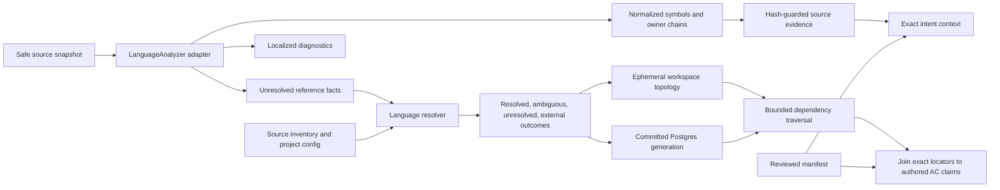
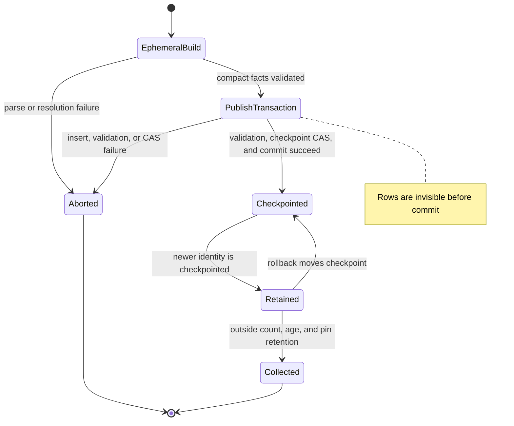
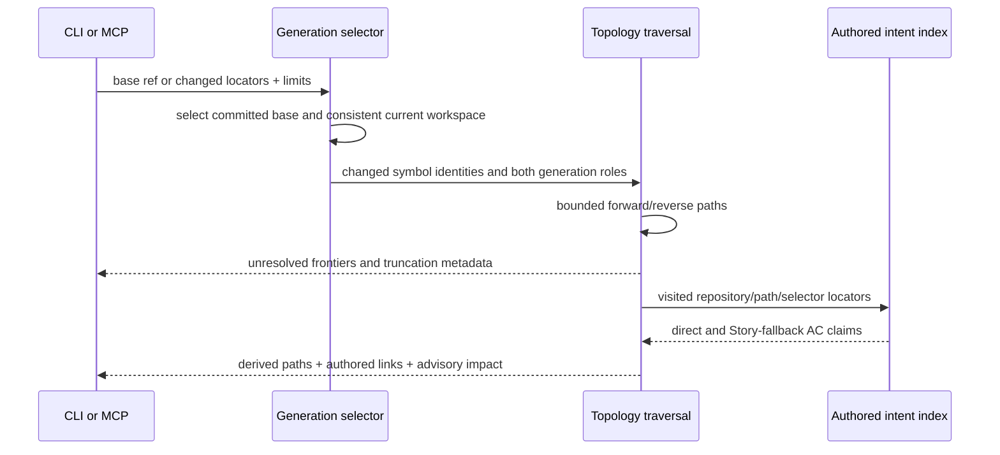
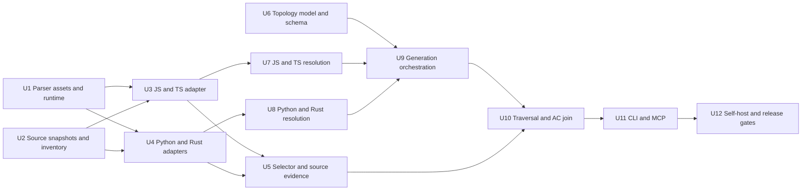

# Multi-Language Code Topology - Plan

## Goal Capsule

- **Objective:** Give Tieline syntax-precise source evidence for JavaScript, TypeScript, Python, and Rust, then derive explainable code-dependency paths that connect changed code to authored Acceptance Criteria.
- **Authority:** Repository YAML and its compiled manifest remain the authority for business intent. Parsed symbols, resolved dependencies, snippets, and blast-radius paths are derived evidence and cannot create or rewrite accepted intent.
- **Execution profile:** Phase 1 establishes the portable parser, source-range, symbol, snippet, and unresolved-reference contracts. Phase 2 resolves project-local references, stores committed topology generations in Postgres, analyzes working trees ephemerally, and exposes bounded dependency and AC-aware traversal.
- **Stop conditions:** Stop if the implementation requires a semantic call graph, type inference, dynamic-dispatch resolution, project toolchain execution, persisted source bodies, automatic YAML edits, cross-repository dependency resolution, or a verdict that implementation satisfies an AC.
- **Tail ownership:** The work is complete after both phases pass focused, database, package-install, Node-version, CLI/MCP parity, and self-hosted contract checks, with no experimental parser or topology code left in the diff.

---

## Product Contract

### Summary

Tieline will first replace conservative declaration matching with a bounded multi-language syntax-analysis layer. It will then use those stable facts to derive revisioned code topology and explain which authored ACs may be affected by a code change.

### Problem Frame

Tieline can now retrieve precise authored intent for a path or selector, but its selector inspection is based on conservative language-shaped text matching. It cannot prove that a qualified method belongs to the named class, return trustworthy source ranges and snippets, or represent imports in a form that later traversal can resolve.

Authored AC links also do not answer which other code depends on a changed symbol. Two assets linked to the same AC are contract-coupled, but that does not prove a code dependency. Tieline needs a separate derived topology that can traverse real, statically resolvable relationships and then join the visited code back to authored intent without merging those authorities.

### Actors

- A1. **Implementing agent:** retrieves exact structural source evidence before changing code and asks which code and ACs may be affected by a proposed change.
- A2. **Reviewing agent:** inspects the ordered dependency paths and authored-link provenance behind an advisory blast-radius result.
- A3. **Maintainer:** uses equivalent CLI text and JSON to debug parser, resolver, generation, traversal, and drift behavior.
- A4. **Repository sync operator:** persists complete topology generations for committed revisions without publishing dirty or partial working-tree state.

### Requirements

#### Phase 1: source snapshots and syntax facts

- R1. Tieline must analyze JavaScript, JSX, TypeScript, TSX, Python, and Rust through a language registry, and must return a named `not_checked` reason for unsupported, missing, binary, oversized, or unsafe targets.
- R2. One immutable source snapshot must provide the content hash, text or bytes, language, parse input, ranges, and snippets for a file so one result cannot combine facts from different file contents.
- R3. The source inventory must reuse repository source roots, ignore rules, deterministic ordering, symlink-cycle prevention, and repository-escape protection already used by coverage analysis.
- R4. Each parsed symbol must retain a snapshot-local identity, canonical selector, parser-native kind, normalized Tieline kind, owner chain, source range, name range, and language; selector lookup must remain separate from symbol identity.
- R5. A qualified selector must resolve only when its complete owner chain matches the parsed structure, and duplicate matches must return `ambiguous` rather than selecting an arbitrary symbol.
- R6. Selector names must remain backward-compatible with existing locators while supporting NFC-normalized Unicode identifiers and documented language-specific forms such as Rust raw identifiers.
- R7. Every exposed range must name its coordinate system. Tieline must distinguish Web binding UTF-16 indices from derived UTF-8 byte offsets and line/column coordinates.
- R8. A source snippet must be bounded by configured byte and line caps, derived from the same source snapshot as its range, include the analyzed content hash, and be omitted when the current file hash no longer matches; source bodies and snippets must not be persisted.
- R9. Localized parser `ERROR` and `MISSING` diagnostics must coexist with usable captures. A file-level parse error must not invalidate symbols captured outside the damaged region.
- R10. Phase 1 must extract normalized unresolved import, export, re-export, module, and statically named reference facts with source and owner identity while making no claim that their targets have been resolved.
- R11. Existing exact intent and assurance results must expose structural source evidence for a uniquely resolved locator while keeping content freshness, locator state, parser diagnostics, contract coupling, and semantic support as separate dimensions.
- R12. Parser-backed selector resolution must replace declaration regex inspection without removing the lexical scanner used by link plausibility or changing its advisory behavior.
- R13. Parser initialization, language loading, object lifecycle, caching, and concurrent use must be deterministic and safe in long-running MCP and short-lived CLI processes.
- R14. The published package must contain a pinned, licensed, integrity-checked parser compatibility set and must locate those assets after normal npm installation without a compiler, language toolchain, network call, or native build step.

#### Phase 2: resolution, topology, and AC-aware blast radius

- R15. Language-specific resolvers must convert project-local static references into `resolved`, `ambiguous`, `unresolved`, or `external` outcomes for supported JavaScript/TypeScript, Python, and Rust module conventions without invoking those projects' toolchains.
- R16. Resolvers must preserve the original unresolved fact, the rule and configuration used, source and target locators when known, and diagnostics sufficient to explain every resolution outcome.
- R17. Topology generations must be immutable and identified by repository, revision, complete inventory digest, parser/grammar compatibility digest, resolver implementation and configuration digest, topology schema version, and fact-producing policy digest; lifecycle and traversal-only settings must not change that identity.
- R18. Only complete committed-revision generations may be persisted in Postgres. Dirty or uncommitted working-tree generations must remain ephemeral and content-hash invalidated.
- R19. Postgres topology must use separate relational generation, file, symbol, reference, and edge records rather than authored `code_assets` or the contract-sync checkpoint, and it must support forward and reverse edge access.
- R20. A topology write must become queryable atomically only after all facts and edges are stored. Failed or partial indexing must leave no persisted generation rows or checkpoint advance.
- R21. Base/current analysis must model both sides of the comparison, including added, deleted, renamed, and reference-retargeted files. Every returned path must state which snapshot or generation supplied each node and edge.
- R22. Dependency traversal must support `dependencies` and `dependents` directions, exclude cycles, apply depth, node, edge, and path limits during expansion, and return truncation counts and reasons.
- R23. Traversal must retain unresolved and ambiguous frontier facts so the absence of a path is not misrepresented as proof that no dependency exists.
- R24. AC-aware blast radius must first compute derived code paths and then join visited exact locators to authored direct or Story-fallback AC claims; sharing an AC must never create a derived code edge.
- R25. Results must distinguish direct authored links, fallback authored links, and transitive derived dependency paths, and must use advisory language such as `may_be_impacted` rather than `satisfies` or `proves`.
- R26. Tieline must expose bounded read-only dependency tracing and change blast-radius primitives through shared domain functions, equivalent CLI JSON/text, and MCP structured content.
- R27. Repository-local CLI and MCP use must work without database configuration by building or reusing a bounded ephemeral topology. Hosted reads without a workspace may use a persisted committed generation or return a named unsupported-state result.
- R28. Derived traversal must remain separate from existing `tieline check` failure semantics in this increment.
- R29. If files change while an ephemeral generation is being built, Tieline must retry from a consistent snapshot or return `workspace_changed`; it must never return ranges and edges from mixed content.
- R30. Identical repository and revision facts, parser and resolver compatibility, topology schema, and fact-producing policy must produce the same ordered facts and generation identity. Identical selected generation roles, traversal limits, and authored manifest or checkpoint identity must produce the same paths, AC joins, and structured output.
- R31. Every AC-aware result must identify both topology generation roles and the manifest digest or contract checkpoint used for authored joins, and must classify divergence between those revision identities.

### Key Flows

- F1. **Inspect a linked symbol with structural evidence**
  - **Trigger:** A1 requests exact intent context for a path and optional selector.
  - **Steps:** Tieline takes one safe source snapshot, parses it with the registered language adapter, resolves the complete selector chain, and joins the unique symbol evidence to the existing authored claim result.
  - **Outcome:** The agent receives the same intent status as today plus hash-guarded ranges, a bounded snippet, native symbol metadata, and localized diagnostics without a semantic verdict.
  - **Covered by:** R1-R14.
- F2. **Index a committed topology generation**
  - **Trigger:** A4 syncs a specific committed revision.
  - **Steps:** Tieline inventories and parses the revision, resolves supported project-local references, writes a new immutable generation, validates completeness, and atomically promotes it for reads.
  - **Outcome:** Readers see either the prior complete generation or the new complete generation, never a partial mix.
  - **Covered by:** R15-R20, R30.
- F3. **Trace dependencies from an exact locator**
  - **Trigger:** A1 or A3 supplies a path/selector, direction, and traversal limits.
  - **Steps:** Tieline selects a workspace or committed generation, identifies exact or ambiguous starting symbols, traverses bounded derived edges, and retains unresolved frontiers and ordered paths.
  - **Outcome:** The caller sees explainable dependencies or dependents with generation identity, limits, and derivation metadata.
  - **Covered by:** R15-R23, R26-R30.
- F4. **Assess a branch change against authored intent**
  - **Trigger:** A1 or A2 supplies a Git base or explicit changed locators.
  - **Steps:** Tieline compares base and current topology roles, handles additions/deletions/renames, traverses affected code, and joins visited locators to exact authored AC claims.
  - **Outcome:** The caller sees which code and ACs may be affected, why each item appears, and where resolution or traversal was incomplete.
  - **Covered by:** R21-R31.
- F5. **Use the same capability locally or through hosted MCP**
  - **Trigger:** A1-A3 call CLI or MCP with or without database configuration.
  - **Steps:** Tieline chooses an ephemeral workspace generation when a repository is present, otherwise a compatible persisted generation when available, and delegates both surfaces to the same domain query.
  - **Outcome:** Structured membership and authority semantics agree across surfaces, with named results when the requested generation cannot be supplied.
  - **Covered by:** R26-R31.

### Acceptance Examples

- AE1. **Covers F1.** Given two classes with a method named `save`, `class:First/method:save` resolves only the method owned by `First`; it does not resolve because `First` and `save` occur independently in the file.
- AE2. **Covers F1.** Given two structurally valid declarations that canonicalize to the same selector, lookup returns `ambiguous` with both symbol identities and no snippet.
- AE3. **Covers F1.** Given BMP text, an astral character, a combining sequence, CRLF, and multiline source before a symbol, its UTF-16 and UTF-8 ranges each round-trip to the same bounded snippet.
- AE4. **Covers F1.** Given a recoverable TypeScript generic tagged-template parse error, declarations outside the error remain resolved and the result also contains the localized diagnostic.
- AE5. **Covers F1.** Given a file that changes after it is analyzed, Tieline suppresses the stale snippet or retries; it never returns the old range with the new hash.
- AE6. **Covers F1.** Given a Python method, a Rust raw identifier, a TypeScript interface, and a JavaScript function, each returns a documented canonical selector and retains its parser-native kind.
- AE7. **Covers F2.** Given a generation write that fails after inserting some rows, readers continue to use the prior complete generation and the failed generation cannot be selected as current.
- AE8. **Covers F2.** Given the same committed revision and compatibility versions, a repeated index is idempotent and produces the same generation identity and ordered facts.
- AE9. **Covers F3.** Given a dependency cycle, reverse traversal visits each node within the configured bounds once, returns ordered paths, and terminates without relying on response-size truncation.
- AE10. **Covers F3.** Given an unresolved package alias or ambiguous module target, the frontier appears with the resolver rule and reason instead of disappearing.
- AE11. **Covers F4.** Given a renamed file and a retargeted import, base/current analysis reports the old and new path roles and derives impact from both deletion and addition sides.
- AE12. **Covers F4.** Given code A and code B linked to the same AC but no derived edge between them, changing A does not manufacture a dependency path to B.
- AE13. **Covers F4.** Given A imports B and B has an authored direct AC link, changing A returns the ordered derived path and the authored link separately, labeled `may_be_impacted`.
- AE14. **Covers F5.** Given no database variables and a readable workspace, equivalent CLI and MCP requests return the same ephemeral generation digest and structured path membership.
- AE15. **Covers F5.** Given hosted MCP without a workspace, a compatible persisted revision returns normally; a missing or incompatible generation returns a named actionable state rather than an empty blast radius.
- AE16. **Covers F4 / F5.** Given topology and authored contract checkpoints from different commits, the result reports both identities and divergence; it does not imply that the joined AC was reviewed against the topology revision.

### Success Criteria

- Existing qualified selector links gain structural ownership proof for all four target languages without weakening unsupported-language or ambiguity semantics.
- An agent can retrieve bounded, hash-consistent source evidence without source persistence or database access.
- A changed locator can be traversed in either direction with an ordered, bounded, revision-identified explanation.
- Derived code paths can be joined to authored ACs while the result preserves the authority and scope of each relationship.
- The shipped parser works from an installed package on supported Node versions and remains within the agreed package, startup, and repository-analysis budgets.
- A failed or stale topology build cannot replace a complete committed generation or contaminate an ephemeral query.

### Scope Boundaries

#### In Scope

- JavaScript/JSX, TypeScript/TSX, Python, and Rust syntax adapters.
- Symbols, owner chains, named source coordinates, bounded snippets, diagnostics, and unresolved static references.
- Conservative project-local module resolution for common supported configurations.
- Immutable relational topology generations for committed revisions and ephemeral topology for working trees.
- Bounded forward/reverse dependency traversal and explainable AC-aware blast radius.
- CLI/MCP parity, package assets, self-hosted contract coverage, and operational verification.

#### Deferred to Follow-Up Work

- Incremental tree editing, background indexing, and watch mode after measurement proves they are needed.
- Additional languages and framework-specific symbol kinds.
- Cross-repository and installed-package dependency resolution.
- Type-aware imports, call graphs, inheritance graphs, dynamic dispatch, macro expansion, and runtime dependency evidence.
- Suggested selector or path rewrites after a rename.
- CI test receipts, mutation evidence, and semantic-support grading linked to code ranges.
- User-configurable parser and traversal budgets beyond stable safe defaults.

#### Outside This Product Increment

- Persisted source bodies or snippets.
- Automatic changes to contract YAML or reviewed links.
- A graph database or a generic unbounded graph-query interface.
- Treating derived topology as authored authority.
- An `implementation_satisfies_ac` verdict.

---

## Planning Contract

### Product Contract Preservation

The Product Contract extends the shipped precise-intent context with the parser and dependency-topology work confirmed in this session. It preserves the existing manifest authority, `has_context` / `no_criteria` language, direct-versus-Story-fallback scope, and `semantic_support: not_assessed` boundary.

### Key Technical Decisions

- KTD1. **Define both phases in one plan.** Phase 1 owns normalized syntax facts and Phase 2 consumes that contract for resolution and traversal. The phases remain separately shippable and have independent exit gates. Governs R1-R31. (session-settled: user-directed — chosen over planning only the parser phase because the shared fact and identity contracts should be designed with their topology consumer)
- KTD2. **Target pinned WebAssembly parser artifacts behind release gates.** Use the official Web binding and pinned grammar Wasm files to avoid native grammar peer conflicts and user toolchain requirements. Keep a `LanguageAnalyzer` port so a native or compiler-backed adapter can replace the runtime if the Wasm performance gate fails. Governs R1, R13, R14.
- KTD3. **Make analysis asynchronous at the domain seam.** Memoize runtime initialization and language loads, serialize use per parser instance or allocate isolated instances, reuse compiled queries, and explicitly release parser-owned objects. Propagate async behavior through assurance, intent context, impact, CLI, and MCP instead of eager server construction. Governs R11-R14.
- KTD4. **Own source consistency in one snapshot abstraction.** A request-local snapshot supplies content, hash, language, and all coordinate conversions. Inventory and Git-revision readers produce the same abstraction so parsing, snippets, and topology never perform independent reads. Governs R2, R3, R7-R9, R21, R29.
- KTD5. **Separate canonical lookup from symbol identity.** Canonical selectors are stable user locators; parsed symbol IDs distinguish owner path, native kind, range, and snapshot. Lookup returns unique, ambiguous, unresolved, or not-checked results without hiding duplicates. Governs R4-R6, R11.
- KTD6. **Treat parser diagnostics as annotations, not file verdicts.** Capture `ERROR` and `MISSING` regions and retain every symbol/reference fact whose range remains usable. Convert absence under damaged syntax to a non-accusatory not-checked reason when resolution is inconclusive. Governs R9-R11.
- KTD7. **Parse first and resolve second.** Language adapters emit normalized unresolved facts without filesystem guesses. Resolver adapters consume those facts, the source inventory, and supported project configuration in Phase 2 and preserve exact/ambiguous/unresolved/external outcomes. Governs R10, R15, R16.
- KTD8. **Resolve only conservative project-local static relationships.** Support relative and statically configured local modules first. Do not execute package managers, compilers, Python environments, Cargo metadata, build scripts, macros, or user code. Treat dependencies outside the indexed repository as external. Governs R15, R16, R23.
- KTD9. **Use committed Postgres generations plus ephemeral workspace generations.** Persist immutable committed revisions for shared and hosted reads. Build dirty and uncommitted working-tree state in memory so local blast radius remains offline and transient code never enters shared persistence. This preserves the existing offline exact-context posture while still giving hosted readers durable generations. Governs R17-R21, R27, R29.
- KTD10. **Keep topology persistence separate from authored assets.** Add a `CodeTopologyStore` port and dedicated relational tables. Join topology symbols to authored locators only at query time using the existing repository, kind, canonical path, nullable selector, and framework-hint identity; return an ambiguous join instead of dropping identity dimensions. Governs R19, R20, R24, R25, R31.
- KTD11. **Make generations immutable and make base/current query roles.** Build compact facts outside Postgres, then bulk-insert and validate the complete generation and compare-and-swap its checkpoint in one transaction. `base` and `current` select generation identities; they are not stored generation states. A rollback changes the checkpoint to a retained complete generation and never mutates facts. Governs R17-R21.
- KTD12. **Use relational adjacency with bounded domain traversal.** Store indexed source and target identifiers for both traversal directions. Apply default limits of depth 4, 500 nodes, 2,000 edges, and 100 paths during cycle-safe expansion; hard maxima are twice those defaults. Return ordered bounded paths, frontier gaps, limits, and truncation metadata. Governs R19, R22, R23, R30.
- KTD13. **Compose dependency paths with the existing intent index.** Compute topology reachability first, then join visited exact locators through `buildContractIntentIndex()` locally or criterion/code-asset junctions in Postgres. Hosted traversal and authored joins use one repeatable-read snapshot and return both checkpoint identities. Preserve `derived_code_dependency` and `contract_coupling` as different relationship types. Governs R24, R25, R31.
- KTD14. **Expose two code-specific read primitives.** Add dependency tracing for an exact locator and change blast radius for explicit changes or a Git base. Do not expose a raw graph query or fold the results into `tieline check` blocking behavior. Governs R22-R28.
- KTD15. **Keep structural evidence separate from AC satisfaction.** Parser capture, current hashes, snippets, resolved imports, tests linked in YAML, and reachability can improve evidence quality but cannot prove the implementation satisfies criterion text. Semantic support remains `not_assessed`. Governs R11, R24, R25, R28.
- KTD16. **Edit the clean baseline schema and preserve role separation.** Add topology objects, indexes, and grants to `migrations/0001_baseline.sql`; use the existing privileged sync writer for committed generations and read roles for traversal. Do not create an upgrade migration while the repository retains its clean-baseline development policy. Governs R18-R20.
- KTD17. **Bound repository analysis and cache lifetime.** Support an initial envelope of 5,000 source files, 50 MiB of source, 100,000 symbols, and 250,000 edges. Analyze files with at most four independently owned parser instances, coalesce same-workspace builds, and keep at most two ephemeral generations or 256 MiB for five minutes in an LRU cache. Eviction must release graph and source buffers. Governs R13, R27, R29, R30.
- KTD18. **Retain queryable history explicitly.** Keep the checkpointed current generation, the ten prior complete generations, every complete generation newer than 30 days, and administrative pins. Hosted base/current reads select both generations in one repeatable-read transaction; an expired base returns `generation_unavailable`. Governs R20, R21, R27, R31.

### High-Level Technical Design

Phase 1 creates versioned syntax facts. Phase 2 resolves those facts and projects committed revisions into a separate topology store. Exact intent remains manifest-backed and can join an ephemeral topology without Postgres.



Generation publication is atomic. Analysis happens outside Postgres; a failed build leaves no persisted generation. A committed transaction publishes immutable facts and moves only the repository checkpoint.



Base/current blast radius preserves both topology and intent authority through the result.



### Existing Patterns to Follow

- `src/contract/selector.ts` owns canonical selector vocabulary and resolution states; replace its declaration regex lookup while retaining external contracts.
- `src/contract/source-scan.ts` and `src/contract/link-plausibility.ts` own the separate lexical plausibility scan that remains in place.
- `src/contract/coverage.ts` establishes source roots, ignore matching, deterministic walking, symlink-cycle prevention, and repository-escape checks to extract into a shared inventory.
- `src/contract/artifact-assurance.ts`, `src/contract/intent-context.ts`, and `src/contract/impact.ts` keep provenance, freshness, locator resolution, and semantic support separate.
- `src/contract/reconciliation.ts` owns `buildContractIntentIndex()` and direct-versus-Story-fallback claim scope for offline AC joins.
- `src/domain/knowledge-store.ts` and Postgres adapters establish the domain-port and composition-root pattern for a new topology store.
- `src/adapters/postgres/contract-sync-repository.ts` establishes advisory locking, expected-previous-commit checks, transactional sync, and privileged writer composition; topology checkpoints remain independent.
- `src/adapters/postgres/search-context.ts` demonstrates bounded recursive SQL and cycle exclusion, but topology queries must return complete ordered paths rather than a proximity score.
- `src/tools/intent-context.ts`, `src/commands/contract-context.ts`, and `src/server.ts` establish lazy workspace lookup, offline exact reads, MCP annotations, and CLI/MCP domain reuse.
- `package.json` already publishes `assets`; migration asset lookup provides the installed-package path-resolution precedent for parser artifacts.

### System-Wide Impact

- **Async domain flow:** Parser initialization changes selector inspection and every caller that currently assumes synchronous resolution. MCP registration remains synchronous, but workspace analysis begins lazily inside async requests.
- **Selector compatibility:** Existing selectors remain valid. New canonical-name handling affects validation, parsed lookup, database joins, schemas, and documentation across all supported languages.
- **Source lifecycle:** Hashing, parsing, coordinate conversion, snippet slicing, and topology indexing share one snapshot. This removes duplicate reads and creates a single concurrency boundary.
- **Data lifecycle:** Topology generations have independent write checkpoints, retention, and grants. Contract synchronization and topology synchronization may share orchestration but cannot share freshness state.
- **Agent context:** Exact context gains structural evidence. Two additional read primitives provide dependency paths and advisory AC-aware impact without requiring agents to interpret raw adjacency rows.
- **Performance and distribution:** The package gains approximately the pinned runtime and grammar Wasm assets measured by the spike. Startup, corpus analysis, memory, published size, and Node compatibility become release gates.
- **Capacity:** The first release supports the KTD17 envelope. File processing releases trees and source buffers after compact facts are produced, while topology caches and concurrent requests remain bounded.
- **Consistency:** Hosted blast-radius reads select topology generations and authored contract data in one repeatable-read transaction and report both checkpoint identities.
- **Self-hosting:** Tieline's own contract must describe structural source evidence, derived topology authority, and advisory blast radius before the implementation is considered complete.

### Risks and Mitigations

- **Wasm performance in Node:** Official guidance warns that the Web binding can be considerably slower than the native binding. Gate the choice with cold-init, warm-file, full-repository, memory, and package-size measurements; keep the analyzer port runtime-neutral.
- **Coordinate corruption:** The Web binding exposes UTF-16-oriented indices while core Tree-sitter documents byte offsets. Name and test each coordinate system, derive UTF-8 offsets from the original source, and avoid ranged-query optimization until its units pass conformance fixtures.
- **Recoverable grammar errors:** Published grammars can emit missing nodes for valid language constructs. Keep captures and diagnostics orthogonal and include the spike's generic tagged-template case as a permanent fixture.
- **Native dependency drift:** Published grammar packages currently declare incompatible native runtime peers. Pin one tested Wasm compatibility set with ABI and SHA-256 validation rather than relying on a formally invalid native npm tree.
- **Module-resolution overclaim:** Static syntax does not encode every runtime import rule. Preserve exact/ambiguous/unresolved/external outcomes, explain the resolver rule, and stop before toolchain or runtime semantics.
- **Topology/contract contamination:** Storing parsed symbols in `code_assets` would conflict with contract sync deleting unreferenced authored assets. Use separate tables and label every join's authority.
- **Dirty-worktree inconsistency:** Files can change during indexing. Compare the start and end inventory digests, retry once, and return `workspace_changed` rather than mixed evidence.
- **Long-lived MCP memory:** Unbounded parser pools or topology caches could retain source buffers and graphs across requests. Enforce KTD17, coalesce duplicate builds, release parser trees immediately after fact extraction, and verify retained heap after eviction.
- **Persisted-base blindness:** A main-only graph misses added, deleted, and retargeted branch edges. Compare two full normalized roles initially; optimize with overlays only after correctness and profiling.
- **Traversal explosion:** Dense graphs can create many paths even with shallow depth. Enforce independent node, edge, path, and depth caps in the domain and return deterministic truncation metadata.
- **Cross-generation corruption:** Independent symbol keys could connect edges across generations or repositories. Use generation-bearing composite foreign keys for files, symbols, references, resolutions, and both edge endpoints; reject duplicate resolutions and cross-generation targets.
- **GC/query races:** Collection could remove a selected base during a multi-statement read. Apply KTD18, protect checkpointed and pinned generations, and perform selection plus traversal in one repeatable-read transaction.
- **Checkpoint drift:** Topology and contract sync advance independently. Return both identities, classify divergence, and keep their transactions and rollback operations independent.
- **False AC assurance:** Reachability can be mistaken for semantic proof. Keep `may_be_impacted`, authored link scope, derived paths, freshness, and `semantic_support: not_assessed` distinct in schemas, renderers, docs, and fixtures.
- **Baseline schema coupling:** Adding tables and grants to the baseline can break clean installs or roles. Extend baseline static and integration tests before topology sync tests.

### Dependencies and Sequencing



---

## Implementation Units

| Unit | Title | Primary files | Depends on |
|---|---|---|---|
| U1 | Package the parser compatibility set | `package.json`, `assets/parsers/`, parser runtime module | None |
| U2 | Unify source inventory and snapshots | coverage, manifest hashing, new source snapshot modules | None |
| U3 | Add JavaScript and TypeScript analysis | JS/TS adapters, queries, fixtures | U1, U2 |
| U4 | Add Python and Rust analysis | Python/Rust adapters, queries, fixtures | U1, U2 |
| U5 | Integrate structural source evidence | selector, assurance, intent context, impact | U3, U4 |
| U6 | Define revisioned topology persistence | domain store, baseline schema, Postgres adapter | None |
| U7 | Resolve JavaScript and TypeScript modules | JS/TS resolver and fixtures | U3 |
| U8 | Resolve Python and Rust modules | Python/Rust resolver and fixtures | U4 |
| U9 | Build committed and ephemeral generations | topology orchestration, Git snapshots, sync | U6-U8 |
| U10 | Traverse topology and join authored intent | traversal domain, intent index, Postgres reads | U5, U9 |
| U11 | Expose CLI and MCP primitives | CLI, commands, schemas, tools, server | U10 |
| U12 | Self-host and enforce release gates | contract specs, docs, workflow, aggregate tests | U11 |

### Phase 1 — Multi-Language Parser Foundation

### U1. Package the parser compatibility set

- **Goal:** Ship a deterministic parser runtime and grammar set that works after ordinary npm installation.
- **Requirements:** R1, R13, R14; KTD2, KTD3.
- **Dependencies:** None.
- **Files:** Modify `package.json` and `package-lock.json`; add `assets/parsers/<compatibility-set>/`, `src/contract/code-analysis/runtime.ts`, `src/contract/code-analysis/languages.ts`, `scripts/prepare-parser-assets.ts`, and `scripts/test-parser-package.ts`.
- **Approach:**
  1. Record the exact Web runtime, JavaScript, TypeScript/TSX, Python, and Rust grammar revisions, ABI range, artifact origins, SHA-256 digests, and license notices as one compatibility manifest.
  2. Fetch or reproducibly build only the required runtime and grammar Wasm artifacts; do not publish native prebuild collections.
  3. Resolve runtime assets relative to the installed package and memoize one initialization promise plus deterministic language loads.
  4. Provide at most four independently owned parser instances, never share mutable parser/cursor state across requests, and explicitly clean up `Tree`, `Query`, and parser objects.
  5. Add an installed-tarball smoke test that initializes every language without network, compiler, or project toolchain access.
- **Test Scenarios:** Missing or corrupt asset; ABI mismatch; concurrent cold initialization; repeat initialization; installed tarball in a temporary project; Node 20 and Node 24.
- **Verification:** `npm run build`; new parser package test; `npm pack --dry-run`; install the tarball in a temporary directory and run the offline parser smoke.

### U2. Unify source inventory and immutable snapshots

- **Goal:** Give parsing, hashing, snippets, and topology one repository-safe and race-aware source input.
- **Requirements:** R2, R3, R7, R8, R29, R30; KTD4.
- **Dependencies:** None.
- **Files:** Modify `src/contract/coverage.ts`, `src/contract/manifest.ts`, and affected callers; add `src/contract/source-inventory.ts`, `src/contract/source-snapshot.ts`, and `scripts/test-source-snapshot.ts`.
- **Approach:**
  1. Extract source-root, ignore, deterministic walk, symlink, and repository-boundary behavior from coverage into a shared inventory.
  2. Define filesystem and Git-revision snapshot readers that produce canonical path, bytes/text, content hash, language hint, file metadata, and inventory digest.
  3. Detect binary, oversized, unreadable, escaping, and changing files with named outcomes.
  4. Implement explicit UTF-16, UTF-8 byte, and line/column conversions against the immutable original source.
  5. Make assurance and later topology callers consume snapshots rather than re-reading a target independently.
  6. Keep inventory and hashing O(files + source bytes), release file buffers after their compact facts are produced, and validate 1x/2x/4x fixture scaling against repeated full scans.
- **Test Scenarios:** Ignore precedence; symlink loop; repository escape; missing/binary/large file; CRLF; astral and combining Unicode; file modification during read; filesystem and Git snapshot parity.
- **Verification:** New source snapshot test plus existing coverage, manifest, assurance, and contract suites.

### U3. Add JavaScript and TypeScript syntax adapters

- **Goal:** Emit normalized, parent-aware JS/JSX/TS/TSX symbols, ranges, diagnostics, and unresolved references.
- **Requirements:** R1, R4-R10, R13; KTD3, KTD5-KTD7.
- **Dependencies:** U1, U2.
- **Files:** Add `src/contract/code-analysis/types.ts`, `src/contract/code-analysis/analyzer.ts`, `src/contract/code-analysis/javascript.ts`, query assets under `assets/parsers/<compatibility-set>/queries/`, fixtures under `scripts/fixtures/code-analysis/`, and `scripts/test-code-analysis-javascript.ts`.
- **Approach:**
  1. Define the runtime-neutral `LanguageAnalyzer` result with normalized symbols, owner chains, native kinds, name/body ranges, unresolved reference facts, diagnostics, and compatibility identity.
  2. Compile one field-qualified query set per grammar compatibility version and bound captures and diagnostics.
  3. Normalize functions, classes, methods, types/interfaces/aliases/enums, constants, imports, exports, and re-exports without attempting module resolution.
  4. Preserve structurally distinct duplicate declarations and overloads as separate symbol identities.
  5. Keep captures around `ERROR` and `MISSING` regions and include the generic tagged-template regression from the spike.
- **Test Scenarios:** JS/JSX/TS/TSX; nested owners; same method in two classes; overloads; anonymous/default exports; type-only and dynamic imports; re-exports; Unicode names; recoverable and fatal syntax damage; capture limits.
- **Verification:** New JS/TS analysis test on fixtures and the Tieline corpus benchmark fixture.

### U4. Add Python and Rust syntax adapters

- **Goal:** Emit the same normalized fact contract for Python and Rust without JS-shaped selector assumptions.
- **Requirements:** R1, R4-R10, R13; KTD3, KTD5-KTD7.
- **Dependencies:** U1, U2.
- **Files:** Add `src/contract/code-analysis/python.ts`, `src/contract/code-analysis/rust.ts`, language query assets, Python/Rust fixtures, and `scripts/test-code-analysis-python-rust.ts`.
- **Approach:**
  1. Map Python classes, functions, methods, imports, relative imports, aliases, and exports-by-definition while retaining native node kinds.
  2. Map Rust structs, enums, traits, type aliases, impl/trait methods, free functions, const/static items, modules, `use`, aliases, and re-exports.
  3. Define canonical handling for Python/Rust Unicode names and Rust `r#` raw identifier spelling.
  4. Preserve owner chains for nested Python definitions and Rust impl/trait contexts.
  5. Reuse the same diagnostic, range, capture-bound, and compatibility contracts as JS/TS.
- **Test Scenarios:** Python nested classes/functions, decorated/async definitions, relative and aliased imports; Rust impl and trait methods, raw identifiers, nested modules, grouped/glob `use`, macros adjacent to captures, incomplete syntax, ambiguity.
- **Verification:** New Python/Rust analysis test with cross-language contract assertions shared with U3.

### U5. Integrate parser-backed selectors and source evidence

- **Goal:** Replace declaration regex lookup with structural resolution and return bounded source evidence through existing exact context surfaces.
- **Requirements:** R4-R12, R30; KTD3-KTD7, KTD15.
- **Dependencies:** U3, U4.
- **Files:** Modify `src/contract/selector.ts`, `src/contract/artifact-assurance.ts`, `src/contract/intent-context.ts`, `src/contract/impact.ts`, `src/commands/contract-context.ts`, `src/tools/intent-context.ts`, `src/schemas.ts`, and their focused scripts; retain `src/contract/source-scan.ts` for `src/contract/link-plausibility.ts`.
- **Approach:**
  1. Widen selector validation and normalization without changing canonical output for current valid selectors.
  2. Resolve complete owner chains against parsed symbols and add explicit ambiguous and parse-incomplete outcomes.
  3. Propagate asynchronous inspection through assurance, exact context, impact, CLI, and MCP request handlers.
  4. Add `source_evidence` only for a unique hash-current match, including language, canonical selector, native kind, ranges, bounded snippet, analyzed hash, compatibility version, and diagnostics.
  5. Preserve `has_context`, `no_criteria`, `not_found`, link scope, freshness, and `semantic_support: not_assessed` semantics.
- **Test Scenarios:** Current selector compatibility; true and false qualified containment; ambiguity; unsupported language; partial parse; stale snippet; no criteria; file-level link; offline CLI/MCP parity; link-plausibility regression.
- **Verification:** `npm run test:artifact-assurance`; `npm run test:intent-context`; `npm run test:impact`; `npm run test:contract-context-command`; `npm run test:contract`; `npm run test:smoke`.

### Phase 2 — Revisioned Topology and AC-Aware Blast Radius

### U6. Define revisioned topology domain and Postgres schema

- **Goal:** Create a separate immutable persistence model for parsed facts, resolver outcomes, and adjacency.
- **Requirements:** R17-R20, R30; KTD9-KTD12, KTD16.
- **Dependencies:** None.
- **Files:** Add `src/domain/code-topology-store.ts`, `src/adapters/postgres/code-topology-repository.ts`, `src/adapters/fakes/fake-code-topology-store.ts`, and topology composition wiring; modify `migrations/0001_baseline.sql`, `scripts/test-baseline.ts`, and `scripts/integration-baseline.ts`.
- **Approach:**
  1. Define immutable generation headers plus file, symbol, unresolved-reference, resolution, and edge records with parser/resolver/schema identities.
  2. Keep authored locator columns suitable for later repository/path/selector joins without foreign-keying derived symbols into authored assets.
  3. Use generation-bearing composite foreign keys for every child and edge endpoint, uniqueness for snapshot-local symbols/references, one resolution per reference, cascading child cleanup, and checkpoint-protected generation deletion.
  4. Add covering adjacency and locator indexes beginning with generation identity, then source symbol, target symbol, or canonical locator fields.
  5. Add complete-generation insertion and compare-and-swap checkpoint operations with expected-previous-generation protection; incomplete work remains transaction-local and rolls back.
  6. Restrict readers to complete generations and restrict the sync role from mutating immutable facts or bypassing checkpoint and GC operations.
- **Test Scenarios:** Clean baseline apply; allowed and denied role operations; duplicate/idempotent generation; digest metadata mismatch; stale expected checkpoint; failure injection after every table write and around promotion; cross-generation edge rejection; duplicate resolution; current deletion rejection; cascade cleanup; forward/reverse index access; GC/query race.
- **Verification:** `npm run test:baseline`; `npm run test:integration:baseline`; new focused domain/store tests.

### U7. Resolve JavaScript and TypeScript project-local modules

- **Goal:** Convert JS/TS unresolved facts into explainable conservative project-local outcomes.
- **Requirements:** R15, R16, R23, R30; KTD7, KTD8.
- **Dependencies:** U3.
- **Files:** Add `src/contract/code-resolution/types.ts`, `src/contract/code-resolution/javascript.ts`, configuration readers, fixtures, and `scripts/test-code-resolution-javascript.ts`.
- **Approach:**
  1. Resolve relative files, index files, supported extensions, and statically declared local aliases from repository configuration.
  2. Resolve named imports to exported top-level symbols only when syntax facts make the target unique; otherwise retain a module-level or ambiguous outcome.
  3. Treat bare external packages, dynamic specifiers, unsupported conditional exports, and generated modules honestly as external or unresolved.
  4. Record the configuration digest and resolution rule on every outcome.
  5. Do not invoke TypeScript, Node resolution hooks, bundlers, package managers, or user code.
- **Test Scenarios:** Relative and extensionless import; directory index; TS path alias; re-export chain; type-only import; CommonJS literal require; dynamic import; duplicate exports; external package; missing config.
- **Verification:** New JS/TS resolution test plus normalized resolver contract tests shared with U8.

### U8. Resolve Python and Rust project-local modules

- **Goal:** Provide the same conservative resolution outcomes for common Python and Rust repository layouts.
- **Requirements:** R15, R16, R23, R30; KTD7, KTD8.
- **Dependencies:** U4.
- **Files:** Add `src/contract/code-resolution/python.ts`, `src/contract/code-resolution/rust.ts`, configuration readers, fixtures, and `scripts/test-code-resolution-python-rust.ts`.
- **Approach:**
  1. Resolve Python relative imports and repository-local absolute modules from declared source roots and supported project configuration without importing code or activating an environment.
  2. Resolve Rust `mod`, `self`, `super`, `crate`, local `use`, and explicit module files for supported conventional layouts without Cargo metadata, build scripts, or macro expansion.
  3. Resolve named imports to unique top-level symbols only when syntax facts support it.
  4. Preserve glob imports, generated modules, ambiguous roots, external crates/packages, and unsupported configuration as explicit frontiers.
  5. Record resolver rule, configuration digest, and source fact provenance consistently with U7.
- **Test Scenarios:** Python package and namespace-style roots, relative import, alias, star import, duplicate root; Rust `lib.rs`/`main.rs`, `mod.rs` and modern module file, nested `use`, grouped/glob use, external crate, generated module.
- **Verification:** New Python/Rust resolution test plus cross-language resolver-state parity assertions.

### U9. Build committed and ephemeral topology generations

- **Goal:** Produce consistent base/current topology roles for committed revisions and working trees.
- **Requirements:** R17-R21, R27, R29, R30; KTD4, KTD9-KTD11.
- **Dependencies:** U6, U7, U8.
- **Files:** Add `src/contract/code-topology-indexer.ts`, `src/contract/topology-generation.ts`, and Git snapshot support; modify `src/commands/contract.ts` and `src/adapters/postgres/contract-sync-repository.ts` only at the orchestration boundary; add `scripts/test-topology-generation.ts` and `scripts/integration-code-topology.ts`.
- **Approach:**
  1. Build a deterministic generation from one inventory, compatibility set, resolver configuration, and revision identity.
  2. Process files with bounded concurrency, reduce each parse to compact facts, and release tree, source, and conversion buffers before advancing; build two ephemeral roles sequentially rather than retaining two source corpora.
  3. Bulk-insert bounded batches for a committed generation, validate component digests and row counts, and compare-and-swap the independent topology checkpoint in the same transaction.
  4. Coalesce concurrent requests for the same workspace and cache only by the complete R17 generation identity under KTD17's LRU, TTL, entry, and byte caps.
  5. Implement base/current selection using two normalized roles before considering changed-file overlays; prefer a compatible persisted base plus ephemeral current when available.
  6. Detect additions, deletions, renames, config changes, stale or expired persisted bases, and workspace mutations during the build.
- **Test Scenarios:** Same-commit idempotence; failed generation at each write boundary; stale checkpoint; no changed files; dirty worktree; concurrent same/different-workspace requests; cache eviction and retained heap; file rename/delete; resolver config change; missing/expired base; incompatible persisted version; retry then `workspace_changed`; retention and rollback.
- **Verification:** New topology generation unit/integration tests; `npm run test:integration:contract-sync`; baseline integration tests.

### U10. Add bounded traversal and authored-intent joins

- **Goal:** Explain dependencies, dependents, and AC-aware impact without conflating derived and authored relationships.
- **Requirements:** R21-R25, R30, R31; KTD12, KTD13, KTD15, KTD18.
- **Dependencies:** U5, U9.
- **Files:** Add `src/contract/code-topology.ts`, `src/contract/code-blast-radius.ts`, Postgres read methods, fake-store parity tests, `scripts/test-code-topology.ts`, and `scripts/test-code-blast-radius.ts`; modify `src/contract/reconciliation.ts` only if an exact-locator join view is needed.
- **Approach:**
  1. Resolve an exact starting locator to unique or ambiguous symbol identities in the selected generation role.
  2. Traverse forward or reverse adjacency in frontier batches, applying KTD12's depth, node, edge, and path bounds during expansion and retaining only bounded predecessor state.
  3. Preserve unresolved and ambiguous frontier facts plus explicit truncation metadata.
  4. Compare base/current topology for explicit changed locators or Git-derived additions, deletions, renames, and edge changes.
  5. Batch-join visited complete locator identities to `buildContractIntentIndex()` locally or authored Postgres junctions, returning direct/fallback scope, manifest/checkpoint identity, and divergence separately from derived paths.
- **Test Scenarios:** Forward/reverse chain; cycle; dense layered diamond; multiple paths; every bound independently; ambiguous start; unresolved frontier; deleted and renamed symbols; base/current edge retarget; direct/fallback AC join; topology/contract checkpoint drift; same-AC no-edge negative; fake/Postgres parity; query-plan inspection without N+1 frontier or AC lookups.
- **Verification:** New topology and blast-radius tests plus focused Postgres integration queries.

### U11. Expose dependency tracing and blast radius through CLI and MCP

- **Goal:** Give agents and maintainers two bounded read primitives with equivalent structured results.
- **Requirements:** R22-R31; KTD14, KTD15, KTD17, KTD18.
- **Dependencies:** U10.
- **Files:** Modify `src/cli.ts`, `src/server.ts`, `src/schemas.ts`, `src/resources.ts`, and composition roots; add `src/commands/code-topology.ts`, `src/tools/code-topology.ts`, `scripts/test-code-topology-command.ts`, and MCP parity fixtures; update `scripts/smoke.ts`.
- **Approach:**
  1. Add an exact dependency trace command/tool accepting locator, direction, generation role, and bounded limit overrides.
  2. Add a change blast-radius command/tool accepting explicit locators or a base ref and returning code paths, AC joins, frontiers, generation identities, and truncation state.
  3. Delegate CLI text/JSON and MCP structured content to the same domain results.
  4. Resolve a repository lazily for offline ephemeral analysis; select a compatible persisted generation only when no workspace is available and database access is configured.
  5. Mark tools read-only/closed-world and keep results separate from `check` exit behavior.
- **Test Scenarios:** CLI/MCP golden parity; no database; no workspace with persisted generation; no workspace/no generation; incompatible generation; invalid locator/base; explicit limits; output truncation does not bypass domain bounds; tool annotation and server-instruction assertions.
- **Verification:** New command/tool tests; `npm run test:smoke`; `npm run test:http`; `npm run test:tieline`.

### U12. Self-host the contract and enforce release gates

- **Goal:** Make parser and topology behavior durable in Tieline's own contract, documentation, CI, and package checks.
- **Requirements:** R1-R31; all KTDs.
- **Dependencies:** U11.
- **Files:** Modify `.tieline/spec/contract.yaml`, relevant sharded contract YAML, regenerated `.tieline/manifest/`, `README.md`, `skills/tieline/SKILL.md`, `.github/workflows/contract.yml`, and `package.json`; add or update aggregate benchmark/package scripts.
- **Approach:**
  1. Add accepted ACs and exact code/test links for source evidence, resolver honesty, generation atomicity, traversal bounds, and authority separation.
  2. Document supported language constructs, unsupported resolution cases, coordinate systems, compatibility identity, offline/hosted behavior, limits, and advisory language.
  3. Add Node 20 and Node 24 package-install parser smoke coverage without duplicating the entire test suite unnecessarily.
  4. Enforce Phase 1 budgets in fresh installed-package child processes on pinned Ubuntu x64 Node 20 CI: parser artifacts at or below 7 MiB unpacked, packed tarball delta at or below 7 MiB, production-install parser footprint at or below 10 MiB, median runtime plus four-language load at or below 2 seconds, worst run at or below 4 seconds, and the 116-file Tieline corpus parse/query at or below 1 second after initialization.
  5. Enforce Phase 2 budgets on a deterministic 5,000-file / 50-MiB / 100,000-symbol / 250,000-edge fixture: one generation builds within 60 seconds, sequential base/current analysis within 120 seconds, peak RSS growth stays within 768 MiB, committed bulk persistence completes within 30 seconds on same-host Postgres, and default-limit sparse or dense traversal plus AC join has p95 at or below 500 ms and worst latency at or below 2 seconds.
  6. Record median, p95, worst, RSS, retained heap after eviction, and 1x/2x/4x scaling results on Node 20; require identical facts across five Node 20 and Node 24 runs.
  7. Run the complete offline, database, installed-package, CLI/MCP, and self-hosted contract validation matrix and remove abandoned spike-derived implementation code.
- **Test Scenarios:** Fresh clone/offline CI; installed package; supported Node matrix; deterministic benchmark fixture; full baseline and topology integrations; contract compile/check; generated manifest drift; docs/tool-list consistency.
- **Verification:** `npm run build`; all focused new suites; `npm run test:contract`; `npm run test:smoke`; `npm run test:baseline`; `npm run test:integration:baseline`; `npm run test:integration:contract-sync`; new topology integration; `npm run test:tieline`; `npm test`; package-install smoke on Node 20 and 24; contract validate, compile, and `check --base origin/main`.

---

## Verification Contract

### Phase 1 Gate

- All JS/JSX/TS/TSX/Python/Rust fixtures produce deterministic normalized facts and named coordinate systems.
- Ownership, ambiguity, Unicode, recoverable syntax errors, capture limits, and stale-snippet cases pass.
- Existing link plausibility behavior remains unchanged while selector inspection becomes parser-backed.
- Exact intent CLI and MCP results remain offline, retain current status language, and agree on structural evidence.
- The packed package initializes every grammar without network or native build on Node 20 and 24.
- Installed-package child-process benchmarks on pinned Node 20 CI meet U12's parser asset, packed-size, install-footprint, cold-load, corpus-time, and worst-run budgets. Node 24 produces identical facts across five runs. The Wasm default cannot ship if these gates fail.

### Phase 2 Gate

- Resolver fixtures cover supported local configuration and preserve ambiguous, unresolved, external, dynamic, glob, generated, and unsupported cases.
- Committed generation writes are idempotent and atomic; a partial build never replaces the previous complete generation.
- Ephemeral generation tests cover dirty worktrees, concurrent edits, missing bases, config drift, additions, deletions, renames, and retargeted edges.
- Traversal tests cover both directions, cycles, multiple paths, each independent bound, deterministic truncation, and unresolved frontiers.
- AC join tests prove direct/fallback scope, ordered derived paths, and the same-AC-without-edge negative case.
- CLI and MCP return equivalent structured membership locally without Postgres and in hosted mode with a compatible persisted generation.
- The KTD17 large fixture meets U12's generation-build, base/current, RSS, persistence, traversal, and retained-heap budgets; 1x/2x/4x results do not show quadratic inventory, resolution, or topology construction.
- Representative `EXPLAIN ANALYZE` plans use the generation/source, generation/target, and complete-locator indexes and do not perform one query per frontier node or AC join.

### Required Commands

```bash
npm run build
npm run test:contract
npm run test:smoke
npm run test:baseline
npm run test:integration:baseline
npm run test:integration:contract-sync
npm run test:tieline
npm test
npm pack --dry-run
npx tsx src/cli.ts contract validate .
npx tsx src/cli.ts contract compile . --output /tmp/tieline-topology-manifest-check
npx tsx src/cli.ts check . --base origin/main
```

Add dedicated package scripts for parser facts, source snapshots, resolver behavior, topology generation, traversal/blast radius, installed-package smoke, and topology Postgres integration. Run those focused scripts before the aggregate commands above.

### Quality Gates

- No parser or resolver path requires a target repository's compiler, package manager, Python environment, Cargo invocation, network access, or user-code execution.
- No source body or snippet is written to Postgres, the manifest, logs, or generated contract artifacts.
- No returned snippet/range lacks the source hash and named coordinate system used to derive it.
- No partial or incompatible topology generation is selectable for reads.
- No response relies on transport-result truncation in place of domain traversal bounds.
- No documentation, schema, renderer, or test describes derived reachability as implementation satisfaction.
- No abandoned native-binding or incremental-parser experiment remains in the shipped diff.

---

## Definition of Done

- R1-R31 are each implemented and traced through at least one unit and behavioral test.
- U1-U4 establish and pass the normalized fact-contract tests before U7 and U8 consume that contract; U1-U5 together pass the Phase 1 release gate before Phase 1 ships.
- U6-U12 pass the Phase 2 gate, including relational-store, ephemeral-workspace, and authority-separation cases.
- The parser compatibility manifest pins runtime, grammars, ABI, origins, SHA-256 digests, and license notices, and the installed package locates all assets offline.
- Postgres topology tables, indexes, grants, atomic promotion, and retention behavior pass clean-baseline and integration verification.
- CLI and MCP expose the same bounded dependency and blast-radius membership and retain named unsupported/incomplete states.
- Tieline's accepted contract and regenerated manifest describe the shipped behavior and are byte-current.
- README and bundled skill guidance explain supported languages, static-resolution limits, coordinates, offline/hosted behavior, derived authority, and the absence of an AC-satisfaction verdict.
- All focused and aggregate commands in the Verification Contract pass on the final diff.
- Experimental files and abandoned approaches are removed; `.context` spike artifacts remain gitignored planning evidence only.

---

## Appendix

### Research That Shapes the Plan

- `.context/tree-sitter-spike/REPORT.md` proves syntax parsing and query extraction for all four target languages, demonstrates Unicode coordinate conversion, records native peer conflicts, measures the current Tieline corpus, and identifies recoverable TypeScript grammar errors.
- Official Web binding documentation establishes asynchronous initialization, language loading, installed asset lookup, Wasm generation, explicit object lifecycle, and a Node performance caution: <https://github.com/tree-sitter/tree-sitter/blob/v0.26.12/lib/binding_web/README.md>.
- Official core parsing documentation defines byte and point semantics, incremental editing requirements, changed ranges, and tree thread-safety constraints: <https://tree-sitter.github.io/tree-sitter/using-parsers/2-basic-parsing.html> and <https://tree-sitter.github.io/tree-sitter/using-parsers/3-advanced-parsing.html>.
- Official query documentation defines `ERROR` and `MISSING` matching, immutable queries, reusable stateful cursors, and query-range behavior: <https://tree-sitter.github.io/tree-sitter/using-parsers/queries/1-syntax.html> and <https://tree-sitter.github.io/tree-sitter/using-parsers/queries/4-api.html>.
- The Web binding bridge converts core byte offsets to JavaScript code-unit coordinates, so this plan requires explicit coordinate naming and conformance tests rather than treating exposed indices as bytes: <https://github.com/tree-sitter/tree-sitter/blob/v0.26.12/lib/binding_web/lib/tree-sitter.c>.
- Published package metadata for the tested grammar versions declares incompatible native `tree-sitter` peer ranges, which is why the first implementation targets a pinned Wasm compatibility set behind release gates.
