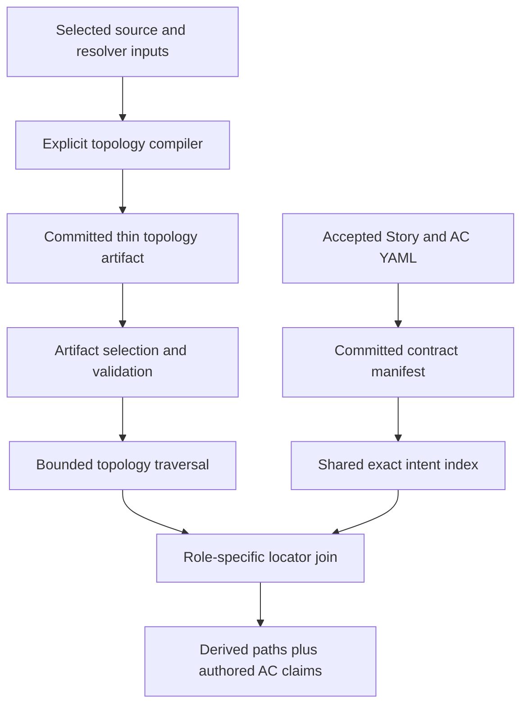
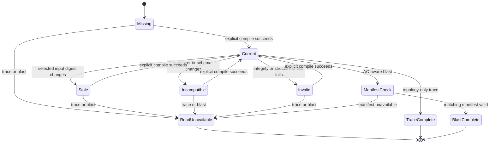
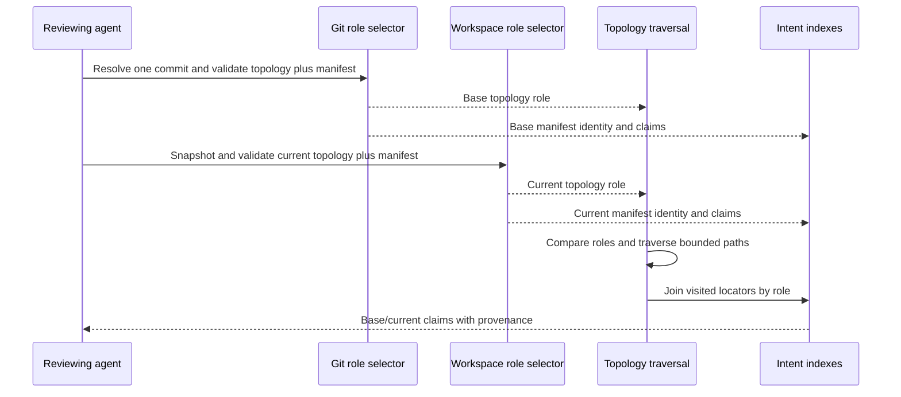
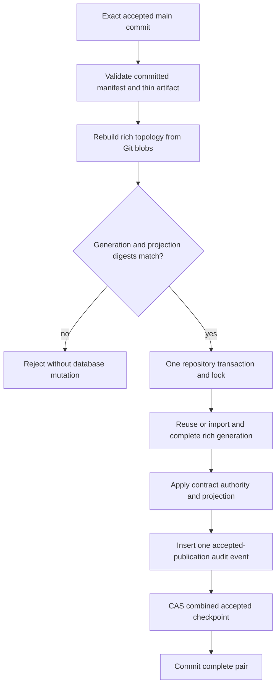
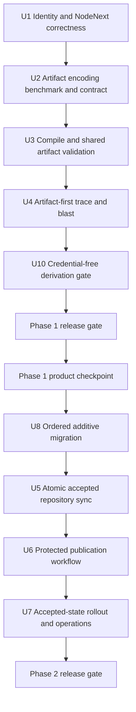

# Repository Topology Artifacts and Accepted-State Sync - Plan

## Goal Capsule

- **Objective:** Productize the existing code-topology engine as a deterministic repository artifact that agents can query without reparsing, then publish the accepted contract and topology to Postgres as one atomic projection of `main`.
- **Authority:** Repository YAML and its compiled manifest remain the authority for business intent. The committed topology artifact and Postgres topology generations remain derived code structure. The accepted repository checkpoint identifies which contract and topology projections were published together.
- **Execution profile:** Phase 1 corrects the two known topology defects, freezes a thin artifact encoding, adds explicit compile/validate commands, and independently ships artifact-first local and Git-revision reads. Phase 2 adds ordered expand/cutover migrations and exact-commit, merge-only publication of the already-reviewed manifest and topology.
- **Stop conditions:** Stop if the work starts rebuilding the parser, symbol/reference model, traversal engine, blast-radius engine, or exact AC joins that already exist. Also stop if the artifact requires source bodies, snippets, AC IDs, a graph database, a semantic call/type/inheritance graph, project toolchain execution, or silent query-time generation. Stop after the encoding benchmark if no candidate meets the absolute adoption ceilings. Stop before U8 if the measured combined publication transaction cannot fit below the deployment timeout without a new staging design.
- **Tail ownership:** After package dependencies are installed, Phase 1 is complete and releasable without Postgres, product-network calls, provider credentials, or repository-sync credentials. The full plan is complete after additive migration, atomic accepted-state publication, protected workflow, operator documentation, and recovery checks pass; remove experimental serializers and obsolete mutable checkpoint paths before declaring completion.

---

## Product Contract

### Summary

Tieline will package its existing multi-language topology engine into a thin committed artifact and make workspace and Git-revision trace/blast reads query that artifact without parsing or writing. This does not create a second topology implementation or add richer graph semantics. Hosted reads will use the same traversal contracts over rich Postgres projections selected by one accepted checkpoint. After `main` advances, protected automation will validate and publish the reviewed manifest and matching topology as a single accepted repository state.

### Problem Frame

The topology engine is already complete for this product increment: it parses JavaScript/TypeScript, Python, and Rust; emits files, symbols, references, resolutions, edges, and frontiers; builds immutable generations; traverses bounded dependency paths; calculates blast radius; and joins exact locators to authored AC claims. Local reads still rebuild those facts from source. A simple graph query therefore pays parser and resolver startup costs, retains large object graphs in long-running MCP processes, and has no committed topology snapshot for Git-revision comparison.

Contract synchronization and topology promotion also advance through separate transactions and checkpoints. Either projection can become current without proving that the other came from the same accepted commit. The merge boundary should publish one coherent repository state while leaving DB-native planning, evidence, and immutable topology history intact.

Two correctness issues must be fixed before changing the lifecycle. A committed artifact cannot use the enclosing Git tree as an identity input because committing the artifact changes that tree. Tieline's NodeNext-style `.js` import specifiers also do not currently resolve back to TypeScript source files, so its own derived graph has no useful edges despite producing valid parse facts.

### Actors

- A1. **Developer agent:** explicitly compiles topology after source or resolver-input changes, validates it, and queries the current working artifact before editing code.
- A2. **Reviewing agent:** compares base and current repository artifacts and inspects the role-specific code paths and AC claims behind advisory impact.
- A3. **Hosted agent:** queries the complete contract/topology pair selected by the accepted repository checkpoint without requiring a checkout.
- A4. **Repository sync automation:** validates an exact accepted `main` commit, imports both projections idempotently, and promotes them atomically with least-privilege credentials.
- A5. **Maintainer/operator:** diagnoses artifact lifecycle states and replays missed accepted commits in order after a post-merge publication failure.

### Requirements

#### Topology correctness and artifact contract

- R1. A topology generation must use a deterministic digest of selected source, resolver configuration, parser compatibility, schema, and fact-policy inputs. It must exclude the generated topology directory, Story/AC YAML, and the contract manifest; an accepted Git commit remains separate publication metadata. The selected-input identity algorithm has a new compatibility version, and mixed legacy-tree/new selected-input identities must never compare or traverse as compatible roles.
- R2. JavaScript and TypeScript resolution must map NodeNext emitted extensions such as `.js`, `.mjs`, and `.cjs` to supported source extensions with explicit ambiguity and unresolved outcomes.
- R3. The repository artifact must contain only the traversal projection: provider metadata, compatibility metadata, input and projection digests, counts, file facts, locator-bearing symbols, derived edges, and unresolved frontiers. It must not contain source bodies, ranges, snippets, authored AC/Story IDs, or machine-specific retained-memory estimates.
- R4. The artifact contract must include a stable schema version and producer identity so future producers can normalize into the same logical model without changing traversal or intent-join semantics.
- R5. The physical encoding must be selected by a reproducible benchmark of predeclared canonical JSON, JSONL records, and sharded compact JSON with local IDs. The selected encoding must remain deterministic, parser-free, Git-reviewable, materially cheaper than parse-first reads, and below the absolute adoption ceilings and recorded regression budgets in the Verification Contract.
- R6. `tieline code compile` must inventory and capture every selected input byte once, then derive both selected-input identity and topology facts from that immutable capture before publishing only `.tieline/topology/`. It uses unique same-filesystem temporary paths, flushes and closes complete candidate files, and serializes writers through one repository-local cross-process lock with bounded wait and safe stale-owner recovery. A monolithic winner uses one rename; a sharded winner writes immutable content-addressed shards before root-index replacement. Every artifact path must stay inside the topology root; absolute paths, `..`, escaping symlinks, unsafe output ownership, and cleanup outside schema-derived names fail closed. A post-build workspace digest may report the artifact already stale but cannot relabel captured facts. An unchanged input produces byte-identical output, and an interrupted or losing build preserves a complete prior or candidate artifact. Directory-entry durability remains platform-dependent. [Node.js 20 file-system APIs](https://nodejs.org/docs/latest-v20.x/api/fs.html)
- R7. `tieline code validate` must verify schema, canonical ordering, artifact digest, compatibility, counts, input freshness, and repository identity without parsing source or modifying files.
- R8. Recoverable parser diagnostics, unresolved frontiers, and bounded captures may produce a valid artifact with warnings. Readers must enforce total bytes, per-file bytes, shard count, record count, and bounded path/string lengths before or during bounded decoding. Malformed, stale, incompatible, mixed-snapshot, capacity-exceeded, and unsafe-path artifacts return distinct fail-closed states.

#### Artifact-first topology reads and intent joins

- R9. Repository-backed `trace` and `blast-radius` reads must select an existing compatible artifact and must never invoke parsing, rewrite the artifact, or advance a persistence checkpoint. Phase 1 preserves the existing hosted persisted-generation adapter. After Phase 2 cutover, hosted reads select rich projections through the combined accepted checkpoint without parsing or persistence mutation.
- R10. Workspace reads must return named `topology_missing`, `topology_stale`, `topology_incompatible`, `topology_invalid`, `topology_capacity_exceeded`, `topology_unsafe_path`, or `workspace_changed` outcomes when a trustworthy current artifact cannot be selected. Git-revision reads additionally return `topology_missing_at_revision` when the selected commit predates the artifact. CLI commands exit zero only for complete results, including warnings and frontiers; every unavailable result exits nonzero with equivalent JSON and text status.
- R11. A topology read must select and validate only the topology role it consumes. A Git-revision selector must resolve one immutable commit and load its topology through batched Git object access without requiring a manifest, reparsing the revision, or depending on checkout state; manifest health must never block topology-only trace.
- R12. AC-aware blast radius and accepted-state publication must compose each valid topology role with the manifest from the same workspace snapshot or immutable commit. Blast radius against a base compares both topology roles, joins base nodes to the base manifest and current nodes to the current manifest, and preserves each topology and contract role in the result. A missing, stale, invalid, or incompatible manifest fails before traversal with a role-specific `base_manifest_*` or `current_manifest_*` state without disabling topology-only trace.
- R13. Derived edges must remain separate from authored direct and Story-fallback claims. Sharing an AC must never create a code edge, and impact language must remain `may_be_impacted` with `semantic_support: not_assessed`.
- R14. CLI and MCP must share operation-specific selection, traversal, bounds, frontier, provenance, lifecycle, remediation, and structured domain-result contracts. Trace exposes topology provenance only; AC-aware blast also exposes contract provenance. Transport formatting may differ, compilation remains CLI-only, and semantic degradation must not make topology reads unavailable. An unavailable MCP read returns the same discriminated domain result as CLI instead of a transport error. Mutable-workspace remediation may identify explicit compilation; immutable-revision failures must not suggest or trigger mutation.
- R15. Topology compilation is a local CLI mutation only. MCP topology tools remain read-only, and no refresh-and-query operation may combine mutation with traversal.

#### Accepted repository publication

- R16. One repository synchronization command must load the reviewed manifest and topology artifact from the exact requested commit, reject dirty or mismatched checkout labeling, and require an expected previous accepted commit except for explicit bootstrap.
- R17. Merge-time synchronization must rebuild the rich topology from the exact accepted commit outside the database transaction and require its logical generation identity and thin projection digest to match the committed artifact before import. Reuse requires the same repository, compatibility envelope, counts, complete status, rich-facts digest, and thin projection digest; collision or corruption fails before contract mutation and is never repaired in place.
- R18. Merge automation must rebuild and validate rich topology before opening SQL. Rich topology insertion/completion, contract projection, one uniquely identified accepted-publication event, retention protection, and the combined accepted repository checkpoint must then commit or roll back in one transaction under one canonical repository lock and whole-tuple CAS. Publication, generation reuse/import, explicit pinning, and collection share that lock. This increment must not introduce a durable incomplete-generation staging lifecycle unless a later plan responds to a failed publication-duration gate.
- R19. The accepted checkpoint must identify the repository, Git commit, manifest digest, topology generation identity, topology projection digest, artifact digest, compatibility identity, and publication time. After cutover it is the sole authority and retention root for hosted accepted-state selection. Before exact-main bootstrap, combined reads return `accepted_state_unavailable` rather than infer a tuple from legacy pointers. The old selector remains available only to the pre-cutover application, then a later retirement migration revokes legacy promotion and removes its retention authority after the rollback floor has advanced.
- R20. Replaying the same accepted tuple must return `unchanged` without contract, topology, checkpoint, or audit mutation. The same commit paired with different manifest or topology identities must fail integrity checks, a delayed job must fail the expected-previous-commit CAS, and publication must reject a candidate outside the protected branch's ordered first-parent path. A lost connection after commit is an unknown outcome resolved by rereading the exact tuple before any retry; it must not create a second publication record.
- R21. Repository synchronization must preserve planning Stories and revisions, observations, Backlog Items, attribution suggestions and decisions, handoff conflicts, audit history, and immutable topology history except where the accepted contract's existing authority-transfer rules apply.
- R22. Core accepted-state publication must not invoke a semantic provider, receive a provider credential, wait for embedding refresh, or report semantic freshness as part of the accepted tuple. Existing explicit semantic-refresh behavior remains outside protected merge publication until a follow-up defines its credential, egress, batching, and stale-job contracts.
- R23. Credential-free pull-request, merge-queue, and protected-`main` validation must create an isolated temporary repository root, compile manifest and topology at their normal repository-relative authority paths inside that root, validate them, and compare complete file sets plus canonical bytes with the reviewed checkout. `generated_artifact_mismatch` identifies the failing artifact and remediation. Only the separate protected publication job for accepted `main` may receive repository-sync credentials or invoke publication.
- R24. Initial rollout must publish a bootstrap artifact before artifact freshness becomes a required branch gate. Protected automation must enumerate and publish every missing first-parent commit from the current accepted checkpoint to the event commit in order using the current trusted publisher. Every compatibility change must retain forward replay support for the immediately preceding on-main identity and pass a missed-transition fixture before merge. The first failure stops the run, leaves the already-published prefix accepted, and resumes from the stored predecessor after repair. Force-pushed, non-ancestor, or arbitrary feature commits are rejected.
- R25. Existing databases must advance through ordered additive migrations after immutable `0001_baseline.sql`; the baseline checksum must never change. After `0002_code_topology.sql`, administrative migration supports an explicit target version: apply through `0003_repository_accepted_state.sql` for expansion, then through `0004_retire_legacy_topology_checkpoint.sql` only after exact-main bootstrap, cutover, and rollback-floor advancement. Verification reports pending, ahead-of-target, or drifted migrations, and a sync-only publisher returns `schema_outdated` instead of running owner DDL.
- R26. Protected publication receives only repository-sync database authority as a named environment secret injected into the publication step. It receives no provider credential. The job pins every action to a reviewed full commit SHA, installs dependencies from the lockfile with integrity checks, runs no executable step after publication, and never uses workflow-level secrets or `secrets: inherit`.
- R27. AC-aware blast results must distinguish visited locators with direct claims, Story-fallback claims, and no authored claim, then summarize those counts per role. Missing authored coverage remains visible and advisory; the system must not manufacture claims or treat sparse coverage as a topology failure.

### Key Flows

- F1. **Compile and validate a working topology**
  - **Trigger:** A1 changes selected source or resolver configuration, or receives a missing/stale artifact state.
  - **Actors:** A1
  - **Steps:** Tieline snapshots selected inputs, derives the thin projection, validates its envelope and compatibility, writes a complete candidate artifact, and atomically replaces the selected encoding's authority file or root index. Validation independently recomputes freshness and structural integrity without parsing.
  - **Outcome:** The working tree contains a deterministic reviewable artifact, or the previous valid artifact remains unchanged with a named failure.
  - **Covered by:** R1-R8, R15.
- F2. **Trace a workspace or Git-revision locator**
  - **Trigger:** A1 or A2 requests dependencies or dependents for an exact locator.
  - **Actors:** A1, A2
  - **Steps:** Tieline selects only the current topology artifact or loads one from an immutable Git commit, validates topology freshness and compatibility, and traverses the existing bounded read-store contract without loading or validating a manifest.
  - **Outcome:** The caller receives generation-identified paths and frontiers, or an actionable lifecycle state, with no parse or write side effect.
  - **Covered by:** R9-R11, R14, R15.
- F3. **Assess a branch against accepted intent**
  - **Trigger:** A2 requests blast radius against a Git base.
  - **Actors:** A2
  - **Steps:** Tieline composes one base topology/manifest role from the resolved commit and one current topology/manifest role from the same workspace snapshot, compares both topology roles, traverses affected paths, and joins each role to the authored claims carried by its matching manifest.
  - **Outcome:** Added, deleted, renamed, and retargeted relationships retain their code and contract provenance without manufacturing an edge from contract coupling.
  - **Covered by:** R10-R14.
- F4. **Publish accepted main**
  - **Trigger:** A protected `main` push or an ordered replay selects one exact commit.
  - **Actors:** A4, A5
  - **Steps:** Automation validates committed manifest and topology bytes, rebuilds matching rich topology outside SQL, then opens one transaction to import/complete the generation, apply contract authority transfer, record one audit event, and advance the combined checkpoint only after every invariant passes.
  - **Outcome:** Readers see the prior accepted tuple or the complete new tuple, never a partial or mixed publication.
  - **Covered by:** R16-R24.
- F5. **Read the hosted accepted state**
  - **Trigger:** A3 invokes a topology read without a checkout.
  - **Actors:** A3
  - **Steps:** Tieline selects one accepted repository checkpoint in a repeatable-read snapshot and queries its referenced topology and contract projections.
  - **Outcome:** Trace identifies the accepted commit and topology identity. AC-aware blast also identifies the manifest identity. Either operation returns a named unavailable or incompatible state rather than selecting mixed projections.
  - **Covered by:** R14, R18-R21.

### Acceptance Examples

- AE1. **Covers F1.** Given unchanged selected inputs, two compilations produce byte-identical artifacts and the second compilation creates no Git diff.
- AE2. **Covers F1.** Given a write failure before the selected encoding's authority file or root index is replaced, the prior artifact remains complete and `code validate` still accepts it; a sharded winner can clean abandoned unreferenced shards on retry.
- AE3. **Covers F1.** Given one source edit or rename, the selected encoding changes only the expected logical records and stays within its recorded patch-byte, touched-file, and incremental Git-object locality budgets; a sharded winner also preserves every unaffected shard digest.
- AE4. **Covers F1 / F2.** Given an edited selected source and an unrefreshed artifact, validate, trace, and blast radius return `topology_stale`; trace and blast do not invoke the parser or change the worktree.
- AE5. **Covers F2.** Given a Git base with a committed artifact, Tieline loads that artifact through Git objects. Given a base before bootstrap, it returns `topology_missing_at_revision` without reparsing.
- AE6. **Covers F2.** Given `import "./module.js"` and a unique `module.ts`, the resolver creates the expected project-local edge. Given both `module.ts` and another supported substitution candidate, it returns an ambiguity rather than guessing.
- AE7. **Covers F3.** Given a PR that deletes code and removes its AC link, the base role still reports the accepted base claim while the current role reports its absence.
- AE8. **Covers F3.** Given two files linked to the same AC with no derived edge, changing one does not create a dependency path to the other.
- AE9. **Covers F3.** Given base and current artifacts with incompatible producer or schema identities, blast radius returns a named incompatibility instead of mixing their paths.
- AE10. **Covers F4.** Given failure injection after contract writes or topology writes, the transaction rolls back and the accepted checkpoint continues to reference the prior complete pair.
- AE11. **Covers F4.** Given the same commit and projection tuple twice, the second sync is unchanged. Given the same commit with different artifact bytes or projection identity, synchronization fails integrity checks.
- AE12. **Covers F4.** Given two `main` publication jobs arriving out of order or one event spanning multiple first-parent commits, the stale job cannot replace newer accepted state and every missing commit is replayed in order. A force-pushed, non-ancestor, or arbitrary feature commit is rejected.
- AE13. **Covers F4.** Given a planning Story revised after materialization, synchronization preserves the later planning revision and records the existing handoff conflict while the merged repository content becomes authoritative.
- AE14. **Covers F5.** Given hosted MCP with no checkout, trace and explicit-change blast radius select the same accepted checkpoint. Trace reports topology provenance; blast reports topology and manifest provenance.
- AE15. **Covers F4 / F5.** Given successful core publication, accepted contract/topology reads use the new checkpoint without any semantic-provider call or semantic-freshness claim.
- AE16. **Covers F2 / F3.** Given a current topology and a missing, stale, or invalid manifest, trace returns the same structural result while AC-aware blast radius returns the matching contract lifecycle state without parsing or writing.
- AE17. **Covers F1.** Given a self-consistent committed artifact that differs from temporary compiler output, parser-free validation may accept its structure but credential-free CI rejects the derivation mismatch.
- AE18. **Covers F4.** Given an existing database with the exact applied baseline and seeded planning, evidence, contract, and topology rows, the additive migration preserves those rows and enables explicit accepted-state bootstrap without baseline checksum drift.
- AE19. **Covers F4.** Given a missed sequence that crosses an artifact/parser compatibility change, ordered replay validates each candidate with supported compatibility logic and either advances every first-parent commit or stops before mutation with a named incompatibility.
- AE20. **Covers F4.** The protected publication job cannot access semantic-provider credentials and has no executable step after its secret-bearing publication step.
- AE21. **Covers F1 / F3.** Given only Story/AC YAML or manifest changes, topology validation remains current and recompilation is byte-identical; AC-aware blast independently selects the matching manifest role.
- AE22. **Covers F2 / F3.** Complete trace and blast results exit zero even with warnings or frontiers. Missing, stale, incompatible, invalid, capacity, unsafe-path, workspace-change, and role-specific contract failures exit nonzero with the same status in JSON and text.
- AE23. **Covers F4.** A manifest-only commit reuses its complete topology generation, a topology-only commit may reuse its manifest digest, and a non-selected-source commit may reuse both projections. Each accepted commit records one publication event without spurious Story/AC revisions.
- AE24. **Covers F4 / F5.** After the additive migration and before exact-main bootstrap, hosted reads return `accepted_state_unavailable`, divergent legacy pointers are ignored, and the sync-only role returns `schema_outdated` if the migration is absent.
- AE25. **Covers F3.** Given a blast result with direct, Story-fallback, and unlinked visited locators, each role reports all three counts and preserves unlinked locators without inventing intent.

### Success Criteria

- Agents query topology snapshots instead of paying parse and resolver cost on every read.
- A developer can see exactly when the committed topology is current, stale, missing, or incompatible and can repair it only through an explicit command.
- Base/current blast radius retains deleted accepted intent and never conflates AC membership with code dependency.
- The repository and Postgres name the same topology generation and projection while using storage formats suited to Git and relational traversal respectively.
- Postgres never exposes a contract from one accepted commit as current beside topology from another.
- The artifact remains small enough to commit and review, and loading two roles materially improves on the current high-memory cold-build path.
- Representative developer-agent trace and reviewing-agent blast tasks preserve correct dependency and affected-intent identification and improve completion time versus the current parse-first workflow.
- AC-aware results expose authored-intent coverage per role so sparse links are visible rather than mistaken for proof of no impact.

### Scope Boundaries

#### In Scope

- Lifecycle and packaging changes around the existing parser, symbol/reference, traversal, blast-radius, and exact-AC-join engine; no replacement topology engine.
- A committed thin topology artifact under `.tieline/topology/`.
- NodeNext emitted-extension resolution required to make the artifact useful for Tieline itself.
- Deterministic compile and read-only validate CLI commands.
- Artifact-first workspace and Git-revision reads across CLI and repository-backed MCP, plus combined-checkpoint Postgres selection for hosted reads behind the same domain interfaces.
- Role-specific manifest joins for base/current blast radius.
- Exact-commit rich rebuild and one atomic accepted contract/topology checkpoint.
- An ordered additive database migration that preserves the applied baseline and installed state.
- Credential-separated PR validation and protected merge-only publication.
- Bootstrap and ordered-replay operational behavior.

#### Deferred to Follow-Up Work

- Additional topology producers, including a SCIP importer.
- File-level incremental parse invalidation, workspace overlays, watchers, and background indexing.
- Read-only MCP topology status/validation if no-shell consumers demonstrate a need beyond the structured read states.
- Call, type, inheritance, macro, runtime, cross-repository, and installed-package graphs.
- Numeric adjacency or dictionary compression beyond what the R5 benchmark proves necessary to pass the artifact gates.
- Durable incomplete-generation staging unless later measurements establish a need.
- Automated semantic refresh, semantic-worker credentials, provider egress policy, tuple-aware semantic batching, and durable semantic-refresh status.
- A graph browser, generic graph query language, community detection, or graph database.

#### Outside This Product Increment

- Embedding AC or Story IDs in topology records.
- Precomputing topology-to-intent joins or creating code edges from shared AC membership.
- Persisting source bodies, snippets, or semantic-support grades in the artifact.
- Git hooks, merge drivers, post-commit hooks, or automatic artifact writes during a read.
- MCP-triggered repository compilation or accepted-state publication.
- Removing immutable Postgres topology history or DB-native planning/evidence state.
- Rebuilding or replacing the existing tree-sitter parsers, symbol/reference model, traversal, blast-radius analysis, or exact locator-to-AC join.

---

## Planning Contract

### Product Contract Preservation

This follow-up preserves the parser, source snapshot, resolver, immutable-generation, bounded-traversal, frontier, exact-locator, and advisory AC-join contracts in `docs/plans/2026-08-10-001-feat-multi-language-code-topology-plan.md`. It supersedes that plan's ordinary local-read choice to build an ephemeral topology and its use of an enclosing Git tree as generation identity. The existing builder becomes the explicit artifact compiler and the merge-time rich importer. Separate immutable topology storage remains, while one combined checkpoint becomes the authority for accepted hosted selection.

### Key Technical Decisions

- KTD1. **Use selected topology inputs as a versioned source identity.** Compute generation identity from repository key, selected-input digest, parser/resolver compatibility, topology schema, and fact policy. Introduce a new compatibility identity so legacy tree-based and selected-input generations cannot mix. Map accepted Git commits to the new identity only in publication metadata. Governs R1, R3, R16-R20.
- KTD2. **Correct NodeNext resolution before materializing the graph.** Extend the JavaScript resolver's exact-extension branch with explicit emitted-to-source substitutions and ambiguity handling. Do not invoke TypeScript or Node resolution at runtime. Governs R2.
- KTD3. **Commit a thin, provider-neutral artifact.** The logical envelope carries producer identity and traversal facts, including file language, but excludes rich parser and persistence facts. `tieline_tree_sitter` is the first producer; later producers must normalize to the same contract. Governs R3, R4. (session-settled: user-approved — chosen over either a tool-specific graph format or implementing a second indexer now: Tieline needs a stable derived-code boundary without widening this phase)
- KTD4. **Let reproducible measurements choose the physical encoding.** Predeclare monolithic canonical JSON, deterministic JSONL records, and sharded compact JSON with local IDs, then compare them with production readers. Choose the first candidate in that simplicity order that passes every hard invariant and sits on the acceptable size/diff/latency/memory frontier; record the evidence and freeze regression budgets from the winner with headroom. Governs R5. (session-settled: user-approved — chosen over declaring JSONL or another node-link encoding up front because repository size, Git locality, and loaded memory are the deciding evidence)
- KTD5. **Make compilation the only local topology mutation.** `code compile` writes atomically; `code validate`, `trace`, and `blast-radius` are read-only and never call the builder. The existing ephemeral builder is retained as compiler implementation, not a normal query fallback. Governs R6-R10, R15. (session-settled: user-directed — chosen over per-request ephemeral generation because topology is developer-facing repository context that should be queried from the current snapshot)
- KTD6. **Select the minimum valid role for each operation.** A `TopologyRoleSnapshot` selects only topology for structural trace. An `IntentAwareRoleSnapshot` composes topology and manifest from one workspace snapshot or immutable commit for AC-aware blast radius and accepted publication. This keeps contract health from disabling structural traversal. Governs R10-R12.
- KTD7. **Join intent by topology role.** Base nodes join to the manifest in the validated base role snapshot and current nodes join to the manifest in the validated current role snapshot through the shared intent index. Return both manifest digests, preserve link role/provenance, and summarize direct/fallback/no-claim coverage per role; never place AC IDs in topology. Governs R12, R13, R27. (session-settled: user-approved — chosen over embedding or precomputing AC relationships in the code graph because authored intent and derived structure have different authority and drift lifecycles)
- KTD8. **Keep MCP reads primitive and non-mutating.** CLI and MCP share operation-specific selectors, traversal, bounds, provenance, and domain results. Compile and validate remain CLI workflows for coding agents with repository access. During Phase 1, existing hosted persisted-generation reads remain behaviorally unchanged behind their current adapter. Phase 2 moves hosted accepted-state selection to the combined checkpoint without changing the shared trace/blast domain-result contracts. Hosted MCP cannot mutate a checkout in either phase. Governs R14, R15.
- KTD9. **Build rich facts before SQL and import them inside one transaction.** The thin artifact is not widened to match the relational schema. Protected merge automation rebuilds the rich generation from exact Git blobs and proves its generation and projection digests match the artifact. One transaction then imports and completes the generation with the contract projection and accepted checkpoint. No durable incomplete staging lifecycle is introduced unless later measurements prove the transaction cannot meet the publication ceiling. Governs R17-R19, R21. [PostgreSQL 16 transactions](https://www.postgresql.org/docs/16/tutorial-transactions.html)
- KTD10. **Promote contract and topology through one transaction.** Extract transaction-aware contract projection and topology import operations. A repository-sync orchestrator owns one canonical repository lock, whole-tuple CAS, transaction, one uniquely constrained accepted-publication ledger row that is also the audit event, and `accepted_repository_checkpoints` authority that references that row. After cutover, supported paths and retention stop using both legacy `repository_sync_checkpoints` and `code_topology_checkpoints` plus the topology promotion function. Governs R18-R21. (session-settled: user-directed — chosen over independent contract and topology updates because Postgres should reflect one accepted state of `main`)
- KTD11. **Validate exact committed bytes, not a supplied label.** `repository sync` reads the manifest, artifact, source, and configuration from the requested full commit. A dirty working tree cannot be labeled as that commit. `contract sync` becomes a compatibility alias to the same combined core orchestration during rollout rather than retaining an independent promotion path or invoking semantic refresh. Governs R16, R20, R22-R24.
- KTD12. **Defer semantic-refresh automation.** Protected publication commits only the accepted contract/topology pair and receives no provider credential. Existing explicit semantic behavior remains outside this workflow. A later increment must define provider egress, a narrower database role, tuple-aware batching, and stale-job handling before automation. Governs R22.
- KTD13. **Use merge as the only shared publication boundary.** Pull-request and merge-queue jobs validate structure and compare a temporary compiler output without credentials. Protected `main` automation publishes exact commits. Recovery replays missing commits in first-parent order with compatibility logic for each commit. Governs R23, R24. (session-settled: user-directed — chosen over updating Postgres on every topology run or branch commit because only merged repository changes are accepted)
- KTD14. **Preserve installed databases with serialized target migrations.** Keep `migrations/0001_baseline.sql` immutable and retain `migrations/0002_code_topology.sql` as the first additive migration. Apply contiguous numbered migrations through an explicit target under one migration advisory lock, with each file's DDL and history row in one transaction. U8 packages `0003_repository_accepted_state.sql`; U7 later packages `0004_retire_legacy_topology_checkpoint.sql`. Reject unknown, missing, gapped, ahead-of-target, or drifted applied files. Prefer ordinary transactional indexes for new tables; split populated-table validation or concurrent indexes only if measurements require it. Governs R25. [PostgreSQL 16 `ALTER TABLE`](https://www.postgresql.org/docs/16/sql-altertable.html), [PostgreSQL 16 `CREATE INDEX`](https://www.postgresql.org/docs/16/sql-createindex.html#SQL-CREATEINDEX-CONCURRENTLY)
- KTD15. **Ship the artifact lifecycle before hosted publication.** Phase 1 ends with local compile, validation, artifact-first trace and blast radius, self-hosted artifacts, documentation, and credential-free CI. Phase 2 starts with schema expansion, uses a protected bootstrap/cutover, and retires legacy authority before enabling atomic merge-only Postgres publication. After dependencies are installed, Phase 1 requires no Postgres, product-network call, provider credential, or repository-sync credential. Governs R9-R27.

### High-Level Technical Design

The repository keeps intent and code structure as separate reviewed artifacts. Normal reads load both directly and combine them only in the result.

Compilation and reads have separate state transitions. A read never crosses into the compilation path.

Base/current blast radius selects both code and intent roles before traversal. Deleted code and removed links therefore retain their accepted-base evidence.

Accepted publication prepares expensive facts before opening the transaction, then makes contract and topology visible together.

### Artifact Measurement Gate

U2 must freeze candidate semantics before measurement: canonical JSON is one ordered envelope with string identities; JSONL is one canonical record per line grouped by record kind with string identities; sharded compact JSON partitions by stable file key and uses deterministic artifact-local IDs for repeated identities and adjacency. Readers must consume each candidate directly rather than normalizing it through the rich generation.

The fixture matrix has three bounded roles:

- Tieline measures real-repository bytes and Git review locality.
- The existing 5,000-file / 100,000-symbol fixture measures the supported envelope with a total dependency-record ceiling of 250,000 across resolved edges and retained unresolved/ambiguous/external frontiers. Run both resolved-dense and frontier-heavy distributions at that ceiling.
- A small representative JavaScript/TypeScript/Python/Rust fixture covers language-dependent selectors, Unicode, frontier shapes, deterministic round-trip, and traversal parity; it does not need to reproduce the scale fixture.

Every candidate must pass these hard invariants:

| Dimension | Required result |
|---|---|
| Determinism and integrity | Five unchanged compiles produce identical bytes, identities, digests, counts, and ordering; corruption, duplicate/cross-generation identities, and count mismatches fail closed. |
| Semantic parity | Ordered starts, visited nodes, paths, edges, frontiers, intent impacts, truncation, roles, and logical generation identity match the existing read model field-for-field; new artifact and manifest provenance is compared separately. |
| Read boundary | Validation and traversal use production artifact readers without parser/resolver initialization or rich-generation hydration. |
| Bounded execution | Both scale distributions complete without capacity overrun, unbounded cache growth, or process failure, and artifact-first two-role peak and retained memory improve by at least 50% over the equivalent isolated parse-first baseline. |

Every candidate must also pass these absolute adoption ceilings. The benchmark may tighten them but cannot relax them without a new product decision.

| Metric | Ceiling |
|---|---|
| Tieline repository artifact | 2 MiB total |
| Full supported-envelope artifact | 32 MiB total; 8 MiB per file or shard |
| Representative one-file edit or rename | 2 MiB patch; 8 touched artifact files |
| Tieline cold validation and first trace | 2 seconds each |
| Full-envelope Git-base plus workspace-current first read | 10 seconds |
| Full-envelope two-role memory | 512 MiB peak RSS growth; 384 MiB retained RSS growth |
| Full-envelope compile | 60 seconds |

For candidates that pass the hard invariants, record serialized bytes, file count, patch bytes/lines, touched files, incremental Git object/delta bytes, compile time, and the latency/memory modes below. A source edit and rename are locality cases; a resolver-config change is reported as intentional global invalidation rather than treated as a local-edit failure. Shard-digest stability applies only to sharded candidates.

Measure production readers in four modes: one-role filesystem validation; one-role filesystem first trace including decode/index construction; Git-base plus workspace-current first blast including both manifests; and repeated long-running MCP reads with the bounded cache. Use fresh child processes on pinned Ubuntu x64 Node 20, record module startup separately, establish the post-module-load/GC baseline, and collect multiple samples of latency, peak/retained RSS, heap used, external memory, and array buffers. Report median and worst/p95 rather than a single run.

Choose the first candidate in KTD4's simplicity order that passes the hard invariants and is not dominated across committed bytes, Git locality, first-read latency, and two-role retained memory. Record candidate definitions, fixture digests/counts/distributions, environment, sample protocol, summarized raw measurements, selection rationale, and fixed headroom in `docs/decisions/code-topology-artifact-encoding.md`. Permanent CI runs only the winner and enforces the recorded size, locality, latency, and memory budgets with 25% headroom; it does not rerun discarded candidates.

If no candidate qualifies, U2 records the evidence and stops before artifact rollout. The follow-up decision is limited to a more compact logical identity/adjacency representation, not a broader graph product.

### Existing Patterns to Follow

- `src/contract/code-topology-indexer.ts` already emits rich and thin projections with matching generation identities and deterministic ordering.
- `src/domain/code-topology-store.ts` defines logical topology identities, read-store boundaries, immutable generations, and persistence validation.
- `src/contract/compact-code-topology-store.ts` provides the persistence-independent traversal store to adapt for artifact-backed loading.
- `src/contract/git-source-snapshot.ts` batches immutable Git tree discovery and blob reads; historical artifact loading should extend this pattern.
- `src/contract/manifest.ts` establishes deterministic sharded artifact writing, snapshot parsing, canonical serialization, and stale-shard cleanup.
- `src/contract/reconciliation.ts` owns the shared exact intent index and direct-versus-Story-fallback claim scope.
- `src/commands/code-topology.ts` and `src/tools/code-topology.ts` already share trace/blast domain results and are the selection seam to replace.
- `src/adapters/postgres/contract-sync-repository.ts` establishes contract authority transfer, handoff conflicts, advisory locking, and expected-commit CAS.
- `src/adapters/postgres/code-topology-repository.ts` establishes rich immutable insertion, completion checks, failure injection, and bounded relational reads.
- `migrations/0001_baseline.sql` owns the clean original schema and roles; `migrations/0002_code_topology.sql` owns the current independent topology checkpoint, promotion functions, and their least-privilege grants.

### System-Wide Impact

- **Repository lifecycle:** `.tieline/topology/` becomes a committed reviewed artifact alongside `spec/` and `manifest/`. The nested ignore rules continue to exclude only the browser review page.
- **Identity:** Topology generation identity no longer means the enclosing Git tree. Results distinguish selected-input identity, artifact bytes, queried Git commit, and accepted publication commit.
- **Developer workflow:** Source and resolver-input changes require an explicit compile before trace/blast reads become current. Named stale states replace hidden parse latency.
- **Agent context:** CLI and MCP reads gain stable artifact provenance and lose the implicit ephemeral-build behavior currently described in README, server instructions, resources, and the bundled skill.
- **Intent accuracy:** Base and current code nodes use their matching manifests, so link deletions and code deletions remain explainable.
- **Postgres lifecycle:** Rich generations and DB-native records remain separate. Before cutover, legacy checkpoints remain active only for the pre-cutover application while legacy publication automation is disabled. After cutover and `0004`, supported reads, writes, and retention use only the combined checkpoint.
- **Operations and security:** Validation remains credential-free. Only protected `main` publication receives repository-sync access, and the publication workflow receives no semantic-provider credential.
- **Performance:** Normal topology reads avoid parser and resolver startup. Artifact decoding and two-role retention become the measured memory boundary for long-running MCP processes.

### Risks and Mitigations

- **Identity self-reference:** An enclosing tree SHA cannot converge inside a committed generated file. Use KTD1 and test that compiling then committing does not change selected-input identity.
- **Valid but empty graph:** NodeNext emitted extensions currently prevent Tieline's own imports from resolving. Make U1's repository-level nonzero-edge and representative-path assertions prerequisites for artifact compilation.
- **Repository bloat:** Large or monolithic artifacts make clones and reviews worse. Enforce the measurement gate before freezing encoding and preserve shard-local diffs.
- **Decode-time memory duplication:** Parsing large JSON into object-heavy records can recreate the cold-build RSS problem. Measure artifact bytes, transient decode RSS, retained RSS, and two-role loading; let the selected reader consume the compact representation without first hydrating the rich generation.
- **Workspace friction:** Artifact-first reads can be unavailable immediately after code edits. Return one actionable compile instruction, keep validation cheap, and never hide repair behind a read.
- **Mixed intent roles:** Joining all nodes to the current manifest loses deleted accepted claims. Build role-specific intent indexes and include manifest role on every impact.
- **Thin/rich divergence:** Merge publication reparses exact accepted source. Compare logical generation identity and thin projection digest before SQL, then validate imported or reused generation facts inside the accepted-state transaction.
- **Long publication transaction:** Rich analysis happens before SQL, but the full-envelope fact import remains transactional. Keep 30 seconds as the cold topology-import sub-budget and set a measured end-to-end ceiling below the deployment timeout for cold and reuse paths before rollout. Reconsider durable staging only in a separate plan if the combined ceiling cannot be met.
- **Independent checkpoint drift:** Existing topology APIs can advance `code_topology_checkpoints`. Remove that capability from supported roles and aliases, route selection and retention through the combined checkpoint, and ignore divergent legacy pointers during bootstrap.
- **Concurrent artifact writers:** Node file-system promises do not serialize writes. Use unique temporary paths and serialize authority replacement. Test two compilers plus concurrent readers against complete prior-or-candidate visibility.
- **Migration lock or checksum regression:** Keep `0001_baseline.sql` immutable and apply an additive PostgreSQL 16 migration before publication. Test clean and populated upgrades, inspect lock behavior, and keep any populated-table validation or concurrent index phase separate from the core migration.
- **Untrusted workflow execution:** Pull requests execute proposed code. Use `pull_request`, explicit read-only job permissions, no environment, and no application secrets. Keep protected publication in its own environment with only the step-scoped sync credential. [GitHub Actions secure use](https://docs.github.com/en/actions/reference/security/secure-use), [deployment environments](https://docs.github.com/en/actions/reference/workflows-and-actions/deployments-and-environments)
- **Skipped workflow:** Strict CAS can block later commits after a missed publication. Enumerate the protected branch's first-parent path, replay every missing accepted commit in order, reject non-ancestor inputs, and do not cancel in-progress `main` publication jobs.
- **Bootstrap gap:** Historical commits lack topology artifacts. Return `topology_missing_at_revision` until the bootstrap commit and stage CI enforcement after that commit lands.

### Dependencies and Sequencing

---

## Implementation Units

Phase 1 is independently releasable after U1-U4 and U10. It changes repository artifact and local/Git read behavior only. After dependencies are installed, its gate requires no Postgres, product-network call, provider credential, or repository-sync credential, and it leaves existing persisted-generation reads unchanged.

### U1. Correct topology identity and NodeNext resolution

- **Goal:** Make logical generations non-self-referential and ensure Tieline's own static imports produce useful dependency edges.
- **Requirements:** R1, R2; KTD1, KTD2.
- **Dependencies:** None.
- **Files:** Modify `src/domain/code-topology-store.ts`, `src/contract/git-source-snapshot.ts`, `src/contract/code-topology-indexer.ts`, `src/contract/topology-generation.ts`, `src/contract/code-resolution/javascript.ts`, `scripts/test-code-resolution-javascript.ts`, `scripts/test-topology-generation.ts`, and `scripts/integration-code-topology.ts`.
- **Approach:**
  1. Replace the generation header's enclosing-tree semantics with a selected-input digest that includes deterministic inventory content and compatibility inputs.
  2. Keep queried and accepted Git commit identities outside logical generation identity and update relational metadata and validation accordingly.
  3. Add explicit `.js` to `.ts`/`.tsx`, `.mjs` to `.mts`, and `.cjs` to `.cts` candidate substitution where supported, preserving exact, ambiguous, unresolved, and external outcomes.
  4. Keep all resolution static and configuration-bound; do not invoke a project compiler or runtime.
- **Patterns to follow:** Existing source inventory digest construction and resolver candidate/rule diagnostics.
- **Test Scenarios:**
  - The same selected source/config inputs at two enclosing Git trees produce the same logical generation identity.
  - Changing selected source, resolver configuration, parser compatibility, schema, or fact policy changes identity.
  - Changing only `.tieline/topology/` does not change selected-input identity.
  - A `.js` import uniquely resolves to `.ts`; `.mjs` and `.cjs` map to their supported source forms.
  - Multiple substitution candidates return `ambiguous`; a missing candidate remains `unresolved`.
  - Tieline's own fixture produces nonzero edges and includes a representative import path.
  - An existing legacy tree-identity generation remains explicitly readable through the Phase 1 adapter, but a legacy role and new selected-input role fail compatibility before comparison or traversal.
- **Verification:** Rich and thin builders retain the same logical identity; Postgres generation validation accepts the new identity semantics; JavaScript resolver fixtures and the current repository no longer yield a structurally valid zero-edge graph.

### U2. Benchmark and freeze the thin artifact contract

- **Goal:** Select a Git-friendly physical encoding and define a provider-neutral logical envelope before adding production writes.
- **Requirements:** R3-R5; KTD3, KTD4.
- **Dependencies:** U1.
- **Files:** Create `src/domain/code-topology-artifact.ts`, `src/contract/code-topology-artifact.ts`, `scripts/test-code-topology-artifact.ts`, `scripts/benchmark-code-topology-artifact.ts`, and `docs/decisions/code-topology-artifact-encoding.md`; modify `src/domain/code-topology-store.ts`, `src/contract/code-topology-indexer.ts`, `scripts/benchmark-code-topology.ts`, `scripts/benchmark-code-topology-scale.ts`, and `package.json`.
- **Approach:**
  1. Define the logical envelope and record ordering independently of physical serialization.
  2. Add language to thin file facts and producer/provider metadata to the envelope; omit `retained_bytes` and all rich-only facts.
  3. Freeze the three candidate definitions, sharding/ID rules, ordering, reader strategy, fixture identities/distributions, measurement protocol, and KTD4 simplicity order before collecting results.
  4. Apply one total 250,000 dependency-record capacity across edges and retained frontiers, and benchmark resolved-dense plus frontier-heavy scale distributions as well as the bounded multi-language correctness fixture.
  5. Benchmark production-reader modes in isolated repeated processes, including Git/workspace two-role reads and repeated MCP cache behavior; capture representation-neutral Git locality and the full latency/memory metric set from the Artifact Measurement Gate.
  6. Keep the first non-dominated candidate that passes the hard invariants, record the one-time evidence and fixed regression budgets, and remove discarded candidate implementations before U2 is complete.
- **Patterns to follow:** Manifest canonical serialization/sharding and topology projection digest ordering.
- **Test Scenarios:**
  - Canonical round-trip preserves logical identity, projection digest, counts, files, symbols, edges, and frontiers.
  - Unknown schema or producer compatibility returns an incompatible result.
  - A corrupted shard, duplicate identity, cross-generation endpoint, or count mismatch fails integrity checks.
  - Five unchanged writes are byte-identical.
  - Edit/rename fixtures prove logical-change locality and stay within the recorded Git budget; resolver-configuration invalidation is reported separately; sharded candidates also prove unaffected shard stability.
  - Resolved-dense and frontier-heavy fixtures both respect the shared dependency-record ceiling and finish within the hard memory-improvement invariant.
- **Verification:** The decision record makes candidate selection reproducible, the selected encoding passes its fixed regression budgets on pinned Node 20 CI, artifact-backed traversal has field-level semantic parity with the in-memory read model, and no abandoned encoder remains in the diff.

### U3. Add safe compile and topology-role validation

- **Goal:** Give developers one explicit topology mutation and provide structural readers with a safe topology-only snapshot boundary.
- **Requirements:** R6-R8, R15; KTD5.
- **Dependencies:** U2.
- **Files:** Create `src/commands/code-topology-artifact.ts`, `src/contract/topology-role-snapshot.ts`, `src/contract/git-artifact-snapshot.ts`, and `scripts/test-code-topology-artifact-command.ts`; modify `src/cli.ts`, `src/tieline/workspace.ts`, `src/contract/topology-generation.ts`, `src/contract/code-topology-artifact.ts`, `src/schemas.ts`, `package.json`, and `.tieline/.gitignore` only if the selected directory layout requires explicit keep rules.
- **Approach:**
  1. Add `tieline code compile [repository]` with optional JSON output. Tests create an isolated temporary repository and use the normal `.tieline/topology/` authority path; the public command accepts no arbitrary artifact destination.
  2. Implement R6 with unique same-filesystem temporary paths and one repository-local cross-process publication lock. The lock uses exclusive creation, bounded wait, owner metadata, and stale recovery only after the owner is absent and the age threshold passes. Do not claim general power-loss durability beyond the platform guarantees in the cited Node.js contract.
  3. Parse and resolve only the immutable byte capture from R6. Recompute the live workspace digest after the build only to report `workspace_changed` or that the completed candidate is already stale. Contract-only changes do not restart or stale topology compilation.
  4. Add `tieline code validate [repository]` that checks canonical bytes, integrity, compatibility, and current selected-input digest without parsing or writing.
  5. Return structured identity, artifact digest, projection digest, counts, warnings, and lifecycle status from both commands.
  6. Add shared workspace and exact-commit `TopologyRoleSnapshot` selectors. Enforce R8 limits before or during decode and batch Git object access without reading the manifest.
- **Patterns to follow:** `contract compile` command resolution and manifest writer result reporting, with stronger directory replacement guarantees for multi-file atomicity.
- **Test Scenarios:**
  - Covers AE1. Unchanged compile is byte-identical and creates no worktree diff.
  - Covers AE2. Failure before the selected authority file/index replacement preserves the prior valid artifact; a sharded winner never exposes an index that references absent or partial shards, and retry cleans abandoned shards.
  - Recoverable diagnostics compile with warnings; capacity, integrity, and mixed-snapshot failures exit nonzero.
  - Validate reports current, stale, missing, incompatible, and invalid states and leaves the worktree byte-for-byte unchanged.
  - Concurrent selected-source or resolver changes retry once, then return `workspace_changed`; Story/AC YAML and manifest-only edits do not affect topology currency or artifact bytes.
  - Absolute paths, `..`, escaping symlinks, capacity overflows, lock contention, stale ownership, concurrent writers, interrupted replacement, and cleanup attempts outside `.tieline/topology/` fail closed while preserving a complete authority.
- **Verification:** Focused CLI tests prove exit codes, JSON/text parity, atomic replacement, and the strict no-parse/no-write validation boundary.

### U4. Switch trace and blast radius to artifact-first selection

- **Goal:** Load current and historical topology snapshots directly and preserve role-specific authored intent without changing hosted persistence behavior.
- **Requirements:** R9-R15, R27; KTD5-KTD8.
- **Dependencies:** U3.
- **Files:** Create `src/contract/intent-aware-role-snapshot.ts`; modify `src/contract/topology-role-snapshot.ts`, `src/contract/compact-code-topology-store.ts`, `src/commands/code-topology.ts`, `src/contract/code-blast-radius.ts`, `src/contract/reconciliation.ts`, `src/schemas.ts`, `src/tools/code-topology.ts`, `src/resources.ts`, `src/server.ts`, `README.md`, `skills/tieline/SKILL.md`, affected `.tieline/spec/*.yaml`, generated `.tieline/manifest/`, generated `.tieline/topology/`, `scripts/test-code-topology-command.ts`, `scripts/test-code-topology.ts`, `scripts/test-code-blast-radius.ts`, `scripts/test-tieline.ts`, and `scripts/smoke.ts`.
- **Approach:**
  1. Use `TopologyRoleSnapshot` for trace. Compose `IntentAwareRoleSnapshot` from topology plus the manifest for each blast-radius role.
  2. Consume historical topology and manifest artifacts from the same resolved commit and batched Git-object snapshot without making manifest health a trace dependency.
  3. Adapt the selected compact representation directly to `CodeTopologyReadStore`; do not hydrate rich generation facts or retain parser state.
  4. Replace local committed/workspace builder calls in trace and blast radius with artifact selection and named lifecycle outcomes.
  5. Change blast analysis to accept base and current manifest roles, build their intent indexes separately, and report role-specific contract lifecycle failures before traversal. Explicit-change mode requires only its current role.
  6. Dispose request-local artifact stores in `finally` paths and keep any decoded cache bounded by artifact identity.
  7. Preserve existing hosted persisted-generation selection during Phase 1 while adapting it to shared result-type changes; do not require the combined checkpoint until Phase 2. Update local documentation, MCP instructions, the bundled skill, and Tieline's self-hosted contract/artifacts for the Phase 1 lifecycle.
- **Patterns to follow:** Existing shared CLI/MCP primitive functions, traversal limits/frontiers, intent index, and snapshot-store adapter.
- **Test Scenarios:**
  - Covers AE4. Stale/missing/incompatible reads neither parse nor write and return actionable structured outcomes.
  - Covers AE5. A symbolic base resolves once, reads its committed artifacts, and returns `topology_missing_at_revision` before bootstrap.
  - Covers AE7. Deleted code and removed links retain base-role claims.
  - Covers AE8. Same-AC membership without an edge remains a negative dependency case.
  - Covers AE9. Incompatible roles never enter traversal.
  - Covers AE16. Trace succeeds with valid topology and missing/stale manifest; blast returns the role-specific contract failure.
  - Covers AE21. Intent-only edits leave topology current and byte-identical.
  - Covers AE22. CLI exit status distinguishes complete results from every unavailable state with JSON/text parity.
  - Base/current manifest tests cover removed links, deleted code, renamed code, and one-valid/one-invalid roles.
  - Covers AE25. Direct, Story-fallback, and no-claim counts are correct per role, and unlinked locators remain visible.
  - CLI and MCP operation-specific domain fields are semantically equivalent for complete, truncated, unresolved, ambiguous, missing, stale, incompatible, and invalid cases; transport envelopes and text presentation are not compared byte-for-byte.
  - For every lifecycle state, CLI returns the documented exit status and MCP returns a successful tool envelope with the equivalent domain result; neither surface parses, writes, or silently repairs.
  - Existing hosted reads retain traversal membership, limits, frontiers, and structured failures throughout Phase 1.
  - New-version generations cannot promote through the legacy checkpoint during Phase 1.
  - Repeated MCP reads dispose request-local state and keep cache memory within the selected encoding's recorded regression budget.
- **Verification:** Existing traversal membership remains unchanged for compatible logical facts. Trace reports topology provenance only; blast reports topology and manifest provenance by role. After dependencies are installed, local/Git reads require no Postgres or product-network call, and existing persisted-generation reads remain unchanged.

### U10. Add the credential-free derivation gate

- **Goal:** Prove committed contract and topology artifacts are the exact compiler outputs on every proposed change without granting publication authority.
- **Requirements:** R23; KTD13, KTD15.
- **Dependencies:** U4.
- **Files:** Modify `.github/workflows/contract.yml`, `package.json`, and `scripts/test-tieline.ts`; add focused artifact-comparison fixtures only where existing command tests cannot express the negative cases.
- **Approach:**
  1. On `pull_request`, merge queue, and every protected-`main` push, create an isolated temporary repository root, compile manifest and topology at their normal repository-relative authority paths, validate them, and compare their complete file sets and canonical bytes with the reviewed checkout.
  2. Run artifact-first trace and blast smoke checks after the comparison. Keep the checkout byte-identical.
  3. Use `pull_request`, no environment, explicit `contents: read` job permission, and no application secrets. Do not use `pull_request_target` for a job that checks out or executes proposed changes. [GitHub Actions workflow syntax](https://docs.github.com/en/actions/reference/workflows-and-actions/workflow-syntax), [secure `pull_request_target` use](https://docs.github.com/en/actions/reference/security/securely-using-pull_request_target)
- **Patterns to follow:** Existing temporary manifest compilation in `.github/workflows/contract.yml` and repository package gates.
- **Test Scenarios:**
  - Source, resolver configuration, Story/AC YAML, producer compatibility, or committed-artifact tampering produces `generated_artifact_mismatch` for the relevant artifact.
  - A structurally self-consistent topology that differs from compiler output can pass parser-free validation but fails the derivation comparison.
  - The derivation gate never points a compiler at an arbitrary external output path and never mutates the reviewed checkout.
  - After dependencies are installed, a network-disabled job completes with no database/provider secret and leaves the checkout unchanged.
  - Protected-`main` validation exists in Phase 1 and has no publication or semantic credential.
- **Verification:** Phase 1 is releasable when U1-U4 and U10 pass after dependency installation without Postgres, product-network calls, or credentials and both self-hosted artifacts recompile byte-for-byte. Representative developer-agent trace and reviewing-agent blast tasks must preserve correct dependencies and affected intent while documenting completion-time improvement versus the current parse-first workflow.

Phase 2 starts only after the Phase 1 artifact and branch gate are live and representative agent workflows show recurring artifact-first use. The product checkpoint must also confirm a hosted need for synchronized accepted contract/topology state. Before U8, benchmark the existing full-envelope rich importer plus representative contract projection under the intended repository lock and deployment timeout. Proceed with KTD9 only after setting and passing the end-to-end transaction ceiling; otherwise revise the import boundary in a new plan before schema or orchestration work. Phase 2 then preserves installed database state, introduces the combined accepted checkpoint, bootstraps one exact `main` tuple, and enables merge-only publication.

### U8. Add ordered migrations and accepted-state schema

- **Goal:** Preserve installed PostgreSQL state while adding the combined accepted-state schema and target-aware migration runner.
- **Requirements:** R19, R25; KTD10, KTD14, KTD15.
- **Dependencies:** U10.
- **Files:** Create `migrations/0003_repository_accepted_state.sql` and migration upgrade fixtures; modify `src/commands/migrate.ts`, `scripts/test-baseline.ts`, `scripts/integration-baseline.ts`, `package.json`, and schema/grant assertions for the ordered migration sequence.
- **Approach:**
  1. Keep the applied `migrations/0001_baseline.sql` bytes and checksum unchanged. Implement KTD14 with one migration advisory lock, atomic file/history application, and an explicit `--through` target.
  2. Make `0003` expand-only. Add `accepted_repository_checkpoints`, one uniquely constrained accepted-publication ledger that is also the audit record, same-repository references, and retention support without revoking the running legacy application. The sync role receives no direct DML on ledger/checkpoint tables; it receives only `EXECUTE` on a fixed-search-path `SECURITY DEFINER` promotion function that enforces the canonical lock, whole-tuple CAS, completion, repository/digest relationships, ledger insert, and checkpoint advance inside the caller's transaction.
  3. Enforce completeness with a composite foreign key that includes the same repository, generation identity, and `complete = true` discriminator. Existing completed-generation immutability prevents later demotion.
  4. Use ordinary transactional indexes for new empty tables on PostgreSQL 16. Review `ALTER TABLE` locks. Split populated-table constraint validation or concurrent indexes only if measurements require it.
  5. Make migration administration a distinct prerequisite. A repository-sync credential performs a read-only exact-version probe, cannot execute DDL, and returns `schema_outdated` when the required rollout version is absent.
- **Patterns to follow:** Existing baseline history/checksum verification, repository-scoped constraints, and least-privilege grant assertions.
- **Test Scenarios:**
  - A clean database applies `0001`, `0002`, then `0003`; an exact populated database already through `0002` applies only `0003`.
  - Pending and checksum-drift verification are distinct, and any modified applied migration fails before DDL.
  - Two migration administrators race safely; one applies while the other verifies. Faults before history insertion or commit leave neither migration objects nor history rows.
  - Unknown, missing, gapped, or future applied migration files fail verification rather than appearing pending.
  - Pre/post digests preserve Stories, ACs, planning revisions, evidence, observations, backlog, attribution state, handoff conflicts, topology history, and every existing grant through expand-only `0003`.
  - Deliberately divergent legacy checkpoints do not seed a combined checkpoint. Before bootstrap, accepted reads return `accepted_state_unavailable`.
  - Owner and sync-role SQL attempts to checkpoint incomplete, missing, cross-repository, or mismatched generations fail before commit.
  - Sync-role direct DML on the ledger and combined checkpoint fails. The promotion function accepts only a valid expected predecessor and coherent tuple.
- **Verification:** PostgreSQL 16 clean-install and populated-upgrade tests through target `0003` produce matching schema/privilege signatures. Rollback may use the old application only while legacy automation remains disabled; U7 owns the later retirement migration and combined-only rollback floor.

### U5. Publish one atomic accepted repository state

- **Goal:** Synchronize exact committed contract and topology projections through one transaction and checkpoint.
- **Requirements:** R16-R22; KTD9-KTD12.
- **Dependencies:** U8.
- **Files:** Create `src/contract/repository-sync.ts`, `src/commands/repository.ts`, `src/adapters/postgres/repository-sync-repository.ts`, and `scripts/integration-repository-sync.ts`; modify `src/cli.ts`, `src/commands/contract.ts`, `src/contract/sync.ts`, `src/adapters/postgres/contract-sync-repository.ts`, `src/adapters/postgres/code-topology-repository.ts`, `src/adapters/postgres/contract-read-repository.ts`, `scripts/integration-contract-sync.ts`, `scripts/integration-code-topology.ts`, and `package.json`.
- **Approach:**
  1. Add an exact-commit repository source that reads reviewed manifest/artifact bytes and current artifact hashes from Git blobs rather than the mutable worktree.
  2. Rebuild rich topology outside SQL and reject generation or projection mismatch with the committed thin artifact. Before reuse, compare the repository, compatibility envelope, counts, complete status, rich-facts digest, and thin projection digest. Treat collision or corruption as an operator-repair terminal; never overwrite immutable facts.
  3. Extract transaction-bound contract projection and topology completion operations from adapters that currently own different transactions and repository lock keys.
  4. Consume U8's database-enforced complete-generation, same-repository, ledger-uniqueness, and grant invariants through the repository adapter; do not redefine schema ownership here.
  5. In one transaction, take the canonical repository lock shared with collection and pinning, check whole-tuple expected state, import and complete the rich generation if needed, apply authority transfer and handoff conflicts, insert one accepted-publication ledger/audit row, and advance the combined checkpoint to that row.
  6. Make exact tuple replay a mutation-free `unchanged` for contract, topology, checkpoint, and accepted-audit state. Treat same-commit/different-tuple as an integrity error. On a lost connection after server commit, reread the tuple before retrying. Inject failures after every bulk-fact, contract, audit, and checkpoint boundary and require rollback to leave no incomplete or orphan generation.
  7. Add the combined-checkpoint read adapter and prove it selects contract and topology in one repeatable-read snapshot, but do not wire it as the hosted current selector before U7's post-bootstrap reader deployment.
  8. Reuse projection identities independently under R17 and AE23. A new accepted commit still records exactly one publication event even when one or both projections are unchanged.
- **Patterns to follow:** Current contract sync authority rules and failure cases, code-topology bulk COPY and completion validation, and repository-scoped advisory locks.
- **Test Scenarios:**
  - Covers AE10. Failure after every contract, topology, and promotion stage exposes neither partial projection.
  - Covers AE11. Exact tuple replay is unchanged; same commit with different digests fails.
  - Covers AE12. Stale CAS fails and ordered replay advances one accepted predecessor at a time.
  - Covers AE13. Planning revisions and handoff conflicts survive combined synchronization.
  - Covers AE14. Hosted reads select matching contract/topology identities from one checkpoint.
  - Covers AE23. Manifest-only, topology-only, and non-selected-source commits reuse valid projections without spurious contract revisions.
  - Covers AE24. Pre-bootstrap hosted reads ignore legacy pointers and return `accepted_state_unavailable`.
  - Sync preserves observations, Backlog Items, attribution state, audit/revision history, and retained immutable topology generations.
  - The checkpoint cannot reference an incomplete or cross-repository generation, and topology collection cannot remove a generation referenced by an accepted checkpoint.
  - A post-commit connection loss followed by replay yields one accepted publication record, one checkpoint tuple, no extra contract revision, and `unchanged`.
  - Concurrent collection before and during both reuse and import cannot delete the prior, candidate, accepted, or pinned generation; it may collect only an unreferenced generation.
  - A complete row with matching identity but altered facts, counts, compatibility, or digests fails before authority transfer and requires separate quarantine/repair.
  - Failure injection after each transactional boundary leaves the prior tuple and hosted projection visible, creates no incomplete/orphan generation or accepted audit event, and preserves authority/revision/conflict state; a committed-but-disconnected retry returns unchanged with exactly one audit event.
- **Verification:** Additive constraints and grants enforce same-repository integrity and least privilege. Before/after core-table digests prove atomicity, mutation-free replay, CAS, exact-commit integrity, hosted coherence, permitted authority-transfer deltas, and preservation of DB-native state. Cold topology import keeps its existing 30-second sub-budget. Before Phase 2 rollout, measure cold-import and generation-reuse combined transactions and set an end-to-end ceiling below the deployment timeout; stop for a separate staging plan if cold publication cannot meet it.

### U6. Add protected publication workflow

- **Goal:** Publish accepted `main` through one protected, least-privilege trust domain without semantic-provider access.
- **Requirements:** R20, R22-R24, R26; KTD12, KTD13, KTD15.
- **Dependencies:** U5.
- **Files:** Modify `.github/workflows/contract.yml`, `package.json`, and workflow-focused assertions in `scripts/test-tieline.ts`; add an operational replay script only if the CLI cannot express ordered replay directly.
- **Approach:**
  1. Reuse U10 validation before publication on protected `main`; do not weaken its derivation comparison.
  2. Put core publication in a protected environment with only the repository-sync database credential. Enforce R26: explicit job permissions, full-SHA action pins, lockfile-integrity installation, step-scoped credential injection, no later executable step, and no `secrets: inherit`.
  3. Resolve the protected ref, reject non-ancestor candidates, enumerate missing first-parent commits, and publish each commit with the current trusted publisher in order with cancellation disabled. A producer compatibility change must keep forward-replay support for the immediately preceding on-main identity. Stop at the first failure; preserve the committed prefix and resume from the stored accepted predecessor.
  4. Support explicit exact-main bootstrap only when no combined checkpoint exists. Use the same ordered path for automatic recovery and manual replay.
- **Patterns to follow:** Existing offline contract job, relational integration service, and release-budget separation.
- **Test Scenarios:**
  - Pull-request and merge-queue jobs have no repository-sync credential and cannot publish.
  - Main publication uses an exact full commit and rejects a stale predecessor.
  - A multi-commit event publishes every missing first-parent commit; force-pushed, non-ancestor, and arbitrary feature commits are rejected.
  - A failed publication is not cancelled or skipped by a newer job; ordered replay restores progress from the accepted checkpoint.
  - Bootstrap succeeds only with no existing accepted checkpoint.
  - A producer compatibility transition fixture proves the current publisher can replay the immediately preceding on-main identity without executing historical repository code.
  - In a three-commit replay where commit two fails, commit one remains accepted, commits two and three have no publication record, and retry resumes at commit two.
  - The publication job has no provider secret, workflow-level secret, mutable action reference, inherited secret, or executable step after publication.
- **Verification:** Workflow inspection and static assertions prove event, permission, environment, named-secret, action-pin, concurrency, bootstrap, replay, and step-order boundaries.

### U7. Complete accepted-state rollout and operations

- **Goal:** Roll out the combined accepted state without a mixed-authority window and document recovery after legacy retirement.
- **Requirements:** R16-R26; KTD9-KTD15.
- **Dependencies:** U6.
- **Files:** Create `migrations/0004_retire_legacy_topology_checkpoint.sql`; modify affected `.tieline/spec/*.yaml`, regenerated `.tieline/manifest/`, `README.md`, `skills/tieline/SKILL.md`, `src/resources.ts`, `src/server.ts`, `scripts/test-baseline.ts`, `scripts/integration-baseline.ts`, `scripts/smoke.ts`, `scripts/test-tieline.ts`, `package.json`, and `.github/workflows/contract.yml` if final aggregate gates need adjustment.
- **Approach:**
  1. Add accepted ACs and exact code/test links for additive migration, atomic merge-only publication, combined hosted selection, replay, and credential separation.
  2. Execute the rollout in this order: Phase 1 artifact gate on PR, merge queue, and `main`; administrative migration through expand-only `0003`; publisher-only combined-capable deployment while hosted selectors remain legacy and legacy publication automation is disabled; exact protected-main bootstrap; hosted-reader deployment that selects only the combined checkpoint; rollback-floor advancement; package and apply `0004` legacy revocation; then merge-only publication enablement.
  3. Document `accepted_state_unavailable`, `schema_outdated`, failed-publication diagnosis, compatibility-aware replay, credential ownership, the deferred semantic boundary, and rollback after legacy retirement. Include an operator checklist for GitHub environment protections, branch restrictions, named secrets, and database grants before publication is enabled.
  4. Explain selected-input identity versus Git commit, thin Git artifact versus rich relational generation, combined authority, projection reuse, and advisory language.
  5. Recompile Tieline's manifest after accepted Phase 2 contract links settle and prove both repository artifacts remain byte-current.
- **Patterns to follow:** Existing self-hosted contract and bundled skill assertions that keep CLI, MCP descriptions, README, and accepted ACs aligned.
- **Test Scenarios:**
  - A pre-bootstrap combined read returns `accepted_state_unavailable`; existing legacy reads remain available only before cutover and never synthesize a combined tuple.
  - The rollout exercises legacy, bootstrapped-not-cut-over, and combined-only states. Rollback before `0004` keeps legacy automation disabled; rollback after `0004` restores a combined-checkpoint-compatible application and never resumes independent writers.
  - `0004` revokes DML/EXECUTE authority for both legacy checkpoints and topology promotion, moves retention to combined checkpoints plus explicit pins, and leaves every unrelated grant unchanged.
  - Server instructions and resource guidance preserve derived versus authored authority and expose hosted accepted-state behavior.
  - Re-running both compilers after the final diff produces no changes.
- **Verification:** Focused and aggregate tests pass, self-hosted artifacts are byte-current, documentation matches command/schema/workflow behavior, and no supported independent-publication or legacy-selection path remains.

---

## Verification Contract

### Required Commands

| Command | Units | Done signal |
|---|---|---|
| `npm run build` | U1-U8, U10 | TypeScript compiles with the revised artifact, identity, command, migration, and repository-sync contracts. |
| `npm run test:code-resolution:javascript` | U1 | NodeNext substitutions and ambiguity rules pass. |
| `npm run test:topology-generation` | U1-U3 | Selected-input identity and rich/thin projection parity pass. |
| `npm run test:code-topology-artifact` | U2-U4 | Envelope integrity, deterministic serialization, artifact selection, and traversal parity pass. |
| `npm run benchmark:code-topology-artifact` | U2, U4 | The one-time decision evidence is reproducible during U2; after selection, the winner's fixed size, locality, latency, memory, and cache budgets pass on pinned Node 20 CI. |
| `npm run test:code-topology-command` | U3, U4 | Compile/validate/trace/blast CLI behavior and lifecycle states pass. |
| `npm run test:topology` | U1-U4, U7 | Parser, resolver, generation, traversal, blast, and command suites pass together. |
| `npm run test:baseline` | U8 | Immutable baseline history, ordered migration discovery, schema objects, and grants match the additive checkpoint design. |
| `npm run test:integration:baseline` | U8 | Clean and populated-upgrade PostgreSQL 16 paths apply pending migrations and preserve installed state. |
| `npm run test:integration:repository-sync` | U5, U6 | Exact-commit atomic publication, rollback, reuse, replay, CAS, legacy retirement, and hosted selection pass. |
| `npm run test:contract` | U4, U7 | Role-specific intent joins and self-hosted contract behavior preserve exact intent semantics. |
| `npm run test:smoke` | U4, U7 | MCP tool registration, schemas, annotations, and instructions match artifact-first behavior. |
| `npm run test:tieline` | U4, U6, U7, U10 | Packaged workflow, documentation, skill, permission, environment, and derivation-gate assertions pass. |
| `npm test` | U1-U8, U10 | The complete offline regression suite passes. |

The repository-sync integration uses disposable Postgres and exact temporary Git commits. It must not target a shared database during local verification.

### Quality Gates

- No trace, blast-radius, validate, or hosted read initializes the parser or writes repository files.
- Topology-only trace remains available when the contract manifest is unavailable; AC-aware blast fails the affected contract role closed before traversal.
- No expected topology or manifest lifecycle state escapes MCP as a protocol error or triggers an agent-only repair mutation.
- No artifact includes source bodies, snippets, AC/Story IDs, machine-specific memory estimates, or rich parser ranges.
- No generated artifact participates in its own selected-input digest.
- No supported NodeNext emitted-extension case silently produces an unresolved edge when a unique source target exists.
- No base/current impact loses contract role, topology role, manifest digest, artifact identity, link provenance, or frontier/truncation state.
- No AC-aware result hides no-claim locators or manufactures authored coverage; direct, fallback, and no-claim counts remain role-specific.
- No accepted hosted read selects contract and topology through independent current pointers.
- No PR or merge-queue job receives repository publication credentials.
- No workflow-level environment, reusable-workflow inheritance, or job secret mapping exposes the repository-sync credential outside its one publication step.
- No applied baseline migration is edited, no publisher role runs DDL, and no supported accepted-state path selects or advances a legacy checkpoint.
- No protected publication path invokes semantic indexing or reports semantic freshness as part of accepted state.
- No failed publication leaves a durable incomplete or orphan topology generation.
- No artifact candidate ships unless it passes every hard invariant, is non-dominated under KTD4's selection rule, and has a durable decision record plus fixed CI budgets.
- No fixture can exceed the shared edge-plus-frontier dependency-record ceiling, and no parity assertion treats expected artifact/manifest provenance as a transport-byte mismatch.

---

## Definition of Done

- Phase 1 is releasable when U1-U4 and U10 pass independently, Tieline's topology and manifest are byte-current, and after dependency installation the complete gate requires no Postgres, product-network call, provider credential, or repository-sync credential.
- Phase 2 is complete when U8 and U5-U7 pass after Phase 1, one exact protected-main tuple is bootstrapped, `0004` has retired both legacy authorities, and merge-only publication is enabled.
- R1-R27 are each implemented and traced through at least one unit and behavioral scenario.
- U1 proves selected-input identity convergence and makes the current repository topology produce representative dependency edges.
- U2 freezes one measured artifact encoding, removes discarded candidates, and retains the reproducible decision evidence and fixed regression budgets in the repository.
- U3 makes compile atomic and validate read-only, deterministic, and actionable.
- U4 removes normal local parse/build calls from trace and blast radius, implements role-correct intent joins, self-hosts the artifact, and preserves CLI/MCP parity.
- U10 makes Phase 1 independently releasable with credential-free compiler-output comparison and offline reads after dependency installation.
- U8 preserves the immutable baseline and installed database state through the target-aware runner and expand-only `0003` migration.
- U5 makes exact accepted contract and topology publication atomic, reuses unchanged projections, removes legacy authority from new combined read/write paths, and preserves DB-native planning/evidence and immutable topology history.
- U6 makes publication protected, merge-only, compatibility-aware, replayable, and free of semantic-provider access.
- U7 completes physical legacy-authority revocation through gated `0004` and leaves the rollout, recovery guidance, manifest, topology, README, skill, resources, server instructions, and accepted ACs consistent.
- All Required Commands and Quality Gates pass on the final diff.
- Experimental encoders, obsolete ephemeral-read selection code, independent accepted-publication paths, and abandoned migration/checkpoint logic are removed.

---

## Appendix

### Research That Shapes the Plan

- `docs/plans/2026-08-10-001-feat-multi-language-code-topology-plan.md` defines the parser/resolver, immutable generation, traversal, frontier, and authority contracts this follow-up preserves.
- `docs/plans/2026-08-09-001-feat-precise-intent-context-plan.md` establishes manifest-backed exact reads, the shared intent index, named unavailable states, and `semantic_support: not_assessed`.
- `docs/plans/2026-07-27-002-feat-tieline-living-spec-plan.md` establishes merge as semantic acceptance, repository-to-Postgres projection, planning authority transfer, expected-commit CAS, and handoff-conflict preservation.
- `src/contract/git-source-snapshot.ts` shows that the current committed topology revision is the enclosing Git tree even though its inventory already carries the selected input set; this is the self-reference constraint addressed by KTD1.
- `src/contract/code-resolution/javascript.ts` treats any explicit extension as exact-only; Tieline's NodeNext `.js` imports therefore require KTD2 before self-hosted artifact rollout.
- `src/commands/code-topology.ts` currently reparses local revision and workspace roles, while `src/contract/compact-code-topology-store.ts` demonstrates that traversal already depends only on the thin projection.
- `src/adapters/postgres/contract-sync-repository.ts` and `src/adapters/postgres/code-topology-repository.ts` currently own separate transactions and promotion checkpoints; their transaction boundaries must be extracted before R18 can be true.
- `.github/workflows/contract.yml` already separates offline, database, parser-package, and release-budget jobs but does not yet publish accepted repository state.
- [Node.js 20 file-system documentation](https://nodejs.org/docs/latest-v20.x/api/fs.html) bounds the artifact publication guarantee: use same-filesystem temporary files, flush and close complete candidates, serialize replacement, and avoid claiming cross-platform power-loss durability.
- [PostgreSQL 16 transaction](https://www.postgresql.org/docs/16/tutorial-transactions.html), [`ALTER TABLE`](https://www.postgresql.org/docs/16/sql-altertable.html), and [`CREATE INDEX`](https://www.postgresql.org/docs/16/sql-createindex.html#SQL-CREATEINDEX-CONCURRENTLY) documentation supports one atomic publication transaction and constrains the additive migration's lock and index choices.
- [GitHub Actions secure-use](https://docs.github.com/en/actions/reference/security/secure-use), [workflow syntax](https://docs.github.com/en/actions/reference/workflows-and-actions/workflow-syntax), and [deployment-environment](https://docs.github.com/en/actions/reference/workflows-and-actions/deployments-and-environments) documentation supports unprivileged proposed-change validation and a step-scoped credential in the protected publication environment.
